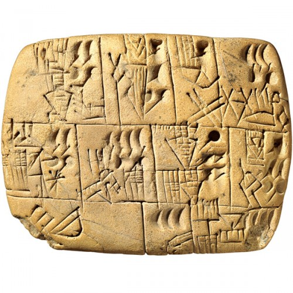
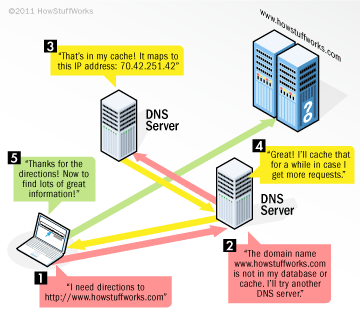
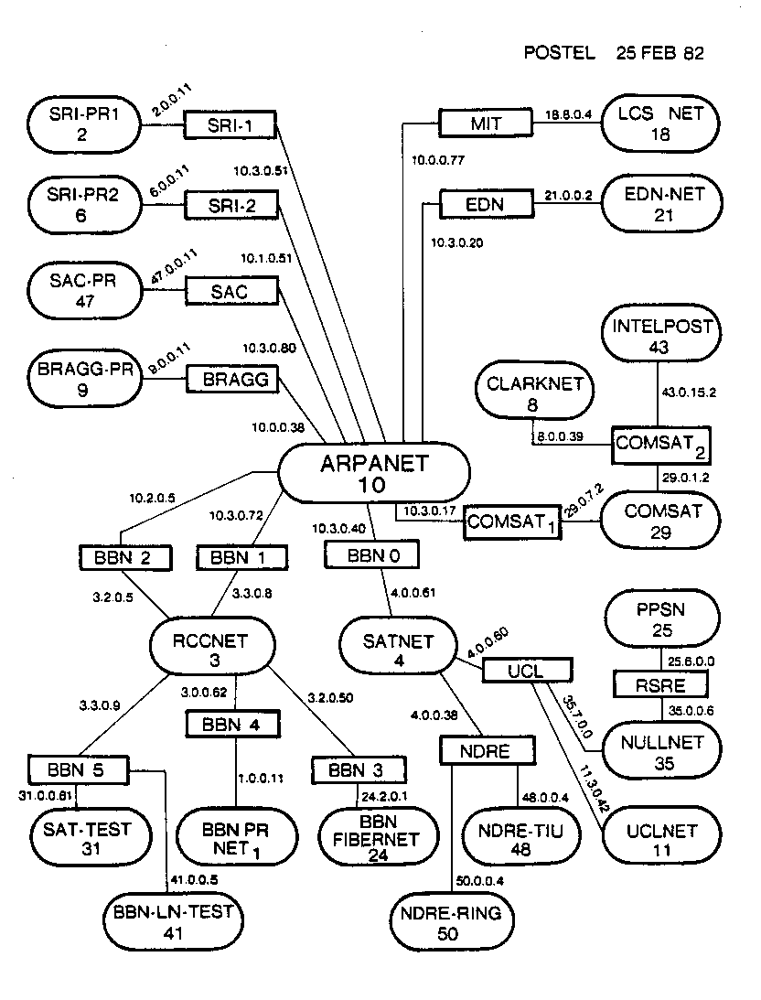
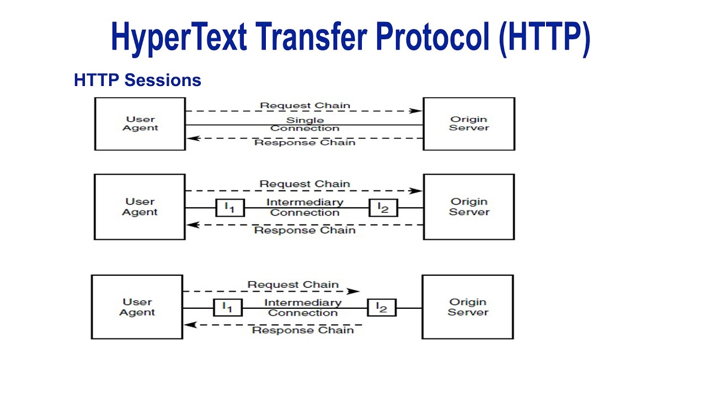

exclude:true
class: module-header dappdevs/topic.dappdevs
---
class: center, middle

     

 
 

    
https://www.dappdevs.org/

    
https://dappdevs-usa.slack.com/

???
DappDevs is a community group founded in January of 2018 by members of the Connecticut crypto community. We focus on the development of decentralized applications, or DApps.
We also have a cool penguin mascot we call Dappy.

Our website:

Check out our slack to join the community:
https://dappdevs-usa.slack.com/

---
# DappDevs Contacts

    

---
exclude:true
class: module-header rj/topic.money-history
---
class:center, middle
# A short history of money

???
ref: https://en.wikipedia.org/wiki/History_of_banking

---
class: invert, topic, center, middle
# Why do we use money?
???
ref: https://socialsciences.mcmaster.ca/econ/ugcm/3ll3/menger/money.txt

---
class:list-large
# How do we distribute resources?

* Discover (windfall)
* Sharing
 * Gift
* Transacting
 * Trade / barter
 * Loan / rent
 * Sell
* Steal

---
class:list-large
# Transacting

* Exchange of goods
* Equivalent relative value
 * No relative gain or loss
* Increased personal value
 * Personal gain, possible personal loss
 * (No lose-lose scenarios without coercion...)
* Quick resolution

???
ref: https://en.wikipedia.org/wiki/Financial_transaction

---
class:list-large
# Barter & Sale

* Exchange of goods of mutually agreeable values.
* Little historic evidence of pure barter as a widespread system of transacting.
* Transactions & property rights can be contested

???
question: why don't we exchange reciepts when we gift?
---
# The coincidence of wants

One of the primary issues with direct barter systems: alignment of wants between the parties.
A medium of exchange separates the concerns with a layer of abstraction to the value being transacted that makes the value fungible while the assets remain non-fungible.

???
ref: https://en.wikipedia.org/wiki/Coincidence_of_wants

---
# Receipts

    

???
The word “receipt” comes from the Old Norman French word for recipe and the Latin word to receive. A receipt is “A written acknowledgment that a specified article or sum of money has been received.”

Writing itself may have been invented as a way to create receipts. Writing that used symbols rather than pictures was invented in Samaria around 3200 BCE

The oldest receipt ever found was for five sheep, one lamb and four grass-fed male kids. The receipt was given to a man named Alulu. It was a piece of clay about one inch by one inch and a half inch thick. 

Papyrus receipts have been found dating from the reign of Ramses II (1278 -1237 BCE). They recorded purchases of things like cattle, grain and beer.

* Problem: they can be lost!
* Problem: they can be faked!

Introducing the need for "marks" or "signatures"

http://blog.abacus.com/a-brief-history-of-receipts-by-frank-addessi/

---
class:bigpic
# Currency - a store of value
(n) Currency : Middle English: curraunt, "in circulation"

???
A currency (from Middle English: curraunt, "in circulation", from Latin: currens, -entis), in the most specific use of the word, refers to money in any form when in actual use or circulation as a medium of exchange, especially circulating banknotes and coins.[1][2] A more general definition is that a currency is a system of money (monetary units) in common use, especially in a nation.[3] Under this definition, US dollars, British pounds, Australian dollars, and European euros are examples of currency. These various currencies are recognized stores of value and are traded between nations in foreign exchange markets, which determine the relative values of the different currencies.[4] Currencies in this sense are defined by governments, and each type has limited boundaries of acceptance.

In this first stage of currency, metals were used as symbols to represent value stored in the form of commodities. This formed the basis of trade in the Fertile Crescent for over 1500 years. However, the collapse of the Near Eastern trading system pointed to a flaw: in an era where there was no place that was safe to store value, the value of a circulating medium could only be as sound as the forces that defended that store. Trade could only reach as far as the credibility of that military.

ref: https://en.wikipedia.org/wiki/Currency
ref: https://en.wikipedia.org/wiki/Coin

---
# Coins

The first coins were developed in Iron Age Anatolia around the 7th and 6th centuries BC. The first coins were made in Lydia during the reign of King Alyattes, from a naturally occurring material called electrum, a variable mix of gold and silver (with about 54% gold and 44% silver), and were in use in Lydia and surrounding areas for about 80 years.

???
ref: https://en.wikipedia.org/wiki/Coin

---
# Fungibility

Fungible: (of goods contracted for without an individual specimen being specified) able to replace or be replaced by another identical item; mutually interchangeable.

Coins are useful as fungible tokens, making calculation convenient via simple counting.
"Clipping" - taking some of the metal off a coin - impacts fungibility if the value is in the metal, but not if it's still considered a full coin for exchange purposes.

---
# Ledgers

    

???
A ledger is the principal book or computer file for recording and totaling economic transactions measured in terms of a monetary unit of account by account type, with debits and credits in separate columns and a beginning monetary balance and ending monetary balance for each account.

For every debit recorded in a ledger, there must be a corresponding credit so that the debits equal the credits in the grand totals. 

* Double entry accounting ledger - the most common
* Transaction: exchange between 2 or more parties
* Credits & Debits

ref: https://en.wikipedia.org/wiki/Ledger

---
# Island of Yap

  

???
    Physical token doesn't need to be present, or even accessible / "real"
    Oral tradition of ownership exchange
    Doesn't need to be present, everyone just needs to agree who owns it

---
class: splash
# Rai stone: the first "stable" coins
<video width="100%" height="" controls>
  <source src="../media/yap.mp4" type="video/mp4">
This browser does not support the video tag.
</video> 

---
class: bigpic
# Hawala
## "money transfer without money movement"

???
ref: https://en.wikipedia.org/wiki/Hawala

In conjunction with the silk road, a system of credit based on trust among a network of bankers called Hawalanders, often businesses with some other function that provide this as a service.

"The unique feature of the system is that no promissory instruments are exchanged between the hawala brokers; the transaction takes place entirely on the honour system."

"In addition to commissions, hawala brokers often earn their profits through bypassing official exchange rates."

"Today, hawala is probably used mostly for migrant workers' remittances to their countries of origin."

Potential for use by terrorists or other undesireables has led to outlawing. 
"illegal in some U.S. states, India, Pakistan,[13] and some other countries"

---
# Wampum

    

???
Wampum, ke'kwuk, squau-tho-won; all are Algonquian words for shell beads or string of shell beads. Wampumpeage is a Narragansett word for "white beads strung". Throughout northeastern America, wampum was used for jewelry, gifts, communication, historical record of important events, religious ceremonies, and trade. It was the earliest form of currency known in North America. Its value was derived from the difficulty involved in producing the cylindrical bead from both Quahog and Whelk, and the scarcity of suitable shells. White beads were made from Whelk, purple-blackish from Quahog. 

Clams were found only at the ocean, but wampum traded far inland. Sea-shell money of a variety of types could be found in tribes across the American continent. The Iriquois managed to collect the largest wampum treasure of any tribe, without venturing anywhere near the clam's habitat. Only a handful of tribes, such as the Narragansetts, specialized in manufacturing wampum, while hundreds of other tribes, many of them hunter-gatherers, used it. Wampum pendants came in a variety of lengths, with the number of beads proportional to the length. Pendants could be cut or joined to form a pendant of length equal to the price paid.

This is an example of proof of work, which we'll see again later in "proof-of-work" systems

ref: https://en.wikipedia.org/wiki/Proof-of-work_system
ref: https://nakamotoinstitute.org/shelling-out/
ref: https://bitcoinmagazine.com/articles/op-ed-bitcoins-roots-great-law-peace/

---
# Problems with currency

    

???
* Standardization of value:
 * Price instability
 * US gold standard
 * Petrodollars

* Control of production = control of value
 * Community controlled 

* Violence - robbery
 * Secure asset
        
* Centralization of control
 * Decentralization

* Trust in third parties
 * Disintermediation

---
exclude: true
# Custom micro-currencies

???
The gold had been purchased by the Saudis from the U.S. Treasury by converting U.S. dollars into gold at the statutory $35 rate. This was back when the U.S. was still on a gold standard and the gold window was still open. The gold in their possession, the Saudis had then asked the U.S. Mint to turn it into discs. This wasn’t the first order that the Mint had completed for Saudi Arabia, one of Boosel’s correspondents pointed out. It had previously produced silver riyal coins as well as copper “girshs”.

When the Saudi monarch Ibn Saud and ARAMCO inked their deal in 1933, the terms of the deal stipulated that for each ton of oil produced, ARAMCO owed the Saudi government a royalty of four gold shillings. This amount was payable in gold sovereigns, a British coin that circulated widely in the Middle East at the time. Each sovereign contained 0.2354 ounces of gold.
The sovereign, however, had been discontinued. For the most part, the Brits these coins by 1917, and so their supply was limited. 
That the discs were stand-ins for sovereigns is underlined by the fact that the Philadelphia Mint had produced the 1947 issue with the exact same specifications as a British sovereign.3 Both sovereigns and discs contained 0.2354 ounces of gold and were of a fineness or purity of 0.9167.

There is a much easier answer to Boosel’s frustrated plea for “the Why” behind the discs. Like most nations in the Middle East, Saudi Arabia didn’t have its own banknotes. Its monetary system was entirely reliant on precious metals coins. But it didn’t produce its own coinage. For smaller transactions, Saudis relied primarily on foreign silver coins including the ubiquitous
, a coin minted in Austria. The Indian rupee, which circulated widely in the Middle East, was equally important. For larger exchanges, Saudis used British gold sovereigns.

ref: https://www.bullionstar.com/blogs/jp-koning/why-us-mint-once-issued-gold-discs-saudi-arabia/

---
exclude: true
# Spahr and the Gold Standard League

???

This isn’t to say that there was no connection at all between the Treasury and ARAMCO. The FRASER documents mention several instances of cooperation between the two. For instance, in 1948 the Treasury helped to facilitate $82 million in ARAMCO sovereign purchases by connecting it with foreign governments that held coin inventories (including the Argentinean deal mentioned above).5 But the Treasury only pointed ARAMCO in the right direction, it didn’t actually participate in the deal itself.

The Treasury, which had banned gold coins from circulation only eleven years before, feared Spahr and his ideas.6 By minting coins for foreign governments and helping companies purchase sovereigns, the Treasury risked drawing Spahr’s anger, providing him with the sort of fuel that he required to spark a public debate on the issue of gold coinage. Luckily for the Treasury, neither the Aramco sovereigns nor the coins sold directly to Saudi Arabia attracted Spahr’s attention or generated public complaints. “Skillful handling of reporters no doubt helped head off the chance of embarrassment,” wrote one official.

---
# The value of Trust

Many solutions to reducing the friction of transactions comes from relying on reputation as a basis for trust, and trusting the toher party to faithfully execute the transaction. 

---
class:bigpic
# Digital Currency

???
ref: https://en.wikipedia.org/wiki/Digital_currency
ref: https://en.wikipedia.org/wiki/Complementary_currency
ref: https://en.wikipedia.org/wiki/Medium_of_exchange
ref: https://en.wikipedia.org/wiki/Money

---
exclude:true
class: module-header rj/topic.internet-history
---
background-image: url(../media/Internet_map_1024_-_transparent,_inverted.png)
class: bg-contain header-back 
# A short history of the internet

???

ref: https://en.wikipedia.org/wiki/Internet
ref: https://en.wikipedia.org/wiki/History_of_the_Internet
ref: https://en.wikipedia.org/wiki/List_of_Internet_pioneers
ref: https://en.wikipedia.org/wiki/History_of_the_World_Wide_Web
ref: https://geography.oii.ox.ac.uk/?page=age-of-internet-empires
ref: https://en.wikipedia.org/wiki/List_of_pioneers_in_computer_science

---
class: middle, center, invert
# Message Relay

---
class:bigpic
# Smoke signals

???
In ancient China, soldiers stationed along the Great Wall would alert each other of impending enemy attack by signaling from tower to tower. In this way, they were able to transmit a message as far away as 750 kilometres (470 mi) in just a few hours. 

Polybius, a Greek historian, devised a more complex system of alphabetical smoke signals around 150 BCE, which converted Greek alphabetic characters into numeric characters. It enabled messages to be easily signaled by holding sets of torches in pairs. This idea, known as the "Polybius square", also lends itself to cryptography and steganography. This cryptographic concept has been used with Japanese Hiragana and the Germans in the later years of the First World War.

ref: https://en.wikipedia.org/wiki/Smoke_signal

---
class:bigpic
# The Telegraph

The Telegraph (“to write at a distance”) in the late 19th century was the first fully digital communication system. 
This key was used to send “What Hath God Wroght” over the prototype telegraph line between Baltimore and Washington D.C. in 1844

???
A relay communication system developed in 18th-century France by the Brothers Chappe. The Chappe semaphore telegraph consisted of a series of towers topped with three rotating arms or panels that could be moved into nearly 200 standard positions, each assigned a unique value or meaning. Messages could be relayed across vast distances by transmitting from one tower or hill (hence, “Telegraph Hill”) to another up to 15 miles away; operators used telescopes to observe and decode the message before doing the hard work of cranking their own semaphore panels into place to relay the message further down the line.

ref: https://www.smithsonianmag.com/arts-culture/how-the-telegraph-went-from-semaphore-to-communication-game-changer-1403433/

---
class:font-24pt
# The advent of ubiquitous networking

| DATE | # OF USERS | % WORLD POPULATION |
|---|---|---|
| Dec. 1995 | 16 millions | 0.4 %
| ... | ... | ... |
| Dec. 2015 | 3,366 millions | 46.4 %
| Dec. 2016 | 3,696 millions | 49.5 %

???
ref: https://www.internetworldstats.com/emarketing.htm
ref: https://en.wikipedia.org/wiki/Mobile_Internet_growth

---
class: bigpic
# Internet adoption by world region

???
ref: https://ourworldindata.org/internet

---
class:center, middle, invert
# Electronic Computers

???

The history of the Internet begins with the development of electronic computers in the 1950s.

---
# Charles Babbage

???
"father of the computer"

Babbage originated the concept of a digital programmable computer.

Babbage's machines were among the first mechanical computers. That they were not actually completed was largely because of funding problems and clashes of personality

Babbage began in 1822 with what he called the difference engine, made to compute values of polynomial functions.

ref: https://en.wikipedia.org/wiki/Charles_Babbage

---
class:tallpic
# ENIAC

ENIAC (/ˈiːniæk, ˈɛ-/; Electronic Numerical Integrator and Computer)

???
ENIAC was amongst the earliest electronic general-purpose computers made. It was Turing-complete, digital and able to solve "a large class of numerical problems" through reprogramming.

Although ENIAC was designed and primarily used to calculate artillery firing tables for the United States Army's Ballistic Research Laboratory, its first program was a study of the feasibility of the thermonuclear weapon.

ENIAC was completed in 1945 and first put to work for practical purposes on December 10, 1945.

ENIAC was formally dedicated at the University of Pennsylvania on February 15, 1946 and was heralded as a "Giant Brain" by the press. It had a speed on the order of one thousand times faster than that of electro-mechanical machines; this computational power, coupled with general-purpose programmability, excited scientists and industrialists alike. The combination of speed and programmability allowed for thousands more calculations for problems, as ENIAC calculated a trajectory in 30 seconds that took a human 20 hours (allowing one ENIAC hour to displace 2,400 human hours). The completed machine was announced to the public the evening of February 14, 1946 and formally dedicated the next day at the University of Pennsylvania, having cost almost $500,000 (approximately $6,300,000 today). It was formally accepted by the U.S. Army Ordnance Corps in July 1946. ENIAC was shut down on November 9, 1946 for a refurbishment and a memory upgrade, and was transferred to Aberdeen Proving Ground, Maryland in 1947. There, on July 29, 1947, it was turned on and was in continuous operation until 11:45 p.m. on October 2, 1955.

ref: https://en.wikipedia.org/wiki/ENIAC
---
class:bigpic
# Programming ENIAC

???

ENIAC's six primary programmers: Kay McNulty, Betty Jennings, Betty Snyder, Marlyn Wescoff, Fran Bilas and Ruth Lichterman

ref: https://en.wikipedia.org/wiki/Kathleen_Antonelli
ref: https://en.wikipedia.org/wiki/Kathleen_Antonelli#/media/File:KayMcNultyAlyseSnyderSisStumpDifferentialAnalyzer.jpg
ref: http://eniacprogrammers.org/

---
class:bigpic
# Networks

???
Initial concepts of wide area networking originated in several computer science laboratories in the United States, United Kingdom, and France. The U.S. Department of Defense awarded contracts as early as the 1960s, including for the development of the ARPANET project, directed by Robert Taylor and managed by Lawrence Roberts. The first message was sent over the ARPANET in 1969 from computer science Professor Leonard Kleinrock's laboratory at University of California, Los Angeles (UCLA) to the second network node at Stanford Research Institute (SRI). 

ref: https://en.wikipedia.org/wiki/History_of_the_Internet
---
class:bigpic
# Memorandum For Members and Affiliates of the Intergalactic Computer Network

???
April 23, 1963, J. C. R. Licklider pens a memo to ARPA colleagues laying out a vision for and exploring the early challenges presented in trying to establish a time-sharing network of computers with the software of the era–ultimately. This vision would lead to ARPANet, the precursor of the Internet in use today.

ref: https://en.wikipedia.org/wiki/J._C._R._Licklider
ref: http://www.kurzweilai.net/memorandum-for-members-and-affiliates-of-the-intergalactic-computer-network
---
# Datagrams

French computer scientist Louis Pouzin invented the datagram and designed an early packet communications network

Each datagram has two components, a header and a data payload. The header contains all the information sufficient for routing from the originating equipment to the destination without relying on prior exchanges between the equipment and the network. Headers may include source and destination addresses as well as a type field. The payload is the data to be transported. This process of nesting data payloads in a tagged header is called encapsulation.

???
ref: https://en.wikipedia.org/wiki/Datagram
ref: https://en.wikipedia.org/wiki/Louis_Pouzin
ref: https://en.wikipedia.org/wiki/IP_fragmentation

---
# Packets & Protocols

Donald Davies first demonstrated packet switching in 1967 at the National Physics Laboratory (NPL) in the UK

Packet switching networks such as the NPL network, ARPANET, Tymnet, Merit Network, CYCLADES, and Telenet, were developed in the late 1960s and early 1970s using a variety of communications protocols.

A network packet is a formatted unit of data carried by a packet-switched network. A packet consists of control information and user data,[1] which is also known as the payload. Control information provides data for delivering the payload, for example: source and destination network addresses, error detection codes, and sequencing information. Typically, control information is found in packet headers and trailers.

In packet switching, the bandwidth of the communication medium is shared between multiple communication sessions, in contrast to circuit switching, in which circuits are preallocated for the duration of one session and data is typically transmitted as a continuous bit stream. 

???

ref: https://en.wikipedia.org/wiki/History_of_the_Internet
ref: https://en.wikipedia.org/wiki/Network_packet
ref: https://en.wikipedia.org/wiki/Packet_switching
ref: https://en.wikipedia.org/wiki/Frame_(networking)

---
exclude: true
# Network Time Protocol (NTP)

The Network Time Protocol (NTP) is a networking protocol for clock synchronization between computer systems over packet-switched, variable-latency data networks. In operation since before 1985, NTP is one of the oldest Internet protocols in current use. NTP was designed by David L. Mills of the University of Delaware.

NTP is intended to synchronize all participating computers to within a few milliseconds of Coordinated Universal Time (UTC). It uses the intersection algorithm, a modified version of Marzullo's algorithm, to select accurate time servers and is designed to mitigate the effects of variable network latency. NTP can usually maintain time to within tens of milliseconds over the public Internet, and can achieve better than one millisecond accuracy in local area networks under ideal conditions. Asymmetric routes and network congestion can cause errors of 100 ms or more.

The protocol is usually described in terms of a client-server model, but can as easily be used in peer-to-peer relationships where both peers consider the other to be a potential time source. Implementations send and receive timestamps using the User Datagram Protocol (UDP) on port number 123. They can also use broadcasting or multicasting, where clients passively listen to time updates after an initial round-trip calibrating exchange. NTP supplies a warning of any impending leap second adjustment, but no information about local time zones or daylight saving time is transmitted.

???

In 1979, network time synchronization technology was used in what was possibly the first public demonstration of Internet services running over a trans-Atlantic satellite network, at the National Computer Conference in New York. The technology was later described in the 1981 Internet Engineering Note (IEN) 173 and a public protocol was developed from it that was documented in RFC 778. The technology was first deployed in a local area network as part of the Hello routing protocol and implemented in the Fuzzball router, an experimental operating system used in network prototyping, where it ran for many years.

question: Compare NTP consensus to public blockchain state consensus.

Differences: 
* it is assumed time is consistent everywhere on earth. This is mostly true
* all time systems are presumed to have a single, accurate state at any given moment
* all time systems could maintain / predict the future state themselves, if accurate enough
* all time systems should have the same state if synced
* blockchain consensus systems have no consistent state at any given time
* blockchain consensus systems eventually agree on a consistent history, but cannot predict a future
* blockchain consensus systems tolerate longer periods of uncertainty about state

ref: https://en.wikipedia.org/wiki/Network_Time_Protocol

---
# TCP/IP

The Internet protocol suite (TCP/IP) was developed by Robert E. Kahn and Vint Cerf in the 1970s and became the standard networking protocol on the ARPANET, incorporating concepts from the French CYCLADES project directed by Louis Pouzin.

In the early 1980s the NSF funded the establishment for national supercomputing centers at several universities, and provided interconnectivity in 1986 with the NSFNET project, which also created network access to the supercomputer sites in the United States from research and education organizations.

???
ref: https://en.wikipedia.org/wiki/History_of_the_Internet
ref: https://en.wikipedia.org/wiki/Communication_protocol

---
class:bigpic
# Addressing

???
An Internet Protocol address (IP address) is a numerical label assigned to each device connected to a computer network that uses the Internet Protocol for communication. An IP address serves two principal functions: host or network interface identification and location addressing. 

IP allows for subnets, networks nested within networks.

ref: https://en.wikipedia.org/wiki/IP_address
ref: https://upload.wikimedia.org/wikipedia/commons/7/74/Ipv4_address.svg

---
exclude: true
# Routing

* Unicast addressing (1:1)
 * normally refers to a single sender or a single receiver, and can be used for both sending and receiving.
* Broadcast addressing (1:*)
 * send data to all possible destinations on a network in one transmission operation, while all receivers capture the network packet
* Multicast addressing (1:*)
 * is associated with a group of interested receivers. The sender sends a single datagram from its unicast address to the multicast group address and the intermediary routers take care of making copies and sending them to all receivers that have joined the corresponding multicast group. 
* Anycast addressing (1:*)
 * the data stream is not transmitted to all receivers, just the one which the router decides is logically closest in the network.

???
https://en.wikipedia.org/wiki/IP_address

---
# ARPANET

"We set up a telephone connection between us and the guys at SRI ...", Kleinrock ... said in an interview: "We typed the L and we asked on the phone,

    "Do you see the L?"
    "Yes, we see the L," came the response.
    We typed the O, and we asked, "Do you see the O."
    "Yes, we see the O."
    Then we typed the G, and the system crashed ...

Yet a revolution had begun" ....[32]

???

Robert Taylor was promoted to the head of the information processing office at Defense Advanced Research Projects Agency (DARPA) in June 1966. He intended to realize Licklider's ideas of an interconnected networking system. Bringing in Larry Roberts from MIT, he initiated a project to build such a network. The first ARPANET link was established between the University of California, Los Angeles (UCLA) and the Stanford Research Institute at 22:30 hours on October 29, 1969.[31]

By December 5, 1969, a 4-node network was connected by adding the University of Utah and the University of California, Santa Barbara. Building on ideas developed in ALOHAnet, the ARPANET grew rapidly. By 1981, the number of hosts had grown to 213, with a new host being added approximately every twenty days.[33][34]

ARPANET development was centered around the Request for Comments (RFC) process, still used today for proposing and distributing Internet Protocols and Systems. RFC 1, entitled "Host Software", was written by Steve Crocker from the University of California, Los Angeles, and published on April 7, 1969. These early years were documented in the 1972 film Computer Networks: The Heralds of Resource Sharing.

ARPANET became the technical core of what would become the Internet, and a primary tool in developing the technologies used. The early ARPANET used the Network Control Program (NCP, sometimes Network Control Protocol) rather than TCP/IP. On January 1, 1983, known as flag day, NCP on the ARPANET was replaced by the more flexible and powerful family of TCP/IP protocols, marking the start of the modern Internet.[35]

International collaborations on ARPANET were sparse. For various political reasons, European developers were concerned with developing the X.25 networks. Notable exceptions were the Norwegian Seismic Array (NORSAR) in 1972, followed in 1973 by Sweden with satellite links to the Tanum Earth Station and Peter Kirstein's research group in the UK, initially at the Institute of Computer Science, London University and later at University College London.[36] 

ref: https://en.wikipedia.org/wiki/History_of_the_Internet

---
# DNS - The Domain Name System

???
The Domain Name System (DNS) is a hierarchical and decentralized naming system for computers, services, or other resources connected to the Internet or a private network.

Using a simpler, more memorable name in place of a host's numerical address dates back to the ARPANET era. The Stanford Research Institute (now SRI International) maintained a text file named HOSTS.TXT that mapped host names to the numerical addresses of computers on the ARPANET

Later, Feinler set up a WHOIS directory on a server in the NIC for retrieval of information about resources, contacts, and entities.[14] She and her team developed the concept of domains.

By the early 1980s, maintaining a single, centralized host table had become slow and unwieldy and the emerging network required an automated naming system to address technical and personnel issues. Postel directed the task of forging a compromise between five competing proposals of solutions to Paul Mockapetris. Mockapetris instead created the Domain Name System.

    Translate IP address into a human memorable id
        information embedded here adds value - overloading the system?
    Centralized, Decentralized, Distributed

    Only recently transferred from US to ICANN

ref: https://en.wikipedia.org/wiki/Domain_Name_System

---
class:tallpic
# Personal Computing Revolution

???
1974 saw the introduction of what is considered by many to be the first true "personal computer", the Altair 8800 created by Micro Instrumentation and Telemetry Systems (MITS)

1976, Steve Jobs and Steve Wozniak sold the Apple I 

* Increasingly affordable computers
* Increasingly available software
* Games

ref: https://en.wikipedia.org/wiki/Personal_computer

---
class:list-large
# Bulletin Board Systems

* Messaging and mail
* Publications
* Interactive software (MUDs, MUSHs, MOOs)
* Digital artwork
* Shareware - precursor to open source
* The first public online social networks

???
a computer server running software that allows users to connect to the system using a terminal program. Once logged in, the user can perform functions such as uploading and downloading software and data, reading news and bulletins, and exchanging messages with other users through public message boards and sometimes via direct chatting. In the middle to late 1980s, message aggregators and bulk store-and-forward'ers sprung up to provide services such as FidoNet, which is similar to email. 

ref: https://en.wikipedia.org/wiki/Bulletin_board_system

---
class: tallpic
# The Internet

???
The term "internet" was adopted in the first RFC published on the TCP protocol (RFC 675:[54] Internet Transmission Control Program, December 1974) as an abbreviation of the term internetworking and the two terms were used interchangeably. In general, an internet was any network using TCP/IP. It was around the time when ARPANET was interlinked with NSFNET in the late 1980s, that the term was used as the name of the network, Internet, being the large and global TCP/IP network

ref: https://en.wikipedia.org/wiki/History_of_the_Internet

---
class:tallpic
# ISPs

???
Commercial Internet service providers (ISPs) began to emerge in the very late 1980s. The ARPANET was decommissioned in 1990. Limited private connections to parts of the Internet by officially commercial entities emerged in several American cities by late 1989 and 1990, and the NSFNET was decommissioned in 1995, removing the last restrictions on the use of the Internet to carry commercial traffic. 

---
# Gopher

As the Internet grew through the 1980s and early 1990s, many people realized the increasing need to be able to find and organize files and information. Projects such as Archie, Gopher, WAIS, and the FTP Archive list attempted to create ways to organize distributed data. In the early 1990s, Gopher, invented by Mark P. McCahill offered a viable alternative to the World Wide Web.

---
# HyperText 

From https://www.w3.org/WhatIs.html

* Hypertext is text which is not constrained to be linear.
* Hypertext is text which contains links to other texts. The term was coined by Ted Nelson around 1965 (see History).
* HyperMedia is a term used for hypertext which is not constrained to be text: it can include graphics, video and sound , for example. Apparently Ted Nelson was the first to use this term too.
* Hypertext and HyperMedia are concepts, not products.

Hypertext is text displayed on a computer or other electronic device with references (hyperlinks) to other text that the reader can immediately access, usually by a mouse click or keypress sequence.

???
ref: https://en.wikipedia.org/wiki/History_of_hypertext

---
# History of Hypertext (1/2)

* 1941: Jorge Luis Borges published "The Garden of Forking Paths", a short story that is often considered an inspiration for the concept of hypertext.
* 1945: Vannevar Bush wrote an article in The Atlantic Monthly called "As We May Think", about a futuristic proto-hypertext device he called a Memex. 
* 1962: Douglas Engelbart independently began working on his NLS system in 1962 at Stanford Research Institute, although delays in obtaining funding, personnel, and equipment meant that its key features were not completed until 1968.
* 1963: Ted Nelson coined the terms 'hypertext' and 'hypermedia' as part of a model he developed for creating and using linked content (first published reference 1965).
* 1967: Nelson & Andries van Dam develop the Hypertext Editing System (text editing) in 1967 at Brown University.
* 1968: Engelbart demonstrated a 'hypertext' interface to the public for the first time, in what has come to be known as "The Mother of All Demos".
* 1969: Charles Goldfarb, leading a small team at IBM, developed the first markup language, called Generalized Markup Language
* 1974: Charles Goldfarb designs SGML and writes the first SGML parser, ARCSGML

---
# History of Hypertext (2/2)
* 1980: Tim Berners-Lee, a physicist contractor at CERN, proposed and prototyped ENQUIRE, a system for CERN researchers to use and share documents. 
* 1989: Tim Berners-Lee wrote a memo proposing an Internet-based hypertext system.
* 1990 Berners-Lee specified HTML and wrote the browser and server software. That year, Berners-Lee and CERN data systems engineer Robert Cailliau collaborated on a joint request for funding, but the project was not formally adopted by CERN.
* 1991: The first publicly available description of HTML was a document called "HTML Tags", first mentioned on the Internet by Tim Berners-Lee in late 1991. It describes 18 elements comprising the initial, relatively simple design of HTML.
* 1995: HTML 2.0 IETF HTML Working Group published "HTML 2.0", the first HTML specification intended to be treated as a standard against which future implementations should be based.
* 1995: XML was compiled by a working group of eleven members, supported by a (roughly) 150-member Interest Group.

???
ref: https://en.wikipedia.org/wiki/Hypertext
ref: https://en.wikipedia.org/wiki/History_of_hypertext
ref: https://en.wikipedia.org/wiki/The_Mother_of_All_Demos
ref: https://en.wikipedia.org/wiki/Standard_Generalized_Markup_Language
ref: https://en.wikipedia.org/wiki/XML

---
class: tallpic
# Browsers - network clients

???

ref: https://en.wikipedia.org/wiki/Timeline_of_web_browsers
---
class:bigpic
# Information Management: A Proposal

March 1989, Tim Berners-Lee submitted a proposal for an information management system to his boss, Mike Sendall. ‘Vague, but exciting’, were the words that Sendall wrote on the proposal.

"This proposal concerns the management of general information about accelerators and experiments at CERN. It discusses the problems of loss of information about complex evolving systems and derives a solution based on a distributed hypertext system."

"Many of the discussions of the future at CERN and the LHC era end with the question - ªYes, but how will we ever keep track of such a large project?º This proposal provides an answer to such questions. Firstly, it discusses the problem of information access at CERN. Then, it introduces the idea of linked information systems, and compares them with less flexible ways of finding information.

It then summarises my short experience with non-linear text systems known as ªhypertextº, describes what CERN needs from such a system, and what industry may provide. Finally, it suggests steps we should take to involve ourselves with hypertext now, so that individually and collectively we may understand what we are creating."

???

ref: http://info.cern.ch/Proposal.html
ref: https://www.w3.org/History/1989/proposal.html
ref: 

---
# WorldWideWeb 

The first web browser, WorldWideWeb, was developed in 1990 by Tim Berners-Lee for the NeXT Computer (at the same time as the first web server for the same machine) and introduced to his colleagues at CERN in March 1991.

???
ref: https://en.wikipedia.org/wiki/Timeline_of_web_browsers
ref: https://en.wikipedia.org/wiki/World_Wide_Web

---
class:bio tallpic
# Tim Berners-Lee

???
He made a proposal for an information management system in March 1989, and he implemented the first successful communication between a Hypertext Transfer Protocol (HTTP) client and server via the internet in mid-November the same year.

Berners-Lee is the director of the World Wide Web Consortium (W3C), which oversees the continued development of the Web. 

He is a founder and president of the Open Data Institute. 

In 2018 he founded Inrupt to execute on his team's work on Solid at MIT Media lab.

---
# Lynx

In 1992, Lynx was born as an early Internet web browser. Its ability to provide hypertext links within documents that could reach into documents anywhere on the Internet began the creation of the Web on the Internet. Lynx is a customizable text-based web browser for use on cursor-addressable character cell terminals.

Lynx was a product of the Distributed Computing Group within Academic Computing Services of the University of Kansas. It was initially developed in 1992 by a team of students and staff at the university (Lou Montulli, Michael Grobe and Charles Rezac) as a hypertext browser used solely to distribute campus information as part of a Campus-Wide Information Server and for browsing the Gopher space.

???
ref: https://en.wikipedia.org/wiki/Lynx_(web_browser)
ref: https://en.wikipedia.org/wiki/History_of_hypertext

---
# HTTP

???

A common protocol lets systems make expectations about how other systems will act, allowing interaction

---
# HTML

???
Uncompiled code, non-proprietary, readable by anyone.
Initially proposed as part of a system for the creation of shareable documents for researchers at CERN.

ref: https://en.wikipedia.org/wiki/HTML

---
class:bigpic
# Internet Protocol Suite

???
ref: https://en.wikipedia.org/wiki/Internet_layer
ref: https://en.wikipedia.org/wiki/Internet_protocol_suite

---
class:list-large
# Application layer protocols

* Telnet, SSH
* FTP, SCP
* POP, SMTP, IMAP
* IRC, Jabber / XMPP
* RSS 

???
ref: https://en.wikipedia.org/wiki/Email
ref: https://en.wikipedia.org/wiki/Instant_messaging
ref: https://en.wikipedia.org/wiki/Internet_Relay_Chat
ref: https://en.wikipedia.org/wiki/Voice_over_IP
ref: https://en.wikipedia.org/wiki/XMPP

---
# Open Source

???
    Licensing is problematic
    Information wants to be free

---
# Distributed Computing

???
    SETI
    Protein Folding

---
# The Digital Revolution

The Digital Revolution, also known as the Third Industrial Revolution, is the shift from mechanical and analogue electronic technology to digital electronics which began anywhere from the late 1950s to the late 1970s with the adoption and proliferation of digital computers and digital record keeping that continues to the present day.

???
ref: https://en.wikipedia.org/wiki/Digital_Revolution

---
class:bigpic
# Search Engines

???
Findability is a problem for any collection.
Indexing is critical in speeding up findability.
Searching indexes to find things is faster than scanning options.
Google doesn't show up until 1998

ref: https://en.wikipedia.org/wiki/Web_search_engine
ref: https://en.wikipedia.org/wiki/List_of_search_engines

---
class:bigpic
# Web Crawler(s)

???
for indexing and other purposes, custom client scripts that visit resources and pull data to store and use privately
user-agent strings

Brian Pinkerton first started working on WebCrawler, which was originally a desktop application, on January 27, 1994 at the University of Washington. On March 15, 1994, he generated a list of the top 25 websites.

ref: https://en.wikipedia.org/wiki/WebCrawler

---
# Cryptography

Email had PGP to protect data in transit, but web pages served over HTTP were still public. This made submitting sensitive information, like a credit card number, risky at best.

???
ref: https://en.wikipedia.org/wiki/Transport_Layer_Security
---
# Transport Layer Security

Netscape developed the original SSL protocols.
Taher Elgamal, chief scientist at Netscape Communications from 1995 to 1998, has been described as the "father of SSL".

* SSL 1.0, never publicly released because of serious security flaws in the protocol
* SSL 2.0, released in February 1995, contained a number of security flaws which necessitated the design of version 3.0.
* SSL 3.0, released in 1996, represented a complete redesign of the protocol produced by Paul Kocher working with Netscape engineers Phil Karlton and Alan Freier, with a reference implementation by Christopher Allen and Tim Dierks of Consensus Development.
 * Newer versions of SSL/TLS are based on SSL 3.0.
 * The 1996 draft of SSL 3.0 was published by IETF as a historical document in RFC 6101
* TLS 1.0, first defined in RFC 2246 in January 1999 as an upgrade of SSL Version 3.0

The PCI Council suggests that organizations migrate from TLS 1.0 to TLS 1.1 or higher before June 30, 2018
In October 2018, Apple, Google, Microsoft, and Mozilla jointly announced they would deprecate TLS 1.0 and 1.1 in March 2020.

???
ref: https://en.wikipedia.org/wiki/Transport_Layer_Security
---
# Digital Certificates

Used in SSL & TLS
AKA a public key certificate or identity certificate.

A digital certificate certifies the ownership of a public key by the named subject of the certificate, and indicates certain expected usages of that key. This allows others (relying parties) to rely upon signatures or on assertions made by the private key that corresponds to the certified public key.

In a typical public-key infrastructure (PKI) scheme, the certificate issuer is a certificate authority (CA), usually a company that charges customers to issue certificates for them. By contrast, in a web of trust scheme, individuals sign each other's keys directly, in a format that performs a similar function to a public key certificate.

The most common format for public key certificates is defined by X.509.

???
In email encryption, code signing, and e-signature systems, a certificate's subject is typically a person or organization. However, in Transport Layer Security (TLS) a certificate's subject is typically a computer or other device, though TLS certificates may identify organizations or individuals in addition to their core role in identifying devices.

ref: https://en.wikipedia.org/wiki/Public_key_certificate

---
class:tallpic
# E-commerce

---
class:tallpic
# Online Identity Theft

---
# Dot-com bubble

Low interest rates in 1998–99 facilitated an increase in start-up companies. Although a number of these new entrepreneurs had realistic plans and administrative ability, most of them lacked these characteristics but were able to sell their ideas to investors because of the novelty of the dot-com concept.

In 2001 the bubble burst, and many dot-com startups went out of business after burning through their venture capital and failing to become profitable.

???

ref: https://en.wikipedia.org/wiki/History_of_the_World_Wide_Web#1999%E2%80%932001:_%22Dot-com%22_boom_and_bust

---
# Online social disruption begins...

* Blogging: Blogger, Livejournal, Wordpress
 * The convenience of posting online takes off, increasing the availability of amateur content that then starts to rival professional content.

* Classifieds: Craigslist, eBay
 * The convenience of posting classified ad style posts online, for muchless than in a print publication and with greater reach, takes off.

* Social Media: Myspace
 * The convenience of making and keeping in touch with friends online takes off, rivaling real life interactions.

* The Service Economy
 * The convenience of delegating work to someone else for money, facilitated by the expanded reach and targeting ability of the internet, takes off.

---
