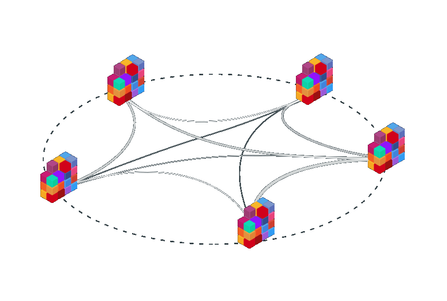
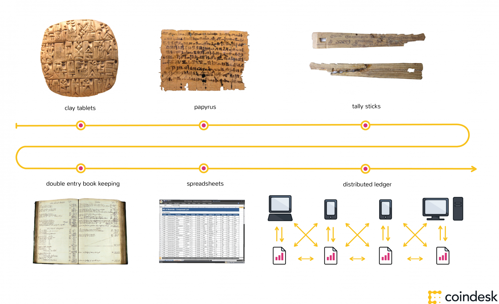
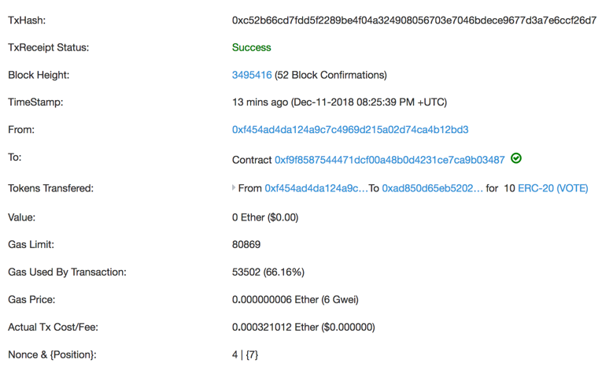

exclude:true
class: module-header ethereum/topic.timestamping
---
class: center, middle, invert
# Timestamping

---
# Trusted Timestamping

Trusted timestamping is the process of securely keeping track of the creation and modification time of a document. Security here means that no one—not even the owner of the document—should be able to change it once it has been recorded provided that the timestamper's integrity is never compromised. 

Anyone trusting the timestamper can then verify that the document was not created after the date that the timestamper vouches.

???
Consider 
ref: https://en.wikipedia.org/wiki/Trusted_timestamping

---
# Why timestamp?

Previously, it was used as a means of creating a proof of a discovery without revealing the discovery.

Now, state officials concerned about cyber warfare are guarding against the threat of data tampering.

“I believe the next push on the envelope here is going to be the manipulation or deletion of data, which will of course compromise its integrity,” director of National Intelligence James Clapper told lawmakers on the House Intelligence Committee

???
ref: https://defensesystems.com/articles/2015/10/08/lockheed-guardtime-anti-data-manipulation.aspx

---
# Anagrams: The history of trusted timestamping

* Galileo first published his discovery of the phases of Venus in the anagram form.
 * .red["Haec immatura a me iam frustra leguntur o.y."] or "These are at present too young to be read by me"
 * .red["Cynthiae figuras aemulatur mater amorum"] or "The mother of love imitates the shape of Cynthia"

--
* when Robert Hooke discovered Hooke's law in 1660, he did not want to publish it yet, but wanted to be able to claim priority. So he published the anagram:
 * .red[ceiiinosssttuv]
 * .red[ut tensio sic vis] (Latin for "as is the extension, so is the force").

--
* Sir Isaac Newton, in responding to questions from Leibniz in a letter in 1677, concealed the details of his "fluxional technique" with an anagram

???
ref: https://www.physics.rutgers.edu/~croft/ANAGRAM.htm

---
class:bigpic
# Hashes: The state of trusted timestamping

![[Hashlinked timestamps]](../media/hashlink-timestamps.png)

???
Hashes have been recognized as superior because they allow the proving of an arbitrarily large size piece of input, and do not reveal any information that would help with guessing.

---
class: tallpic
# Haber and Stornetta: Surety


???
The world’s oldest blockchain predates Bitcoin by 13 years and it’s been hiding in plain sight, printed weekly in the classified section of one of the world’s most widely circulated newspapers: The New York Times.

Blockchains, insofar as they constitute a chronological chain of hashed data, were first invented by the cryptographers Stuart Haber and Scott Stornetta in 1991 and their use cases were a lot less ambitious. Instead, Haber and Stornetta envisioned the technology as a way to timestamp digital documents to verify their authenticity.

Surety’s main product is called “AbsoluteProof” that acts as a cryptographically secure seal on digital documents. Its basic mechanism is the same described in Haber and Stornetta’s original paper. Clients use Surety’s AbsoluteProof software to create a hash of a digital document, which is then sent to Surety’s servers where it is timestamped to create a seal. This seal is a cryptographically secure unique identifier that is then returned to the software program to be stored for the customer.

At the same time, a copy of that seal and every other seal created by Surety’s customers is sent to the AbsoluteProof “universal registry database,” which is a “hash-chain” composed entirely of Surety customer seals. This creates an immutable record of all the Surety seals ever produced, so that it is impossible for the company or any malicious actor to modify a seal. But it leaves out an important part of the blockchain equation: Trustlessness. How can anyone trust that Surety’s internal records are legit?

ref: https://www.anf.es/pdf/Haber_Stornetta.pdf
ref: https://motherboard.vice.com/en_us/article/j5nzx4/what-was-the-first-blockchain

---
exclude:true
class: module-header ethereum/topic.consensus
---
class: center, middle, invert
# Consensus

???

# The Problem

The consensus problem requires agreement among a number of processes (or agents) for a single data value. Some of the processes (agents) may fail or be unreliable in other ways, so consensus protocols must be fault tolerant or resilient. The processes must somehow put forth their candidate values, communicate with one another, and agree on a single consensus value.

ref: https://en.wikipedia.org/wiki/Consensus_(computer_science)

---
# Data security: ACID

* Atomicity - Transactions are often composed of multiple statements. Atomicity guarantees that each transaction is treated as a single "unit", which either succeeds completely, or fails completely.
* Consistency - ensures that a transaction can only bring the database from one valid state to another, maintaining database invariants: any data written to the database must be valid according to all defined rules, including constraints, cascades, triggers, and any combination thereof.
* Transactions - are often executed concurrently (e.g., reading and writing to multiple tables at the same time). Isolation ensures that concurrent execution of transactions leaves the database in the same state that would have been obtained if the transactions were executed sequentially.
* Durability guarantees that once a transaction has been committed, it will remain committed even in the case of a system failure (e.g., power outage or crash) 

???

ref: https://en.wikipedia.org/wiki/ACID_(computer_science)

---
class:tallpic
# Centralized data stores


---
# Database replication

Log based replication replays transactions recorded on the master node at each slave node.
Other forms may directly update the state of the db to match the master.

Eventual consistency means all databases will eventually reach agreement on the state of the data.

Slaves implicitly trust the master. Affect the master, affect all slaves.

---
# PAXOS

Paxos is a family of protocols for solving consensus in a network of unreliable processors (that is, processors that may fail). Consensus is the process of agreeing on one result among a group of participants. This problem becomes difficult when the participants or their communication medium may experience failures.

The Paxos protocol was first published in 1989 and named after a fictional legislative consensus system used on the Paxos island in Greece. It was later published as a journal article in 1998.

???
ref: https://en.wikipedia.org/wiki/Paxos_(computer_science)

---
# RAFT

Raft is a consensus algorithm designed as an alternative to Paxos. It was meant to be more understandable than Paxos by means of separation of logic, but it is also formally proven safe and offers some additional features. Raft offers a generic way to distribute a state machine across a cluster of computing systems, ensuring that each node in the cluster agrees upon the same series of state transitions.

Raft achieves consensus via an elected leader. A server in a raft cluster is either a leader or a follower, and can be a candidate in the precise case of an election (leader unavailable). The leader is responsible for log replication to the followers. It regularly informs the followers of its existence by sending a heartbeat message. Each follower has a timeout (typically between 150 and 300 ms) in which it expects the heartbeat from the leader. The timeout is reset on receiving the heartbeat. If no heartbeat is received the follower changes its status to candidate and starts a leader election.

???
ref: https://en.wikipedia.org/wiki/Raft_(computer_science)

---
# Eventual Consistency

Eventual consistency is a consistency model used in distributed computing to achieve high availability that informally guarantees that, if no new updates are made to a given data item, eventually all accesses to that item will return the last updated value. Eventual consistency, also called optimistic replication, is widely deployed in distributed systems, and has origins in early mobile computing projects. A system that has achieved eventual consistency is often said to have converged, or achieved replica convergence.

???
ref: https://en.wikipedia.org/wiki/Eventual_consistency

---
# BASE

* Basically Available
* Soft state
* Eventual consistency

---
# CAP Theorem

States that it is impossible for a distributed data store to simultaneously provide more than two out of the following three guarantees:

* Consistency: Every read receives the most recent write or an error
* Availability: Every request receives a (non-error) response – without the guarantee that it contains the most recent write
* Partition tolerance: The system continues to operate despite an arbitrary number of messages being dropped (or delayed) by the network between nodes

Database systems designed with traditional ACID guarantees in mind such as RDBMS choose consistency over availability, whereas systems designed around the BASE philosophy, common in the NoSQL movement for example, choose availability over consistency.

???
Formulated by Eric Brewer

"ACID and BASE represent two design philosophies at opposite ends of the consistency-availability spectrum. The ACID properties focus on consistency and are the traditional approach of databases. My colleagues and I created BASE in the late 1990s to capture the emerging design approaches for high availability and to make explicit both the choice and the spectrum."

ref: https://en.wikipedia.org/wiki/CAP_theorem
ref: https://en.wikipedia.org/wiki/Eric_Brewer_(scientist)
ref: https://www.infoq.com/articles/cap-twelve-years-later-how-the-rules-have-changed

---
# Decentralized networks

* Who to trust?
* Who to believe when a conflict arises?

---
exclude: true
# git repositories as decentralized databases

???
git repositories as decentralized databases

---
class: middle, center
# Byzantine failure

???
A process that experiences a Byzantine failure may send contradictory or conflicting data to other processes, or it may sleep and then resume activity after a lengthy delay. Of the two types of failures, Byzantine failures are far more disruptive. 
ref: https://en.wikipedia.org/wiki/Consensus_(computer_science)

ref: https://en.wikipedia.org/wiki/Byzantine_fault

---
# Byzantine Generals problem

<video width="100%" height="" controls>
  <source src="../media/byzantine-generals-problem.mp4" type="video/mp4">
This browser does not support the video tag.
</video>

???
ref: https://www.youtube.com/watch?v=_MwqAaVweJ8
ref: https://blockgeeks.com/guides/blockchain-consensus/
ref: https://en.wikipedia.org/wiki/Two_Generals%27_Problem

---
class: middle, center, invert
# How would you approach solving it?

---
# Distributed Consensus mechanisms

* Proof of Work (PoW)
* Proof of Stake (PoS)
* Delegated Proof of Stake (DPoS)

* Proof of Elapsed Time (PoET)
* Proof of Authority (PoA)
* Proof of Capacity
* Proof of Activity
* Proof of Burn
* Proof of Importance

???
ref: https://medium.com/the-daily-bit/9-types-of-consensus-mechanisms-that-you-didnt-know-about-49ec365179da

---
# Proof of Work

###Challenge-response
<p align=center>
    
</p>

###Solution-verification
<p align=center>
    
</p>

???
Proof-of-work is essentially one-CPU-one-vote.

The concept was invented by Cynthia Dwork and Moni Naor as presented in a 1993 journal article.

The term "Proof of Work" or POW was first coined and formalized in a 1999 paper by Markus Jakobsson and Ari Juels titled,
"Proofs of work and bread pudding protocols"  - http://www.hashcash.org/papers/bread-pudding.pdf

 A proof-of-work (PoW) system (or protocol, or function) is an economic measure to deter denial of service attacks and other service abuses such as spam on a network by requiring some work from the service requester, usually meaning processing time by a computer. The concept was invented by Cynthia Dwork and Moni Naor as presented in a 1993 journal article. The term "Proof of Work" or POW was first coined and formalized in a 1999 paper by Markus Jakobsson and Ari Juels. An early example of the proof-of-work system used to give value to a currency is the shell money of the Solomon Islands.

ref: https://en.wikipedia.org/wiki/Proof-of-work_system
ref: https://medium.com/@julianrmartinez43/understanding-proof-of-work-part-1-586d7ee6b014

---
# Longest chain

A principle for determining how to proceed with incomplete knowledge about the state of the network.

Relativity and technological constraints prevent us from doing instant communication across the globe, so two nodes can not be expected to pick the same chain as the active one. This is no problem: the mining mechanism makes sure that the chance two nodes disagree about blocks in the past decreases exponentially as they are older.

The active chain is one path from genesis block at the top to some leaf node at the bottom of the block tree. Every such path is a valid choice, but nodes are expected to pick the one with the most "work" in it they know about (where work is loosely defined as the sum of the difficulties).

The rules in practice are this: when a new block arrives, and it extends the previous active chain, we just append it to the active chain. If not, it depends on whether the branch it extends now has more work than the currently active branch. If not, we store the block and stop. If it does have more work, we do a so called "reorganisation": deactivating blocks from the old branch, and activating blocks from the new branch.

Ethereum determines the longest chain based on the total difficulty, which is embedded in the block header. Ties are broken randomly.

Total difficulty is the simple sum of block difficulty values without explicitly counting uncles. Difficulty is computed based on parent difficulty and timestamp, block timestamp, and block number, again without reference to uncles.

All of these except tiebreaking are consensus-critical, and so can be expected to be the same across all clients.

???
ref: https://bitcoin.stackexchange.com/questions/5540/what-does-the-term-longest-chain-mean
ref: https://ethereum.stackexchange.com/questions/13378/what-is-the-exact-longest-chain-rule-implemented-in-the-ethereum-homestead-p
---
# How PoW + Longest chain solves the Byzantine Generals problem 


1. The Generals agree the first plan received by all Generals will be accepted as the plan
2. A General solves the PoW problem, creating a block that is broadcast to the network so that all Generals receive it
3. Following receipt of this block, each General verifies and works on solving the next PoW problem, incorporating the prior solution into it, so that their plan adds on to the previous resolution
4. Each time a General solves a PoW problem, a block is generated and the chain begins to grow. In time, any General working on a different solution will switch over to the longest chain. This is the one most Generals are contributing to and therefore has the greatest chance of success
5. As the Generals know roughly how long a PoW solution takes to solve, after a set amount of time they will know if enough of the other Generals are also working on the same chain

???
PoW solves the Byzantine Generals Problem as it achieves a majority agreement without any central authority, in spite of the presence of unknown/potentially untrustworthy parties and despite the network not being instantaneous. It empowers the distributed and un-coordinated Generals to come to an agreement.

Through this process, the Generals can arrive at a consensus of when to attack, can estimate their chances of successfully doing so, and can prevent multiple different signals to attack being sent simultaneously.

PoW also prevents malicious actors, such as a traitorous General, from sabotaging the network by tampering with historic messages. Bitcoin, for example, stores the hash signature of the previous block in every new block. Any change to an earlier block would therefore require all successive blocks to also be changed. This would take an excessively large amount of computing power, and therefore the ledger is secure from alterations.

ref: https://www.radixdlt.com/post/what-is-proof-of-work

---
# Proof-of-Stake (PoS)

In PoS-based networks the creator of the next block is chosen via various combinations of random selection and wealth or age (i.e., the stake).

Proof of stake must have a way of defining the next valid block in any blockchain. Selection by account balance would result in (undesirable) centralization, as the single richest member would have a permanent advantage. Instead, several different methods of selection have been devised.

Unlike in proof-of-work systems, there is little cost to working on several chains.

???
ref: https://cryptoeconomics.study/overview.html#further-suggestions
ref: https://en.wikipedia.org/wiki/Proof-of-stake

---
# Delegated Proof-of-Stake (DPoS)

Various projects are using delegated proof-of-stake, or DPoS. The system uses a limited number of nodes to propose and validate blocks to the blockchain. This is meant to keep transaction processing fast, rather than using several hundred or several thousand nodes. EOS uses a limited number of block validators, 21, whose reputation may or may not drop, allowing back-up validators to replace former nodes.

---
# Proof-of-Authority (PoA)

Parity supports a PoA consensus engine to be used with Ethereum Virtual Machine (EVM) based chains. PoA is a replacement for PoW, which can be used for both public and private chain setups. There is no mining involved to secure the network with PoA, and relies on trusted ‘Validators’ to ensure that valid transactions are added to blocks, processed and executed by the EVM faithfully.

Because mining does not occur on our proposed public test net, malicious actors are prevented from acquiring testnet Ether, solving the spam attack that Ropsten is currently facing.

There is no difference in the way that contracts are executed compared to PoW chains, so developers can test their contracts and user interfaces before deploying to the mainnet in a more reliable and convenient environment.

More information about PoA can be found at: https://github.com/ethcore/parity/wiki/Proof-of-Authority-Chains

???
q: How are transactions validated in a PoA network?
q: How does PoA differ from PoW?

ref: https://github.com/ethcore/parity/wiki/Proof-of-Authority-Chains
ref: https://en.wikipedia.org/wiki/Proof-of-authority
ref: https://kovan-testnet.github.io/website/proposal/

---
exclude: true
# Proof of Autonomy (POA...)

ref: https://forum.poa.network/t/proof-of-autonomy/1743

---
exclude: true
# PoET - Proof of Elapsed Time

PoET uses new secure CPU instruction, which is more and more available in new processors like Intel builds. With these instructions, PoET ensures a safe and random selection of a so-called  “leader”. This can be compared with Bitcoin mining, in which the miners compete for a one-time access to write the blockchain. Other than Bitcoin’s proof algorithm, PoET doesn’t need specialized mining hardware.

To become a leader, every “validator” – which equals to a node or a miner – needs to use the secure CPU instruction to request a wait time. The validator with the shortest wait time will be elected as a leader. Like every good mining, algorithm PoET works like a lottery with the price to get write access to the blockchain.

??? 

Barf. Reliance on a proprietary protocol to pick a fair leader, and a clear mechanism for cheating by enabling a mechanism for a back door to operate by shortcutting and being picked leader. No thanks.

---
exclude: true
# GHOST

Greedy Heaviest Observed Subtree

ref: https://www.cryptocompare.com/coins/guides/what-is-the-ghost-protocol-for-ethereum/
ref: https://blog.ethereum.org/2015/08/01/introducing-casper-friendly-ghost/
ref: https://coincentral.com/what-is-casper-the-friendly-haunting-of-ethereum/

---
exclude: true
# Casper

"The Casper protocol is a PoS algorithm for Ethereum. A validator deposits a stake into a smart contract.  He then runs a node to participate in the consensus algorithm to propose new blocks to the chain.  This keeps the network running.  Casper the Friendly Finality Gadget (CFFG) finalizes the blocks to the chain. Validators receive rewards for behaving correctly, but the system slashes deposits of a validator acts badly."

"Casper provides accountability by detecting violations, knowing which validators violated the rules, and punishing those violators. It also provides a safe process for new validators to enter the system and existing validators to leave the system. Security defenses are integral to Casper."

"Casper exists as an independent module and lives on top of a proposal mechanism. For Ethereum, the current underlying proposal mechanism is PoW.  The first iteration of Casper will sit on top of Ethereum’s existing PoW consensus mechanism. This will make it a hybrid PoW/PoS system. The underlying PoW mechanism lends itself to upgrad to something else in the future. Some form of round-robin approach may replace the PoW component."

“Accountable safety” and “plausible liveness” define two fundamental properties of Casper.

???
ref: https://github.com/ethereum/research/blob/master/papers/casper-basics/casper_basics.pdf
ref: https://coincentral.com/what-is-casper-the-friendly-haunting-of-ethereum/

---
exclude: true
# Accountable Safety
Accountable safety prevents two conflicting checkpoints from being finalized unless at least 1/3 of validators violate the rules.

---
exclude: true
# Plausible liveness
Plausible liveness guarantees that it will always be possible to finalize a new checkpoint without any validator violating any rules if at least 2/3 of validators follow the protocol.

---
exclude:true
class: module-header ethereum/platform.bitcoin
---
class:tallpic
# Bitcoin

![bitcoin][bitcoin-logo]
[bitcoin-logo]: ../media/bitcoin_logo.png "Bitcoin"

---
name: bitcoin-whitepaper
exclude: true

# Bitcoin Whitepaper

???

"It might make sense just to get some in case it catches on. If enough people think the same way, that becomes a self fulfilling prophecy."
Satoshi Nakamoto, 1/17/2009 - http://nakamotoinstitute.org/crash-course/

---
# Specification

There's more to Bitcoin these days than the whitepaper.

The reference implementation is considered the de-facto specification, while the network protocol is often accurately captured in 
https://en.bitcoin.it/wiki/Protocol_documentation

???
ref: https://en.bitcoin.it/wiki/Protocol_documentation

---
# Bitcoin Network Clients: "Nodes"

Software running as a bitcoin network client is called a "node", and only if it participates in searching for new valid blocks is it a miner.

A bitcoin client is the end-user software that facilitates private key generation and security, payment sending on behalf of a private key, and optionally provides:

* Useful information about the state of the network and transactions.
* Information related to the private keys under its management.
* Syndication of network events to other peer clients.

???
ref: https://en.bitcoin.it/wiki/Clients

---
# Bitcoin Core

The reference implementation of Bitcoin network clients is called Bitcoin Core.
Originally published by Satoshi, it was rebranded "Bitcoin Core" to disambiguate it from the network. Also known as the Satoshi client.
It currently has a team of maintainers, with Wladimir J. van der Laan leading the release process.

???
ref: https://en.wikipedia.org/wiki/Bitcoin_Core

---
# Bitcoin Core Implementations

Original Satoshi clients
 * Private clients pre-release
 * 0.1.0 (2009-01-09) (which supported only Windows 2000 / Windows NT and Windows XP)
 * 0.1.5 (2009-02-04)
Community client implementations
 * 0.2.0 (2009-12-17) (starts to support Linux, adoption rises)
 * 0.3.0 (2010-07-06) (Windows32, Linux, MacOS X support)
 * 0.16.0 (2018-02-26) (Latest as of 2019-01)

Many other community built clients also exist.

???
ref: https://en.bitcoin.it/wiki/Original_Bitcoin_client
ref: https://en.bitcoin.it/wiki/Bitcoind#History_of_official_bitcoind_.28and_predecessor.29_releases

---
# Full nodes

A full node is a program that fully validates transactions and blocks. Almost all full nodes also help the network by accepting transactions and blocks from other full nodes, validating those transactions and blocks, and then relaying them to further full nodes.

Most full nodes also serve lightweight clients by allowing them to transmit their transactions to the network and by notifying them when a transaction affects their wallet. If not enough nodes perform this function, clients won’t be able to connect through the peer-to-peer network—they’ll have to use centralized services instead.

???
ref: https://bitcoin.org/en/full-node

---
# Running a bitcoin full node - requirements

Recommended starting specs for a node:
* Desktop or laptop hardware running recent versions of Windows, Mac OS X, or Linux.
* 200 gigabytes of free disk space, accessible at a minimum read/write speed of 100 MB/s.
* 2 gigabytes of memory (RAM)
* A broadband Internet connection with upload speeds of at least 400 kilobits (50 kilobytes) per second
* An unmetered connection, a connection with high upload limits, or a connection you regularly monitor to ensure it doesn’t exceed its upload limits. It’s common for full nodes on high-speed connections to use 200 gigabytes upload or more a month. Download usage is around 20 gigabytes a month, plus around an additional 195 gigabytes the first time you start your node.
* 6 hours a day that your full node can be left running. (You can do other things with your computer while running a full node.) More hours would be better, and best of all would be if you can run your node continuously.

???
ref: https://bitcoin.org/en/download
ref: https://bitcoin.org/en/full-node#minimum-requirements

---
# Running a bitcoin full node - risks

* Legal: Bitcoin use is prohibited or restricted in some areas.
* Bandwidth limits: Some Internet plans will charge an additional amount for any excess upload bandwidth used that isn’t included in the plan. Worse, some providers may terminate your connection without warning because of overuse. We advise that you check whether your Internet connection is subjected to such limitations and monitor your bandwidth use so that you can stop Bitcoin Core before you reach your upload limit.
* Anti-virus: Several people have placed parts of known computer viruses in the Bitcoin block chain. This block chain data can’t infect your computer, but some anti-virus programs quarantine the data anyway, making it more difficult to run Bitcoin Core. This problem mostly affects computers running Windows.
* Attack target: Bitcoin Core powers the Bitcoin peer-to-peer network, so people who want to disrupt the network may attack Bitcoin Core users in ways that will affect other things you do with your computer, such as an attack that limits your available download bandwidth.

---
# Initial block download

Initial block download refers to the process where nodes synchronize themselves to the network by downloading blocks that are new to them. This will happen when a node is far behind the tip of the best block chain. In the process of IBD, a node does not accept incoming transactions nor request mempool transactions.

If you are trying to set up a new node following the instructions below, you will go through the IBD process at the first run, and it may take a considerable amount of time since a new node has to download the entire block chain (which is roughly 195 gigabytes now). During the download, there could be a high usage for the network and CPU (since the node has to verify the blocks downloaded), and the client will take up an increasing amount of storage space (reduce storage provides more details on reducing storage).

Before the node finishes IBD, you will not be able to see a new transaction related to your account until the client has caught up to the block containing that transaction. So your wallet may not count new payments/spendings into the balance.

???
ref: https://bitcoin.org/en/full-node#initial-block-downloadibd

---
# Wallet Security

Understand how secure the private key managed by your software is, because it's yours.
Nodes are considered "hot" wallets, as they are on a computer, ready for use and connected to the network.

???
ref: https://bitcoin.org/en/secure-your-wallet

question: Is a bitcoin client wallet on your computer more or less secure than a wallet at an exchange?

---
# BIP

[Bitcoin Improvement Proposals](https://github.com/bitcoin/bips)


"We intend BIPs to be the primary mechanisms for proposing new features, for collecting community input on an issue, and for documenting the design decisions that have gone into Bitcoin. The BIP author is responsible for building consensus within the community and documenting dissenting opinions."

???
ref: https://en.bitcoin.it/wiki/Bitcoin_Improvement_Proposals
ref: https://en.bitcoin.it/w/images/en/e/ea/BIP_Workflow.png
ref: https://en.bitcoin.it/wiki/BIP_0001
ref: https://github.com/bitcoin/bips/blob/master/bip-0002.mediawiki BIP2 - Proposal workflow


But maybe this isn't the most important part of what makes a system like Bitcoin like a DAO

---
# BIP Types

There are three kinds of BIP:
* Standards
* Informational
* Process

???

* A Standards Track BIP describes any change that affects most or all Bitcoin implementations, such as a change to the network protocol, a change in block or transaction validity rules, or any change or addition that affects the interoperability of applications using Bitcoin. Standards Track BIPs consist of two parts, a design document and a reference implementation.
* An Informational BIP describes a Bitcoin design issue, or provides general guidelines or information to the Bitcoin community, but does not propose a new feature. Informational BIPs do not necessarily represent a Bitcoin community consensus or recommendation, so users and implementors are free to ignore Informational BIPs or follow their advice.
* A Process BIP describes a process surrounding Bitcoin, or proposes a change to (or an event in) a process. Process BIPs are like Standards Track BIPs but apply to areas other than the Bitcoin protocol itself. They may propose an implementation, but not to Bitcoin's codebase; they often require community consensus; unlike Informational BIPs, they are more than recommendations, and users are typically not free to ignore them. Examples include procedures, guidelines, changes to the decision-making process, and changes to the tools or environment used in Bitcoin development. Any meta-BIP is also considered a Process BIP.

---
exclude:true
# Bitcoin as a DAC

Does the Bitcoin project count as a Decentralized, Autonomous, Corporation?

???
question: In what ways is the Bitcoin project like a Decentralized Autonomous Corporation?

---
# Joining the network

The Bitcoin client has a number of sources that it uses to locate the network on initial startup. In order of importance:

1. The primary mechanism, if the client has ever run on this machine before and its database is intact, is to look at its database. It tracks every node it has seen on the network, how long ago it last saw it, and its IP address.
2. The client can use DNS to locate a list of nodes connected to the network. One such seed is bitseed.xf2.org. The client will resolve this and get a list of Bitcoin nodes.
3. The client has a list of semi-permanent nodes compiled into it.
4. The client can connect to a well-known IRC network, irc.lfnet.org, and find other nodes that way. (This method has been removed as of version 0.8.2)
5. It takes IP addresses from the commandline (-addnode).

???
question: How does a bitcoin node know how to connect to the network? (Peer discovery)

ref: https://bitcoin.stackexchange.com/questions/2027/how-does-the-bitcoin-client-make-the-initial-connection-to-the-bitcoin-network

---
# Hashing algorithm: hashcash

Bitcoin mining uses the hashcash Proof-of-Work algorithm.

Hashcash was proposed in 1997 by Adam Back and described more formally in Back's paper "Hashcash - A Denial of Service Counter-Measure"

Parameters:
* service string
* nonce
* counter

???
ref: https://en.bitcoin.it/wiki/Block_hashing_algorithm
ref: https://en.wikipedia.org/wiki/Hashcash
ref: http://www.hashcash.org/papers/hashcash.pdf

---
# Bitcoin block header

| Field | Purpose | Updated when... | Size (Bytes) |
|---|---|---|---|
| Version | Block version number | You upgrade the software and it specifies a new version | 4 |
| hashPrevBlock | 256-bit hash of the previous block header | A new block comes in | 32 |
| hashMerkleRoot | 256-bit hash based on all of the transactions in the block | A transaction is accepted | 32 |
| Time | Current timestamp as seconds since 1970-01-01T00:00 UTC | Every few seconds | 4 |
| Bits | Current target in compact format | The difficulty is adjusted | 4 |
| Nonce | 32-bit number (starts at 0) | A hash is tried (increments) | 4 |

???
ref: https://en.bitcoin.it/wiki/Block_hashing_algorithm

---
# Bitcoin block body

The body of the block contains the transactions. These are hashed only indirectly through the Merkle root. Because transactions aren't hashed directly, hashing a block with 1 transaction takes exactly the same amount of effort as hashing a block with 10,000 transactions.

???
ref: https://en.bitcoin.it/wiki/Block_hashing_algorithm

---
# Further reading

* https://bitcoin.org/
 * https://bitcoin.org/en/faq

---

exclude:true
class: module-header ethereum/ethereum.intro
---
# Ethereum: a quick introduction
<p align=center>
    
</p>
???
More resources
https://ethereum.gitbooks.io/frontier-guide/

---
exclude: true
# Ethereum whitepaper
<p align=center>
    
</p>
???
https://github.com/ethereum/wiki/wiki/White-Paper

---
# Ethereum is a P2P network
<p align=center>
    
</p>
???
Decentralized - no single "master" node
There are "boot nodes" that are reliably available and help new nodes join the network

---
# Ethereum is P2P network software

| | |
|----|----|
| Main network | Other networks |
|  |  

</p>
???

---
exclude:true
# Participating network nodes

Full nodes - download a full copy of the blockchain's transactions
Light clients - sync up with the latest block and old root, trusting the calculations up to that point

???
Work:
* Mining: processing transactions
* Proving: checking block hashing to confirm integrity
* Facilitating interaction via transaction submission

---
# Networks

* Public main network
* Public test networks
 * Ropsten
 * Kovan - PoA network, moving to Görli
 * Rinkeby - PoA network, moving to Görli
* Private Test networks
 * testrpc / ganache
 * javascript vm
* Private networks

???
Test networks often have a single node, running locally, possibly only for the duration of the testing

ref: https://ethereum.stackexchange.com/questions/10311/what-is-olympic-frontier-morden-homestead-and-ropsten-ethereum-blockchain

---
exclude: true
# Peer discovery
???

The peer discovery algorithm is based on the kademlia protocol.

A simplified model of how the p2p algorithm works is the following:

1. you have nodes that are assumed to be always available/online (in Ethereum they are called bootstrap nodes)
2. bootstrap nodes maintain a list of all nodes that connected to them in a period of time (predefined temporal value, for example last 24 hours)
3. when peers (Ethereum client applications such as eth, geth, pyethapp, etc.) connect to the Ethreum network, they first connect to the bootstrap nodes which share the lists of peers that have connected to them in the last predefined time period
4. the connecting peers then synchronize with the peers and may prune the connections to the bootstrap nodes since they are no longer essential in peer discovery (the peers can perform discovery on their own)
ref: https://ethereum.stackexchange.com/questions/7743/what-are-the-peer-discovery-mechanisms-involved-in-ethereum?noredirect=1&lq=1

---
# Hashes

* Functions that transform data
* Accept arbitrary input as a serialized string
* Produce uniform length output
* Output, the has, is arbitrary - not related to the input
* Same input = Same output
* Keccak-256 (SHA3) is the heavy lifter among hashing functions in Ethereum

???

MD5: An algorithm is a widely used hash function producing a 128-bit hash value. Although MD5 was initially designed to be used as a cryptographic hash function, it has been found to suffer from extensive vulnerabilities. It can still be used as a checksum to verify data integrity, but only against unintentional corruption.

SHA3: A hash function formerly called Keccak, chosen in 2012 after a public competition among non-NSA designers. It supports the same hash lengths as SHA-2, and its internal structure differs significantly from the rest of the SHA family.

---
# Hash uses

* Different input SHOULD produce different output
** If not, this is a collision
* One-way function
* Small changes to the input will produce a significantly different output
* Useful to quickly compare two pieces of data
* The harder to compute a collision, the better

???
Being able to take data of arbitrary size - say the entirety of a novel, or a hard drive, or a database - and tell if it is identical to another piece of data

"One basic requirement of any cryptographic hash function is that it should be computationally infeasible to find two non-identical messages which hash to the same value. MD5 fails this requirement catastrophically; such collisions can be found in seconds on an ordinary home computer."
ref: https://en.wikipedia.org/wiki/MD5

---
exclude: true
# Hash functions

MD5: An algorithm is a widely used hash function producing a 128-bit hash value. Although MD5 was initially designed to be used as a cryptographic hash function, it has been found to suffer from extensive vulnerabilities. It can still be used as a checksum to verify data integrity, but only against unintentional corruption.

SHA0: A retronym applied to the original version of the 160-bit hash function published in 1993 under the name "SHA". It was withdrawn shortly after publication due to an undisclosed "significant flaw" and replaced by the slightly revised version SHA-1.

SHA1: A 160-bit hash function which resembles the earlier MD5 algorithm. This was designed by the National Security Agency (NSA) to be part of the Digital Signature Algorithm. Cryptographic weaknesses were discovered in SHA-1, and the standard was no longer approved for most cryptographic uses after 2010.

SHA2: A family of two similar hash functions, with different block sizes, known as SHA-256 and SHA-512. They differ in the word size; SHA-256 uses 32-bit words where SHA-512 uses 64-bit words. There are also truncated versions of each standard, known as SHA-224, SHA-384, SHA-512/224 and SHA-512/256. These were also designed by the NSA.

SHA3: A hash function formerly called Keccak, chosen in 2012 after a public competition among non-NSA designers. It supports the same hash lengths as SHA-2, and its internal structure differs significantly from the rest of the SHA family.

???
ref: https://en.wikipedia.org/wiki/MD5
ref: https://en.wikipedia.org/wiki/Secure_Hash_Algorithms
ADD: https://en.wikipedia.org/wiki/Merkle%E2%80%93Damg%C3%A5rd_construction

---
exclude: true
# Merkle Tree
<p align=center>
    
</p>
???
A hashes of hashes!

Merkle proofs make it easy to compare hierarchies and identify differences caused by undesired changes, such as tampering or corruption

Git uses merkle trees for just this purpose

File hashes are useful as an ID for that file

ref: https://www.youtube.com/watch?v=-SMliFtoPn8

---
# Blockchains are:
## Public ledgers

<p align=center>

</p>
???
secured via distributed verification
permissioned via account addresses

---
# Blockchains are:
## Append-only databasees

<p align=center>
    
</p>

An ever-growing merkle tree

* Data is composed into sets called blocks
* Hashing old root + new block = new root
* Repeat ad infinitum

???
Root (hash of existing data) + new data, hashed, = new root
Locks in the order of additional data: no tampering with the order possible without changing all the following hashes

---
exclude:true
# Blockchains are:
## Directed acyclic graph (DAG)

<p align=center>
    
</p>

???
In mathematics and computer science, a directed acyclic graph, is **a finite directed graph with no directed cycles**. That is, it consists of finitely many vertices and edges, with each edge directed from one vertex to another, such that there is no way to start at any vertex v and follow a consistently-directed sequence of edges that eventually loops back to v again. Equivalently, a DAG is a directed graph that has a topological ordering, a sequence of the vertices such that every edge is directed from earlier to later in the sequence.

---
<style>
    .red { color: red }
</style>
# Reaching Consensus

How do we know which root to use when multiple nodes are contending with different options?

Who to choose?

--
<b>Let participants compete!</b>

Type of competition is the .red[Consensus Protocol]

???
Because we want a fair competition, we use a method that should provide fair and equal distribution across all participants

---
class: middle, center
# Proof of work
???
Based on performing calculations known to be hard
Difficulty can be adjusted to tune the time it takes to add a new block ("blocktime")

???

---
# Incentivizing participants
<p align=center>
    
</p>
???
* Miner who contributes the next block gets the "block reward"
* Reward is cryptocurrency--bitcoin, ether--used to pay transaction fees and as currency
* Miner gets transaction fees - cost of doing the work to process the transactions
** This is why there is a "gas cost"
** prevent spam, DOS attacks
* Encourages miners to process blocks with transactions
* Encourages users to pay fees depending on urgency
** This is why you can adjust the "gas limit"

---
exclude: true
# Ethereum VM

Virtual machine state is the result of previous transactions: the previous "block"

---
exclude: true
# Ethereum Block composition
* Timestamp
* List of transactions
* Root hash
* Hash
* Uncles - would-be parent blocks that lost
* Miner address
* Difficulty
* Nonce
* Gas used
* Reward

---
# Transaction composition
* from address
* to address
* gas price per operation
* gas limit per transaction
* value sent (in ether)
* data
* signature

---
# Ether denomonations

| Unit  | Wei Value  | Wei |
|---|---|---|
| wei   | 1 wei    | 1 |
| gwei  | 1e9 wei  | 1,000,000,000 |
| ether | 1e18 wei | 1,000,000,000,000,000,000 |

???
ref: https://github.com/ethereum/EIPs/issues/33

The whitepaper only has wei, szabo, finney, ether: https://github.com/ethereum/wiki/wiki/White-Paper

web3.js has shannon etc. https://github.com/ethereum/web3.js/blob/master/lib/utils/utils.js

These other unit names are not popular and cause confusion, recent discussion in top comment: https://www.reddit.com/r/ethereum/comments/3to11c/eip_102_serenity_rename_gas_to_mana_vbuterin/

ref: https://ethereum.stackexchange.com/questions/253/the-ether-denominations-are-called-finney-szabo-and-wei-what-who-are-these-na

---
# Accounts

Accounts are identified by a 160 bit hash number

.center[Example:]
.center[<b>0x0FAfCFf23DACd4E828C5af786b19eF1Df8A532B5</b>]
.center[(Not an address I own, don't send ETH here!)]

--
There are 2 types of accounts, both identified by a 160 bit hash number

--
* EOA: externally owned account (<b>just value</b>) 
 * tracks (stores) ONLY value 
 * accessed via private key
 * not allocated a location, but each transaction in order updates the value
 * address derived from last 20 

* Smart contract (<b>value + .red[code]</b>)
 * accessed via function call

???
An address acts as a key into the blockchain's state trie
Wallets have no code
Allocation of smart contract addresses is somehow sequential, preventing duplicates
State storage space is allocated right after the smart contract code itself

In Ethereum, the state is made up of objects called "accounts", with each account having a 20-byte address and state transitions being direct transfers of value and information between accounts. An Ethereum account contains four fields:

* The nonce, a counter used to make sure each transaction can only be processed once
* The account's current ether balance
* The account's contract code, if present
* The account's storage (empty by default)

"Ether" is the main internal crypto-fuel of Ethereum, and is used to pay transaction fees. In general, there are two types of accounts: externally owned accounts, controlled by private keys, and contract accounts, controlled by their contract code. An externally owned account has no code, and one can send messages from an externally owned account by creating and signing a transaction; in a contract account, every time the contract account receives a message its code activates, allowing it to read and write to internal storage and send other messages or create contracts in turn.

Note that "contracts" in Ethereum should not be seen as something that should be "fulfilled" or "complied with"; rather, they are more like "autonomous agents" that live inside of the Ethereum execution environment, always executing a specific piece of code when "poked" by a message or transaction, and having direct control over their own ether balance and their own key/value store to keep track of persistent variables.

---
exclude: true
# Assigning a new address

1. Generate a new private key
2. Derive the public key from the private key
3. Derive the address from the public key

???

Deriving the address
1. Start with the public key (128 characters / 64 bytes)
2. Take the Keccak-256 hash of the public key. You should now have a string that is 64 characters / 32 bytes. (note: SHA3-256 eventually became the standard, but Ethereum uses Keccak)
3. Take the last 40 characters / 20 bytes of this public key (Keccak-256). Or, in other words, drop the first 24 characters / 12 bytes. These 40 characters / 20 bytes are the address. When prefixed with 0x it becomes 42 characters long.

ref: https://ethereum.stackexchange.com/questions/51647/the-difference-between-contract-address-and-wallet-address

---
exclude: true
# Assigning addresses
???
https://ethereum.stackexchange.com/questions/3542/how-are-ethereum-addresses-generated

---
# Ethereum timeline (1/2)

* 2013 November: Ethereum whitepaper published
* 2014 January: public announcement and initial team formation: Vitalik Buterin, Mihai Alisie, Anthony Di Iorio, and Charles Hoskinson. Initial development under a Swiss company called Ethereum Switzerland GmbH
* 2014 June: Ethereum Foundation founded
* 2014 July and August: Ethereum crowdsale, Ethereum becomes available in exchange for Bitcoin. 11.9 million Ethereum tokens were sold (about 13% of the circulating supply), raising about 18.4 million USD
* 2014 August: Gavin Wood proposes Solidity language for smart contracts
* 2015 May: Olympic testnet launched
* 2015 July: "Frontier" phase of network launched. Basic functionality, no guarantees on safety or security
* 2015 August: Augur launches first ICO
* 2016 March: "Homestead" launches as the first "safe" version of the Ethereum platform

???
* 2013 November:
After proposing a scripting language for Bitcoin and having the idea rejected by the community, Vitalik Buterin publishes the Ethereum whitepaper, proposing inclusion of a virtual machine in the network clients, the Ethereum Virtual Machine. This would allow for the execution and verification of smart contracts.

---
# Ethereum timeline (2/2)

* 2016 May: DAO crowdfund
* 2016 June: DAO reentrance hack exploit
* 2016 July: Vote called and decision made to hard fork, in order to reverse the DAO hack transactions. ETC forks.
* 2016 October: "Tangerine whistle" first update/fork released
* 2016 November: "Spurious Dragon" second hard fork
* 2017 October: "Byzantium" release (pt 1/2 of Metropolis, 3rd of 4 phases on the roadmap) adds zkSNARK support and other features
* 2019 January: ETC susceptible to double spend attacks
* 2019 February: Constantinople update due
* TBD: Serenity update, moving consensus on mainnet from PoW to PoS

???

* 2016 July
as a result of the exploitation of a flaw in The DAO project's smart contract software, and subsequent theft of $50 million worth of Ether, Ethereum was split into two separate blockchains – the new separate version became Ethereum (ETH) with the theft reversed, and the original continued as Ethereum Classic (ETC).
Ethereum network implemented a “hard fork” to refund the money users put into The DAO. This was accomplished using a block that moved all Ether from The DAO and child DAO accounts into a “refund contract” account that only allowed affected users to withdraw their original investment.

* 2016 October: Tangerine whistle - in response to attackers using the low cost of operations to launch Denial of Service attacks against the Ethereum network. By executing a large number of computationally expensive but gas-cheap operations on the Ethereum blockchain, the attacker was able to delay transactions on Ethereum, slowing down the Ethereum Virtual Machine.

* 2016 November: Spurious dragon - hard fork of the Ethereum blockchain designed to thwart the Denial of Service attackers creating "empty accounts" in order to attack the network.

ref: https://en.wikipedia.org/wiki/The_DAO_(organization)
ref: https://www.coinmama.com/guide/history-of-ethereum
ref: https://en.wikipedia.org/wiki/Ethereum_Classic
ref: https://en.wikipedia.org/wiki/Gavin_Wood

---
# Version / "fork" history

|    |                  |                    |              |
|----|------------------|--------------------|--------------|
| 0. | Genesis          | @ block 0          |  ~ Jul 30 2015 (first block mined)
|0.1 | Ice Age          | @ block #200,000   | on Sep 07 2015
| 1. | Homestead        | @ block #1,150,000 | on Mar 14 2016
| 2. | DAO              | @ block #1,920,000 | on Jul 20 2016 (ETC spins off)
| 3. | Tangerine Whistle| @ block #2,463,000 | on Oct 18 2016
| 4. | Spurious Dragon  | @ block #2,675,000 | on Nov 18 2016
| 5. | Byzantium        | @ block #4,370,000 | on Oct 12 2017

???
ref: https://ethereum.stackexchange.com/questions/13014/please-provide-a-summary-of-the-ethereum-hard-forks

see also media/ethereum-forks-map.png

---
exclude:true
class: module-header ethereum/topic.wallets
---
name: WALLETS-START
class: middle, center, invert 
# Wallets

???
TODO: fill in
ref: https://medium.com/@attores/step-by-step-guide-getting-started-with-ethereum-mist-wallet-772a3cc99af4

---
# What is a wallet?

Functions:
* Transacting - data in motion
 * Receiving & sending cryptocurrency
 * Interacting with smart contracts (on supported platforms)
* Storing - data at rest

---
# Wallets may include

* a mnemonic / seed phrase
* one or more accounts, each with
 * a private key
 * a public key
 * an address

???
ref: https://en.bitcoin.it/wiki/Seed_phrase

---
# Externally Owned Accounts

* Built off a private key.
* Address is derived from the private key via series of 1 way hashing and truncation

---
# Keys

* Private keys
 * generated secret with guaranteed strength
 * uses randomness (entropy) during generation to make less predictable

* Public keys
 * derived from the private key
 * cannot be used to derive the private key (one-way hashed)

You should know: Who holds the (private) key to your wallet?

???
ref: https://github.com/vkobel/ethereum-generate-wallet

---
exclude: true
# Keystores

???
ref: https://theethereum.wiki/w/index.php/Accounts,_Addresses,_Public_And_Private_Keys,_And_Tokens
todo: add snippets of example keystore files
todo: point out where students can find a keystore file in software they have installed to examine

---
# Tools for key generation


???
Metamask: wallet generation is built in, and private key / mnemonic can be exported

ref: https://kobl.one/blog/create-full-ethereum-keypair-and-address/

---
# Mnemonics / Seed phrases

A wallet specific mechanism for generating multiple private keys / accounts.

Introduced on the Trezor hardware wallet.

A random sequence of words from a dictionary.

Typically a 12, 18, or 24 word "phrase"

See BIP39 for a mnemonic protocol recommendation
https://github.com/bitcoin/bips/blob/master/bip-0039.mediawiki

???
ref: https://github.com/bitcoin/bips/blob/master/bip-0039.mediawiki
ref: https://blockchain.wtf/wallets/hardware/
ref: https://gitlab.com/help/ssh/README#generating-a-new-ssh-key-pair
ref: https://iancoleman.io/bip39/

---
# .red[Hot] & .blue[Cold] wallets

### Hot
* "online" - connected to a network (typically the internet)
* ready to use
* less secure
* more like cash

### Cold
* "offline" - not connected to a network
* requires steps to access
* more secure
* more like a bank acct

---
# Types of wallets

* Web
* Software
 * Desktop
 * Mobile
* Hardware
* Physical

---
# Online wallets

Available via browser -> website

Provided by a 3rd party

Aka "Cloud" wallets

PROVIDER MAY MANAGE YOUR PRIVATE KEY--THIS IS NOT OWNERSHIP.

* Coinbase - https://www.coinbase.com/
* MyEtherWallet - https://www.myetherwallet.com/

---
# Software wallets: Desktop 

Software installed on laptops & computers (Windows / OS X / Linux)

Often part of full network client node software.

Examples:
* Mist - dapp browser
* Metamask (browser plugin) - https://metamask.io/
* geth - ethereum client
* parity - https://www.parity.io/ethereum/
* Jaxx - https://jaxx.io/

---
# Software wallets: Mobile 

Software installed on mobile devices (Android, iOS) as an app

Examples:
* Metamask - web browser plugin
* Jaxx (app) - https://jaxx.io/
* Coinbase (app) - https://www.coinbase.com/

---
# Hardware wallets

Often a dongle format, like a USB stick

Examples:
* Trezor - https://trezor.io/ - the first to market
* Ledger - https://www.ledger.com/
* Bitbox - https://shiftcrypto.ch/
* KeepKey - https://www.keepkey.com/

Some feature 2FA (2 factor authentication) additions to prevent unauthorized access, even with physical access to the device.

---
# Physical wallets

Physical record of the private key (and optionally, other information)

* required: include the private key OR mnemonic
 * mnemonic can be used for multiple private keys
 * mnemonic is easier to accurately record / read / type...
* optional: include the public key - not necessary, this can be derived from the private key
* optional: include the address - not necessary, this can be derived from the public key
* optional: include a QR code for the address - not necessary, just convenient

* Paper - "Paper" wallets are hardware wallets that use the keyboard (or camera via QR code) as the interface.
Risk of fire loss!

* Steel - provide a fire (etc) resistant means of storing your private key
---
exclude: true
# On paper wallets

???
https://medium.com/@pi0neerpat/walrus-paper-wallet-5c39b89c9e22
https://github.com/blockchainbuddha/Walrus-Paper-Wallet-Generator

see exercise

---
# Mist Browser

https://github.com/ethereum/mist

https://wallet.ethereum.org

---
# Bitcoin "paper wallet" generators

* https://www.bitaddress.org/
* https://walletgenerator.net/
* <strike>https://bitcoinpaperwallet.com/</strike>
* https://mycelium.com/mycelium-entropy.html - notable as a USB device that plugs directly into the printer

### Considerations:
* Do you trust a service to be involved with generating your private key?
* Do you trust that information was not shared back to the service / eavesdroppers?
* Do you trust the randomness generator process?

* \[Update: bitcoinpaperwallet.com domain sold, no longer tied to the github code--no proof generated keys are not shared!!!\]

???
ref: https://www.coindesk.com/information/paper-wallet-tutorial/

---
# Hierarchical Deterministic Wallets

"Using some tricks with cryptography and elliptic curve mathematics, a method to generate a tree of key-pairs from a single key-pair was introduced to help with the management/storage/backup of all the addresses a user has.

This enables users to focus on the security and storage of a single key-pair while simultaneously having the flexibility to use as many key-pairs as needed. This also allows for easy recovery or portability, as you only have to enter a single private-key into a new wallet to restore all of your accounts."

This also makes the secrecy of those private keys only as strong as the secrecy of the parent key... all the more reason to protect that secret.

???
ref: https://medium.com/the-bitcoin-podcast-blog/reframing-how-you-think-about-the-concept-of-managing-your-private-keys-fdf95060728a

---
exclude: true
# Generating a new private key on your computer

---
# Wallet projects

* [Arkane](https://arkane.network)
* [BitGo](https://www.bitgo.com/)
* [Emerald Wallet](https://www.etcdevteam.com/) - ETC
* [KeepKey](https://shapeshift.io/)
* [MetaMask](https://metamask.io/) -ETH
* [MyCrypto](https://mycrypto.com/)
* [MyEtherWallet](https://www.myetherwallet.com/) - ETH
* [Parity](https://www.parity.io/)
* [Trustwallet](https://trustwallet.com/)
* [Unchained Capital](https://www.unchained-capital.com/)

---
exclude:true
class: module-header ethereum/topic.addresses
---
class: center, middle, invert
name: ADDRESSES-START
# Addresses

???
TODO: migrate material from longer talks here

---
# 2 types
* Externally owned
* Contracts

---
# Private keys

See [Wallets](../build/modules/wallets.md)

???

For example of likelihood of brute forcing / collision, see this generator demo:
https://keys.lol/ethereum/

---
# Generating a new private key

Using RSA:

```shell
ssh-keygen -o -t rsa -b 4096 -C "comment, such as myemail@mydomain.com"
```
???
ref: https://gitlab.com/help/ssh/README#generating-a-new-ssh-key-pair
ref: https://ed25519.cr.yp.to/

---
# Addresses and networks

* Wallet (external) addresses (secured by private key) are network agnostic - holder has access across networks
* Contract (network) addresses are network specific - deployment to the network is required

---
# Generating an address from a private key

1. Generate the public key from the private key
2. Generate the address from the public key

???
ref: https://medium.freecodecamp.org/how-to-create-an-ethereum-wallet-address-from-a-private-key-ae72b0eee27b
---
# Generating an address from a private key
## Generate the public key 1/2

```python
private_key_bytes = codecs.decode(private_key, ‘hex’)
# Get ECDSA public key
key = ecdsa.SigningKey.from_string(private_key_bytes, curve=ecdsa.SECP256k1).verifying_key
key_bytes = key.to_string()
key_hex = codecs.encode(key_bytes, ‘hex’)
```
???
The first thing we need to go is to apply the ECDSA, or Elliptic Curve Digital Signature Algorithm, to our private key. An elliptic curve is a curve defined by the equation y² = x³ + ax + b with chosen a and b. There is a whole family of such curves that are widely known and used. Bitcoin uses the secp256k1 curve. Ethereum uses the same elliptic curve, secp256k1, so the process to get the public key is identical in both cryptocurrencies.

By applying the ECDSA to the private key, we get a 64-byte integer, which is two 32-byte integers that represent X and Y of the point on the elliptic curve, concatenated together.

ref: https://medium.freecodecamp.org/how-to-create-an-ethereum-wallet-address-from-a-private-key-ae72b0eee27b

---
# Generating an address from a private key 
## Generate the address 2/2

```python
public_key_bytes = codecs.decode(public_key, ‘hex’)
keccak_hash = keccak.new(digest_bits=256)
keccak_hash.update(public_key_bytes)
keccak_digest = keccak_hash.hexdigest()
# Take the last 20 bytes
wallet_len = 40
wallet = ‘0x’ + keccak_digest[-wallet_len:]
```

???
Apply Keccak-256 to the public key and then take the last 20 bytes of the result.
Add 0x to the beginning to denote an address in hexidecimal form.

unlike Bitcoin, Ethereum has the same addresses on both the main and all test networks.

---
# Address checksums

Originally there were none, unlike in Bitcoin. They were added in 2016 with EIP-55.

Adding a checksum to the Ethereum wallet address makes it case-sensitive.

```
# All caps
0x52908400098527886E0F7030069857D2E4169EE7
0x8617E340B3D01FA5F11F306F4090FD50E238070D
# All Lower
0xde709f2102306220921060314715629080e2fb77
0x27b1fdb04752bbc536007a920d24acb045561c26
# Normal
0x5aAeb6053F3E94C9b9A09f33669435E7Ef1BeAed
0xfB6916095ca1df60bB79Ce92cE3Ea74c37c5d359
0xdbF03B407c01E7cD3CBea99509d93f8DDDC8C6FB
0xD1220A0cf47c7B9Be7A2E6BA89F429762e7b9aDb
```
---
# Address checksum generation
1. First, you need to get the Keccak-256 hash of the address. Note that this address should be passed to the hash function without the 0x part.
2. Second, you iterate over the characters of the initial address. If the ith byte of the hash is greater than or equal to 8, you convert the ith address’s character to uppercase, otherwise you leave it lowercase.
3. Add the 0x back

```javascript
const createKeccakHash = require('keccak')

function toChecksumAddress (address) {
  address = address.toLowerCase().replace('0x', '')
  var hash = createKeccakHash('keccak256').update(address).digest('hex')
  var ret = '0x'

  for (var i = 0; i < address.length; i++) {
    if (parseInt(hash[i], 16) >= 8) {
      ret += address[i].toUpperCase()
    } else {
      ret += address[i]
    }
  }
  return ret
}

var hash = createKeccakHash('keccak256').update(
    Buffer.from(address.toLowerCase(), 'ascii') ).digest()
```

???
“on average there will be 15 check bits per address, and the net probability that a randomly generated address if mistyped will accidentally pass a check is 0.0247%.”
ref: https://github.com/ethereum/EIPs/blob/master/EIPS/eip-55.md

---
exclude:true
class: module-header ethereum/exercises.etherscan
---
class:tallpic, center
# Exploring the blockchain with Etherscan


https://etherscan.io/

---
# View Transactions



???
ref: https://rinkeby.etherscan.io/tx/0xc52b66cd7fdd5f2289be4f04a324908056703e7046bdece9677d3a7e6ccf26d7

---
exclude:true
class: module-header ethereum/clients.geth
---
class:splash
name: CLIENTS.GETH-1-START
# Geth: Go Ethereum client


???
ref: https://geth.ethereum.org
ref: https://github.com/ethereum/go-ethereum/

TODO: see sample slides on geth for additional info

---
# GEth: Go Ethereum node client

Geth is the official go implementation of the Ethereum network client.

An entry point into the Ethereum network (main-, test- or private net), capable of running as a full node (default), archive node (retaining all historical state) or a light node (retrieving data live). It can be used by other processes as a gateway into the Ethereum network via JSON RPC endpoints exposed on top of HTTP, WebSocket and/or IPC transports.

Geth has been audited for security and will be the future basis for the enduser-facing Mist Browser, so if you have experience with web development and are interested in building frontends for dapps, you should experiment with Geth.

???

ref: https://www.ethereum.org/cli

---
# Installing on OS X

1. Install Homebrew and make sure it's up to date
2. `brew update`
3. `brew upgrade`
4. `brew tap ethereum/ethereum`
5. `brew install ethereum`

For more, see the full documentation on [Mac OSX Geth](https://github.com/ethereum/go-ethereum/wiki/Installation-Instructions-for-Mac)
---
# Installing on Windows

1. Download the latest stable binary, extract it, download the zip file, extract geth.exe from zip, open a command terminal and type:

2. `chdir <path to extracted binary>`
3. `open geth.exe`

For more, see the [full documentation on Windows Geth](https://github.com/ethereum/go-ethereum/wiki/Installation-instructions-for-Windows)

---
# Installing on Linux (Ubuntu)

On Ubuntu, execute these commands:

1. `sudo apt-get install software-properties-common`
2. `sudo add-apt-repository -y ppa:ethereum/ethereum`
3. `sudo apt-get update`
4. `sudo apt-get install ethereum`

For other environments and more instruction, see the [full documentation on Geth](https://github.com/ethereum/go-ethereum/wiki/Building-Ethereum)
---
# Other options

See https://www.ethereum.org/cli

---
# Running Geth

Mainnet, quick sync, with javascript console:
```shell
$ geth console
```
Same, but on a local test network instead of mainnet:
```shell
$ geth --testnet console # ropsten test network
$ geth --rinkeby console # rinkeby test network
```

To end your session, type '''exit'''

???
add: https://www.ethereum.org/cli

---
class:scrollable
# Other utilities included

* abigen - Source code generator to convert Ethereum contract definitions into easy to use, compile-time type-safe Go packages. It operates on plain Ethereum contract ABIs with expanded functionality if the contract bytecode is also available. However it also accepts Solidity source files, making development much more streamlined. Please see our Native DApps wiki page for details.

* bootnode - Stripped down version of our Ethereum client implementation that only takes part in the network node discovery protocol, but does not run any of the higher level application protocols. It can be used as a lightweight bootstrap node to aid in finding peers in private networks.

* evm - Developer utility version of the EVM (Ethereum Virtual Machine) that is capable of running bytecode snippets within a configurable environment and execution mode. Its purpose is to allow isolated, fine-grained debugging of EVM opcodes (e.g. evm --code 60ff60ff --debug).

* gethrpctest - Developer utility tool to support our ethereum/rpc-test test suite which validates baseline conformity to the Ethereum JSON RPC specs. Please see the test suite's readme for details.

* rlpdump - Developer utility tool to convert binary RLP (Recursive Length Prefix) dumps (data encoding used by the Ethereum protocol both network as well as consensus wise) to user friendlier hierarchical representation (e.g. rlpdump --hex CE0183FFFFFFC4C304050583616263).

* swarm - Swarm daemon and tools. This is the entrypoint for the Swarm network. swarm --help for command line options and subcommands. See Swarm README for more information.

* puppeth - a CLI wizard that aids in creating a new Ethereum network.

---
# Sync modes

Allow for running different "types" of client, performing different operations.

`$ geth --syncmode [ full | light | fast ]`

* Full
* Light
* Fast

---
# Full mode

Full synchronization with the network's blockchain, including download of all transactions.

---
# Light mode

The purpose of the light client protocol is to allow users in low-capacity environments (embedded smart property environments, smartphones, browser extensions, some desktops, etc) to maintain a high-security assurance about the current state of some particular part of the Ethereum state or verify the execution of a transaction. Although full security is only possible for a full node, the light client protocol allows light nodes processing about 1KB of data per 2 minutes to receive data from the network about the parts of the state that are of concern to them, and be sure that the data is correct provided that the majority of miners are correctly following the protocol, and perhaps even only provided that at least one honest verifying full node exists.

???
ref: https://github.com/ethereum/wiki/wiki/Light-client-protocol

---
# Fast mode

The goal of the the fast sync algorithm is to exchange processing power for bandwidth usage. Instead of processing the entire block-chain one link at a time, and replay all transactions that ever happened in history, fast syncing downloads the transaction receipts along the blocks, and pulls an entire recent state database. This allows a fast synced node to still retain its status an an archive node containing all historical data for user queries (and thus not influence the network's health in general), but at the same time to reassemble a recent network state at a fraction of the time it would take full block processing.

An outline of the fast sync algorithm would be:

* Similarly to classical sync, download the block headers and bodies that make up the blockchain
* Similarly to classical sync, verify the header chain's consistency (POW, total difficulty, etc)
* Instead of processing the blocks, download the transaction receipts as defined by the header
* Store the downloaded blockchain, along with the receipt chain, enabling all historical queries
* When the chain reaches a recent enough state (head - 1024 blocks), pause for state sync:
 * Retrieve the entire Merkel Patricia state trie defined by the root hash of the pivot point
 * For every account found in the trie, retrieve it's contract code and internal storage state trie
* Upon successful trie download, mark the pivot point (head - 1024 blocks) as the current head
* Import all remaining blocks (1024) by fully processing them as in the classical sync

???
ref: https://github.com/ethereum/go-ethereum/pull/1889
ref: https://ethereum.stackexchange.com/questions/1161/what-is-geths-fast-sync-and-why-is-it-faster

---
# Gas price oracle

Built in to geth.

Details: https://github.com/ethereum/go-ethereum/wiki/Gas-Price-Oracle

???
---
exclude:true
class: module-header ethereum/tools.metamask
---
name: TOOLS.METAMASK-START
exclude:true

---
class: middle, center
# Metamask
<p align=center>
    
</p>
[https://metamask.io/](https://metamask.io/)

???
Everyone's favorite browser extension wallet

ref: https://cryptospaceguides.com/step-by-step-guide-to-metamask/
ref: https://metamask.zendesk.com/hc/en-us/articles/360015489211-MetaMask-Basics
ref: https://metamask.zendesk.com/hc/en-us/articles/360015489531-Getting-Started-With-MetaMask-Part-1-
ref: https://metamask.zendesk.com/hc/en-us/articles/360015489391-Getting-Started-With-MetaMask-Part-2-
ref: https://metamask.zendesk.com/hc/en-us/articles/360015290092-How-To-Get-Logs-And-Help-MetaMask-Support-and-Diagnose-Your-Issue

todo: add a live metamask logo here, as from https://github.com/MetaMask/metamask-logo

---
# Hello, Metamask

MetaMask is an extension for accessing Ethereum enabled distributed applications, or "Dapps" in your normal browser!

The extension injects the Ethereum web3 API into every website's javascript context, so that dapps can read from the blockchain.

MetaMask also lets the user create and manage their own identities, so when a Dapp wants to perform a transaction and write to the blockchain, the user gets a secure interface to review the transaction, before approving or rejecting it.

Because it adds functionality to the normal browser context, MetaMask requires the permission to read and write to any webpage. You can always "view the source" of MetaMask the way you do any extension, or view the source code on Github:
https://github.com/MetaMask/metamask-plugin

---
# Installing Metamask

* From your browser's extension market
 * Chrome: https://chrome.google.com/webstore/category/extensions
 * Firefox: https://addons.mozilla.org/en-US/firefox/addon/ether-metamask/
* From a scratch build
 * Source from github: https://github.com/MetaMask
* Pre-installed in your browser
 * Brave: https://brave.com/

---
# Creating a new Metamask account

Your Metamask account is protected with a password, and is used to "unlock" Metamask so that it can be used.

Similar to password keeper programs, Password Safe, KeePass, etc.

---
class: center, middle
# Protect your seed phrase!

---
exclude: true
# Accessing different wallets

---
exclude: true
# Adding tokens

---
# Enabling Blockies icons

Addresses are not easily compared at a glance. Ethereum dapp browsers have converged on using a variant of the [Blockies]() code to generate an image from an address, allowing for an an easy additional visual check that two addresses match.

To switch from Metamask's default image to a Blockie style image, flip the toggle switch in your Metamask plugin settings tab.

For applications that use the same variant of Blockies, addresses should be rendered as the same image, making it more convenient to compare addresses across applications / screens. 

???
todo: add image

---
exclude:true
class: module-header ethereum/topic.smart-contracts
---
class: center, middle, invert
name: def-smart-contracts
# Smart Contracts

???
"A smart contract is the simplest form of decentralized automation, and is most easily and accurately defined as follows: a smart contract is a mechanism involving digital assets and two or more parties, where some or all of the parties put assets in and assets are automatically redistributed among those parties according to a formula based on certain data that is not known at the time the contract is initiated."

ref: https://en.wikipedia.org/wiki/Smart_contract
ref: https://en.wikipedia.org/wiki/Secure_multi-party_computation
ref: https://en.wikipedia.org/wiki/Yao%27s_Millionaires%27_Problem
ref: https://en.wikipedia.org/wiki/Ricardian_contract

---
class:bigpic
# What is a Smart Contract?


???
Well, a smart contract is basically a small computer program.  It is compiled into Bytecode and interpretted by the Ethereum VM for use by the network of Ethereum users it is developed to target.

A smart contract is able to accept calls from Ethereum's users, who provide external data in the form of arguments in order to perform the logic specified within the smart contract and modify the underlying state of the smart contract moving forward.

Smart contracts typically contain access restrictions in order to ensure only the right parties, under the right conditions, are able to modify this state. Otherwise, anyone could say whatever they want and the smart contract wouldn't be useful.

There are a few smart contract languages in existance that target the EVM, but Solidity is by far and away the most widely used

ref: https://en.wikipedia.org/wiki/Smart_contract

---
class:tallpic
# Smart Contracts on Ethereum


???
"cryptographic ‘boxes’ that contain value and only unlock it if certain conditions are met" - Vitalik Buterin, Ethereum white-paper

Smart contracts are...
* compiled bytecode for the EVM
* able to accept calls
* contains access rules and logic

Smart contract langauges:
* Solidity (most common)
* Vyper
* others...

ref: https://github.com/ethereum/wiki/wiki/White-Paper

---
# Creating a Smart Contract in Ethereum

* Send a transaction with no recipient (empty "to" field)
* Transaction data becomes the executable code
* Contract installed at an address, becomes accessible for transacting

???
When a smart contract gets compiled (translated into machine language so that Ethereum can understand it), it's hashed – compressed into an unreadable format.
This is why we need the ABI: Application Binary Interface

---
# Calling a Smart Contract

* Send to the contract's address
* Data is used

# Side-effects to Contract Calls
Contracts can call other contracts!
* Beware of re-entrancy issues, where called contract calls the calling contract...

---
# Smart Contract ABIs
Application Binary Interface: used after smart contract is deployed & hashed to access the binary executable

???
How to get the ABI?
1. The author of the smart contract generally publishes the ABI alongside his contract. For example, the ABI of our raffle contract is here.
2. If the author published the source code of the smart contract, the ABI can be generated with tools like Truffle, Solc, or even Remix as we'll see later.
ref: https://bitfalls.com/2018/04/08/how-to-call-ethereum-smart-contract-functions/

---
# ABIs do not need to be complete

You can provide a subset of functions present in the contract in an ABI for that contract.

???
It's important to note that an ABI does not need to match the contract's source code 100%. If a contract has 10 functions of which only one is myFunction, then an ABI with just that one function defined is enough to call that one function, ignoring the rest.

---
# Upgrading

What is upgrading a smart contract?
> Not changing the bytecode deployed to an address
> Changing (re-pointing) an address reference to a different address with the "upgraded" code

---
exclude: true
# Data Migration on Upgrade

Q: If you have a deployed smart contract that has collected state data, how do you migrate that data to maintain it on the new contract?
A: ?

???
ref: https://medium.com/coinmonks/ethereum-smart-contract-migration-13f6f12539bd

---
# Lack of arbitration

Human contracts are fairly flexible, and often fall back on arbitration and compromise.
Smart contracts are not flexible in their execution, and are fit for transactions that can be trusted to not require such accomodation.

---
exclude:true
class: module-header ethereum/solidity.workshop-intro
---
class: middle, center 
<style>
    .red { color: red }
</style>
# Introduction to
# .red[D]ecentralized .red[App]lication
# Development with Solidity

???
@TODO: It's a shim to put the style in here, and potentially conflicts with concatenated modules, change this when you have time

---
# Overview

* Ethereum: A brief introduction
* Smart contracts: What are they?
* Solidity: language basics
* Remix: in-browser IDE
* web3.js: Accessing smart contracts from Javascript
* Next steps: where to learn more

???

[DappDevs Intro to Ethereum](https://dappdevs.github.io/presentations/?title=Introduction%20to%20Dapps%20and%20Ethereum&content[]=whats-a-dapp.md&content[]=ethereum.md)
[DappDevs Intro to Dapps](https://dappdevs.github.io/presentations/?title=Introduction%20to%20Dapps%20on%20Ethereum&content[]=solidity.md&content[]=break.md&content[]=money.md)

---
exclude:true
class: module-header ethereum/lang.solidity
---
# Solidity

---
# Updates

Solidity is still under rapid development, and as such still sees breaking changes.

---
# 0.4.x -> 0.5.x breaking changes

* Change solidity pragma version to ^0.5.0.
* Add calldata storage keyword to external function complex parameters like arrays that lack an already defined storage location.
* Add memory storage keyword to public, private and internal complex parameters that don’t already have a defined parameter storage location.
* Rename constructor function definition from function ContractName to constructor.
* Add default function visibility of public to those functions which don’t have function visibility explicitly defined.
* Add function visibility of external to fallback functions and all functions of any interface.
* Convert constant function state mutability modifier to view.

See https://solidity.readthedocs.io/en/latest/050-breaking-changes.html for a complete list

???
ref: https://mudit.blog/tool-refactor-your-solidity-0-4-x-code-to-solidity-0-5-x-code/
ref: https://solidity.readthedocs.io/en/latest/050-breaking-changes.html

---
# Compatibility in 0.5.0

Contracts compiled with Solidity v0.5.0 can still interface with contracts and even libraries compiled with older versions without recompiling or redeploying them. Changing the interfaces to include data locations and visibility and mutability specifiers suffices. 

---

exclude:true
class: module-header ethereum/tools.remix
---
name: REMIX-1
# Introduction to remix

???

---
# remix: the in-browser Solidity IDE

Available in your browser @ https://remix.ethereum.org/
---
# Navigating
---
# Editing smart contracts
---
# Deploying a contract
---
# Accessing remote contracts

---
# Compiling in remix

---
# Compiling issue troubleshooting checklist


