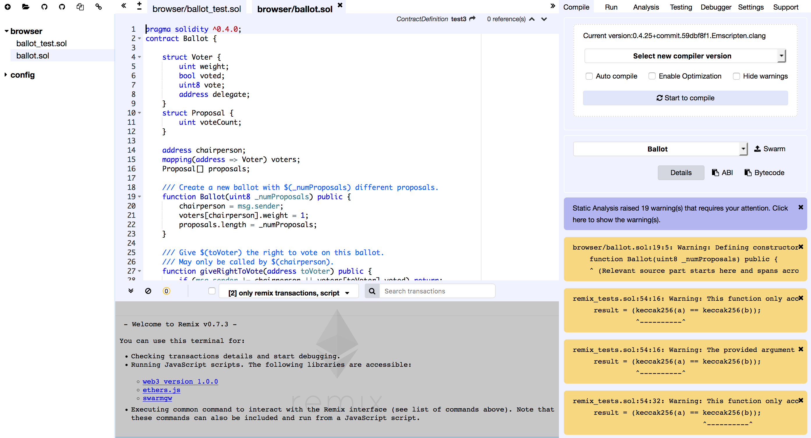
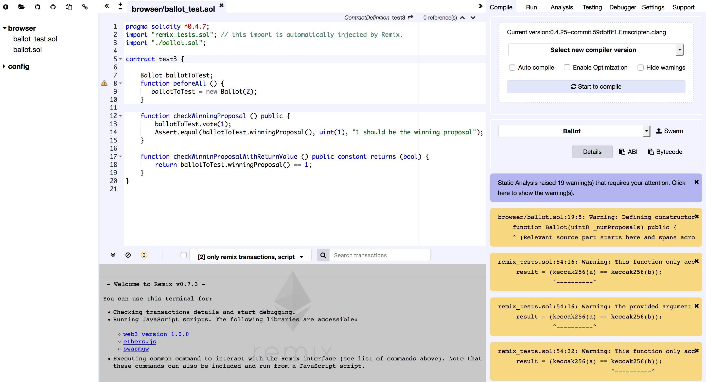
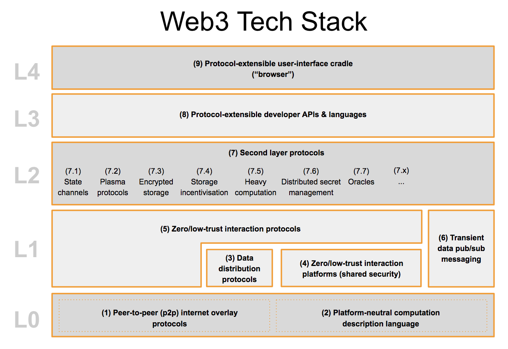

exclude:true
class: module-header ethereum/tools.remix-intro
---
name: REMIX-INTRO
# .red[Remix]: in-browser Solidity IDE

Available in your browser, now! 

.bold.center[ https://remix.ethereum.org/ ]

<p align=center>
    
</p>
???

Other images available:
    

* tabs
* new sol file
* compiling
* accounts
* deploying

ref: https://github.com/ethereum/remix-workshops/
---
exclude:true
class: module-header ethereum/project.simple-contracts
---
---
class: middle, center, invert
# Project: Eth Demos

[https://github.com/beyondlogical/eth-demos](https://github.com/beyondlogical/eth-demos)
???
TODO: copy this file and break out with each of: https://github.com/beyondlogical/eth-demos

---
# Overview

This repo is a set of introductory Solidity contracts. They are each a .sol file, and are intended to be worked on in this order:

* simple_value.sol - MVP of immutable data storage via smart contract
* simple_field.sol - a mutable data storage field
* simple_record.sol - an improved single record contract
* simple_db.sol - a contract that stores multiple records

---
# Code Repository

##  [https://github.com/beyondlogical/eth-demos](https://github.com/beyondlogical/eth-demos)

---
# Simple Value
## [https://github.com/beyondlogical/eth-demos/blob/master/simple_value.sol](https://github.com/beyondlogical/eth-demos/blob/master/simple_value.sol)

???
<p align=center>
    
</p>

---
# Simple Field
## [https://github.com/beyondlogical/eth-demos/blob/master/simple_field.sol](https://github.com/beyondlogical/eth-demos/blob/master/simple_field.sol)

???
<p align=center>
    
</p>

---
# Simple Record
## [https://github.com/beyondlogical/eth-demos/blob/master/simple_record.sol](https://github.com/beyondlogical/eth-demos/blob/master/simple_record.sol)

???
<p align=center>
    
</p>

---
# Simple DB
## [https://github.com/beyondlogical/eth-demos/blob/master/simple_db.sol](https://github.com/beyondlogical/eth-demos/blob/master/simple_record.sol)

???
<p align=center>
    
</p>

---

exclude:true
class: module-header ethereum/tokens.intro
---
class: center, middle, invert
# Tokens

---
# What is a token?

* Managed by a smart contract
* Implements a ledger, tracking
 * owner address
 * assigned value
* Observes transaction function standard, such as ERC20

???
ref: https://openzeppelin.org/api/docs/learn-about-tokens.html

---
# Finding public tokens

https://etherscan.io/tokens

---
exclude: true
# SEC token security guidelines

But... what IS a token? For the SEC, the jury is still out.

???
ref: https://www.sec.gov/litigation/investreport/34-81207.pdf

---

exclude:true
class: module-header ethereum/tokens.fungible
---
class: center, middle, invert
# Fungible Tokens

---
# ERC20 standard

An ERC20 token is a contract that keeps track of a mapping(address => uint256) that represents a user's balance. These tokens are fungible in that any one token is exactly equal to any other token; no tokens have special rights or behavior associated with them. This makes ERC20 useful for things like a medium of exchange currency, general voting rights, staking, and more.

???
todo: See Token Talk to extract slides
ref: https://openzeppelin.org/api/docs/learn-about-tokens.html
ref: https://medium.com/@dexaran820/previously-described-at-erc20-critical-problems-medium-article-db616c84acc1

---
# OpenZepplin Contracts supporting ERC20 

* IER20 — defines the interface that all ERC20 token implementations should conform to
* ERC20 — the base implementation of the ERC20 interface
* ERC20Detailed — the name(), symbol(), and decimals() getters are optional in the original standard, so ERC20Detailed adds that information to your token.

---
# OpenZepplin Contracts supporting ERC20 cont.

* ERC20Mintable — allows users with the MinterRole to call the mint() function and mint tokens to users. Minting can also be finished, locking the mint() function's behavior.
* ERC20Burnable — if your token can be burned (aka, it can be destroyed), include this one
* ERC20Capped — a type of ERC20Mintable that enforces a maximum cap on tokens; this is really useful if you want to ensure network participants that there will always be a maximum number of tokens, and is useful for making sure that multiple different minting methods don't accidentally create more tokens than you expected.
* ERC20Pausable — allows anyone with the Pauser role to pause the token, freezing transfers to and from users. This is useful if you want to stop trades until the end of a crowdsale, or if you want to have an emergency switch for freezing your tokens in the event of a large bug. Note that there are inherent decentralization tradeoffs when using a pausable token; users may not expect that their unstoppable money can be frozen by a single address!

???
After that, OpenZeppelin provides a few extra properties that you may want depending on your use-case:

---
# OpenZepplin Contracts supporting ERC20 cont.

* SafeERC20 — provides safeTransfer, safeTransferFrom, and safeApprove that are helpful wrappers around the normal ERC20 functions. Using SafeERC20 forces transfers and approvals to succeed, or the entire transaction is reverted.
* TokenTimelock — is an escrow contract for ERC20 tokens that will release some tokens after a specified timeout. This is useful for simple vesting schedules like "advisors get all of their tokens after 1 year". For a better vesting schedule, though, see TokenVesting

???
Finally, if you're working with ERC20 tokens, OpenZeppelin provides some utility contracts:

---
exclude:true
class: module-header ethereum/tokens.nonfungible
---
class: invert, middle, center
# Non-Fungible Tokens

---
# ERC721 Standard

ERC721 is a standard for representing ownership that is non-fungible aka, each token has unique properties.

???
todo: See Token Talk to extract slides
ref: https://openzeppelin.org/api/docs/learn-about-tokens.html
ref: https://github.com/ethereum/EIPs/blob/master/EIPS/eip-721.md
ref: https://nakamotoinstitute.org/shelling-out/

---
# "NFT" Word Choice

"NFT" was satisfactory to nearly everyone surveyed and is widely applicable to a broad universe of distinguishable digital assets. We recognize that "deed" is very descriptive for certain applications of this standard (notably, physical property).

Alternatives considered: distinguishable asset, title, token, asset, equity, ticket

???
ref: https://github.com/ethereum/EIPs/blob/master/EIPS/eip-721.md

---
# OpenZepplin Contracts supporting ERC721 

* ERC721 — the full implementation of ERC721, and the contract you'll most likely be inheriting from. Interfaces are part of the IERC721.sol file:
 * IERC721
 * IERC721Metadata
 * IERC721Enumerable
* IERC721Receiver — in some cases, it's beneficial to be 100% certain that a contract knows how to handle ERC721 tokens (imagine sending an in-game item to an exchange address that can't send it back!). When using safeTransferFrom(), the contract checks to see that the receiver is an IERC721Receiver, which implies that it knows how to handle ERC721 tokens. If you're writing a contract that accepts 721 tokens, you'll want to implement this interface.
* ERC721Mintable — like the ERC20 version, ERC721Mintable allows addresses with the Minter role to mint tokens.
* ERC721Pausable — like the ERC20 version, ERC721Pausable allows addresses with the Pauser role to freeze transfers of tokens.

???

https://openzeppelin.org/api/docs/learn-about-tokens.html

---
# Transfer 

ERC-721 standardizes a safe transfer function safeTransferFrom (overloaded with and without a bytes parameter) and an unsafe function transferFrom. Transfers may be initiated by:

* The owner of an NFT
* The approved address of an NFT
* An authorized operator of the current owner of an NFT


Additionally, an authorized operator may set the approved address for an NFT. This provides a powerful set of tools for wallet, broker and auction applications to quickly use a large number of NFTs.

---
# ERC-165 Standard Interface Detection

Used to expose the interfaces that a ERC-721 smart contract supports and avoid ill-equipped recipient contracts.

???
ref: http://erc721.org/
---
exclude: true
# Extensions

---
# Utility libraries

* [OpenZepplin utils/Address](https://github.com/OpenZeppelin/openzeppelin-solidity/blob/master/contracts/utils/Address.sol) - exposes
 * isContract(address) internal view returns (bool) 
* [OpenZepplin utils/SafeMath](https://github.com/OpenZeppelin/openzeppelin-solidity/blob/master/contracts/math/SafeMath.sol) - exposes
 * mul(int, int) , mul(uint, uint)
 * div(int, int) , div(uint, uint)
 * add(int, int) , add(uint, uint)
 * sub(int, int) , sub(uint, uint)
 * mod(unit, unit) 

???
https://github.com/OpenZeppelin/openzeppelin-solidity/blob/master/contracts/utils/Address.sol
---
# Library: Address

```solidity
library Address {
    /**
     * Returns whether the target address is a contract
     * @dev This function will return false if invoked during the constructor of a contract,
     * as the code is not actually created until after the constructor finishes.
     * @param account address of the account to check
     * @return whether the target address is a contract
     */
    function isContract(address account) internal view returns (bool) {
        uint256 size;
        // XXX Currently there is no better way to check if there is a contract in an address
        // than to check the size of the code at that address.
        // See https://ethereum.stackexchange.com/a/14016/36603
        // for more details about how this works.
        // TODO Check this again before the Serenity release, because all addresses will be
        // contracts then.
        // solium-disable-next-line security/no-inline-assembly
        assembly { size := extcodesize(account) }
        return size > 0;
    }
}
```
---
exclude:true
class: module-header ethereum/project.ethereum-token
---
class: center, middle, invert
# Project: Ethereum Token
[https://ethereum.org/token](https://ethereum.org/token)

???
As presented on the Ethereum.org website

This project shows you how to create a fungible token, as per the ERC20 spec.

https://theethereum.wiki/w/index.php/ERC20_Token_Standard#Approve_And_TransferFrom_Token_Balance

---
exclude:true
class: module-header ethereum/training.cryptozombies
---
class: bigpic, center

[https://cryptozombies.io/](https://cryptozombies.io/)
???
More info about the creator, Loom networks:
@ADD: https://medium.com/loom-network/everything-you-need-to-know-about-loom-network-all-in-one-place-updated-regularly-64742bd839fe

---
exclude:true
class: module-header ethereum/platform.hyperledger
---
name: HYPERLEDGER-INTRO-START
# Hyperledger

<p align=center>
    
</p>
???
Launched in 2016

Hyperledger is an open source collaborative effort created to advance cross-industry blockchain technologies. It is a global collaboration led by IBM, hosted by The Linux Foundation, including leaders in finance, banking, Internet of Things, supply chains, manufacturing and Technology.

https://www.hyperledger.org/

---
# Hyperledger Ecosystem
<p align=center>
    
</p>

???
https://hyperledger.org/wp-content/uploads/2018/07/Hyperledger_Greenhouse-59-2.png

---
# Support for Ethereum

Just recently, Hyperledger announced support for Ethereum, Solidity and Vyper
https://www.hyperledger.org/blog/2018/10/26/hyperledger-fabric-now-supports-ethereum

---
# Fab3

Another key piece we adopted from the Ethereum ecosystem is the Ethereum JSON RPC API. The API defines a systematic way clients can interact with the Ethereum network. However, due to the differences of Ethereum and Fabric, Fab3 does not completely implement the API. It does support enough instructions to allow for DApps written using the web3.js library.

https://github.com/hyperledger/fabric-chaincode-evm/blob/master/examples/EVM_Smart_Contracts.md

???
ref: https://www.hyperledger.org/blog/2018/10/26/hyperledger-fabric-now-supports-ethereum
exclude:true
class: module-header ethereum/platform.corda
---
name: PLATFORM.CORDA
# Corda

???
ref: https://cointelegraph.com/news/natwest-bank-launches-r3-corda-blockchain-based-syndicated-lending-platform

http://www.corda.net/

---
# R3 - The Company behind Corda

https://www.r3.com/

R3 builds blockchain technology to transform the way the world does business. Our global network of partners works with us to develop innovative apps for finance and commerce on our blockchain platform, Corda.

---
# Installing

http://www.corda.net/download.html

---
# Corda

Corda is an open source blockchain project, designed for business from the start. Only Corda allows you to build interoperable blockchain networks that transact in strict privacy. Corda's smart contract technology allows businesses to transact directly, with value.

https://github.com/corda/corda
???
ref: https://github.com/corda/corda

---
# Corda Features

* Smart contracts that can be written in Java and other JVM languages
* Flow framework to manage communication and negotiation between participants
* Peer-to-peer network of nodes
* "Notary" infrastructure to validate uniqueness and sequencing of transactions without global broadcast
* Enables the development and deployment of distributed apps called CorDapps
* Written in Kotlin, targeting the JVM

---
# Whitepaper

Corda:  A distributed ledger
Mike Hearn
November 29, 2016
Version 0.5

Abstract

A decentralised database with minimal trust between nodes would al-
low for the creation of a global ledger.  Such a ledger would have many
useful applications in finance, trade, supply chain tracking and more.  We
present Corda, a decentralised global database, and describe in detail how
it achieves the goal of providing a platform for decentralised app develop-
ment.  We elaborate on the high level description provided in the paper
<i>Corda: An introduction</i> and provide a detailed technical discussion.

https://docs.corda.net/_static/corda-technical-whitepaper.pdf

???
ref: https://docs.corda.net/_static/corda-technical-whitepaper.pdf

---
# Core Concepts

* The network
* The ledger
* Identity
* States
* Contracts
* Transactions
* Flows
* Consensus
* Notaries
* Time-windows
* Oracles
* Nodes
* Tradeoffs

???
ref: https://docs.corda.net/key-concepts.html

---
# Installing Corda

Follow the instructions, the environment is rather specific:

https://docs.corda.net/getting-set-up.html

---
# Software requirements

Corda uses industry-standard tools:

* Oracle JDK 8 JVM - minimum supported version 8u171
* IntelliJ IDEA - supported versions 2017.x and 2018.x (with Kotlin plugin version 1.2.51)
* Git

We also use Gradle and Kotlin, but you do not need to install them. A standalone Gradle wrapper is provided, and it will download the correct version of Kotlin.

Please note:

* Corda runs in a JVM. JVM implementations other than Oracle JDK 8 are not actively supported. However, if you do choose to use OpenJDK, you will also need to install OpenJFX
* Applications on Corda (CorDapps) can be written in any language targeting the JVM. However, Corda itself and most of the samples are written in Kotlin. Kotlin is an official Android language, and you can read more about why Kotlin is a strong successor to Java here. If you’re unfamiliar with Kotlin, there is an official getting started guide, and a series of Kotlin Koans.
* IntelliJ IDEA is recommended due to the strength of its Kotlin integration.

---
# Demobench

DemoBench is a standalone desktop application that makes it easy to configure and launch local Corda nodes. It is useful for training sessions, demos or just experimentation. 

exe & dmg available

http://www.corda.net/discover/demobench.html

---
# Running DemoBench

### Configuring a Node
Each node must have a unique name to identify it to the network map service. DemoBench will suggest node names, nearest cities and local port numbers to use. The first node will host the network map service, and we are forcing that node also to be a notary. Hence only notary services will be available to be selected in the Services list. For subsequent nodes you may also select any of Corda’s other built-in services. Press the Start node button to launch the Corda node with your configuration.

### Running Nodes
DemoBench launches each new node in a terminal emulator. The View Database, Launch Explorer and Launch Web Server buttons will all be disabled until the node has finished booting. DemoBench will then display simple statistics about the node such as its cash balance. It is currently impossible from DemoBench to restart a node that has terminated, e.g. because the user typed “bye” at the node’s shell prompt. However, that node’s data and logs still remain in its directory.

### Exiting DemoBench
When you terminate DemoBench, it will automatically shut down any nodes and explorers that it has launched and then exit. Profiles You can save the configurations and CorDapps for all of DemoBench’s currently running nodes into a profile, which is a ZIP file with the following layout, e.g.: notary/ node.conf plugins/ banka/ node.conf plugins/ bankb/ node.conf plugins/ example-cordapp.jar ... When DemoBench reloads this profile it will close any nodes that it is currently running and then launch these new nodes instead. All nodes will be created with a brand new database. Note that the node.conf files within each profile are JSON/HOCON format, and so can be extracted and edited as required.

DemoBench writes a log file to the following location:

* MacOSX/Linux - $HOME/demobench/demobench.log
* Windows - %USERPROFILE%\demobench\demobench.log

---
# CorDapps

https://docs.corda.net/cordapp-overview.html

Primary languages:
* Kotlin (Android language)
* Java

---

exclude:true
class: module-header ethereum/platform.cardano
---
# Cardano

### https://www.cardano.org/

???
ref: https://blockgeeks.com/guides/what-is-cardano/
ref: https://whycardano.com/

---
# Introducing Cardano
Cardano is a decentralised public blockchain and cryptocurrency project and is fully open source. Cardano is developing a smart contract platform which seeks to deliver more advanced features than any protocol previously developed. It is the first blockchain platform to evolve out of a scientific philosophy and a research-first driven approach. The development team consists of a large global collective of expert engineers and researchers

---
# Motivation

Cardano is a project that began in 2015 as an effort to change the way cryptocurrencies are designed and developed. The overall focus beyond a particular set of innovations is to provide a more balanced and sustainable ecosystem that better accounts for the needs of its users as well as other systems seeking integration.

In the spirit of many open source projects, Cardano did not begin with a comprehensive roadmap or even an authoritative white paper. Rather it embraced a collection of design principles, engineering best practices and avenues for exploration. These include the following:

* Separation of accounting and computation into different layers
* Implementation of core components in highly modular functional code
* Small groups of academics and developers competing with peer reviewed research
* Heavy use of interdisciplinary teams including early use of InfoSec experts
* Fast iteration between white papers, implementation and new research required to correct issues discovered during review
* Building in the ability to upgrade post-deployed systems without destroying the network
* Development of a decentralized funding mechanism for future work
* A long-term view on improving the design of cryptocurrencies so they can work on mobile devices with a reasonable and secure user experience
* Bringing stakeholders closer to the operations and maintenance of their cryptocurrency
* Acknowledging the need to account for multiple assets in the same ledger
* Abstracting transactions to include optional metadata in order to better conform to the needs of legacy systems
* Learning from the nearly 1,000 altcoins by embracing features that make sense
* Adopt a standards-driven process inspired by the Internet Engineering Task Force using a dedicated foundation to lock down the final protocol design
* Explore the social elements of commerce
* Find a healthy middle ground for regulators to interact with commerce without compromising some core principles inherited from Bitcoin

???
ref: https://whycardano.com/

---
exclude:true
class: module-header ethereum/project.grin
---
# Grin

???
ref: https://grin-tech.org/
---
# What is Grin?


---
# Why?


---
# Private

Grin has no amounts and no addresses. Transactions can be trivially aggregated. To hide where a newly created transaction comes from, it gets relayed privately (a "random walk") among peers before it is publicly announced. 

---
# Open

Grin is developed openly, by developers distributed all over the world. It's not controlled by any company, foundation or individual. The coin distribution is designed to be as fair (but not gratis) as is known to be possible. 

---
# MimbleWimble 

MimbleWimble leverages cryptography to allow most of the past transaction data to be removed. This guarantees Grin won't crumble under its own weight in the long term. 

"a radically different approach to transaction construction from Bitcoin, sup- porting noninteractive merging and cut-through of transactions,confidential transactions, and full verification of the current chainstate without requiring new users to verify the full history of any coins."

---
# Team

Andrew Poelstra
---
# MimbleWimble Whitepapers

19 July, 2016
"Tom Elvis Jedusor" original whitepaper - https://download.wpsoftware.net/bitcoin/wizardry/mimblewimble.txt

6 October 2016
Andrew Poelstra follow up whitepaper: https://download.wpsoftware.net/bitcoin/wizardry/mimblewimble.pdf
---
# Floonet test network

---
# Launched "fairly"

Grin is launched fairly, free of ICO, pre-mine or founder’s reward. We rely on donations to keep working on the project. Support the movement by purchasing some swag or making a donation. 
---
# Tutorials

Grin for Bitcoiners: https://github.com/mimblewimble/grin/blob/master/doc/grin4bitcoiners.md
GrinMW Intro: https://github.com/mimblewimble/grin/blob/master/doc/intro.md
Cuckoo Cycle PoW: https://github.com/mimblewimble/grin/blob/master/doc/pow/pow.md

ref: https://github.com/mimblewimble/grin/releases


exclude:true
class: module-header ethereum/platform.solid
---
name: PROJECT.SOLID-START
# Solid

### https://solid.mit.edu/

???
ref: https://en.wikipedia.org/wiki/Solid_(web_decentralization_project)

---
# What is Solid?

Solid is an exciting new project led by Prof. Tim Berners-Lee, inventor of the World Wide Web, taking place at MIT. The project aims to radically change the way Web applications work today, resulting in true data ownership as well as improved privacy.

Solid (derived from "social linked data") is a proposed set of conventions and tools for building decentralized social applications based on Linked Data principles. Solid is modular and extensible and it relies as much as possible on existing W3C standards and protocols.

At a glance, here is what Solid offers...

---
# True data ownership

Users should have the freedom to choose where their data resides and who is allowed to access it. By decoupling content from the application itself, users are now able to do so.

---
# Modular design

Because applications are decoupled from the data they produce, users will be able to avoid vendor lock-in, seamlessly switching between apps and personal data storage servers, without losing any data or social connections.

---
# Reusing existing data

Developers will be able to easily innovate by creating new apps or improving current apps, all while reusing existing data that was created by other apps.

---
# Specification

https://github.com/solid/solid-spec

---
# Getting Started

ref: https://solid.inrupt.com/
ref: https://solid.inrupt.com/docs/

---
# Source

https://github.com/solid/solid

---
# Developer Resources

---
# Your first Solid App

ref: https://solid.inrupt.com/docs/app-on-your-lunch-break

---
# Get a Pod

ref: https://solid.inrupt.com/get-a-solid-pod

---
# Run a Solid server

https://solid.inrupt.com/docs/installing-running-nss

```shell
$ npm install -g solid-server
```
---
# JS utilities
* solid-auth-client allows us to perform authenticated retrieval of data from pods
* RDFlib lets us parse and process that data

---
# solid-auth-client

The solid-auth-client library helps us with authenticating the user and securely fetching files from their pod. You need the following components:

---
# RDFlib.js

RDFlib.js is a JavaScript library that allows us to interact with Linked Data stored in Solid pods. You can obtain it from https://linkeddata.github.io/rdflib.js/dist/rdflib.min.js

---
# History


---
# Inrupt
https://www.inrupt.com/

---
# Resources

???
see: beyondlogical/solid-resources

Inrupt team interview: https://www.pscp.tv/w/1lPKqdWNbLYxb

gitter: https://gitter.im/solid/chat


---
# Linked Data

---
# Breadcrumbs

---
# Permissioning

---
# Registration

---
# Decentralized Authentication

---
# Inrupt Data Browser

---
# Devkit

* Helpers
* Utilities
* Libraries

---
# LDP

---
# node-solid-server

---
# Go server

---
# PHP server

---
# 
exclude:true
class: module-header ethereum/platform.ipfs
---
name: platform.ipfs
class: center, middle, invert
# IPFS
### Interplanetary File System
### P2P file hosting & sharing

Developer: Protocol Labs 
https://protocol.ai/

???

ref: https://ipfs.io/
ref: https://awesome.ipfs.io/
ref: https://docs.ipfs.io/introduction/install/
ref: https://github.com/ipfs/go-ipfs
ref: https://github.com/ipfs/go-ipfs/blob/v0.4.18/README.md
ref: https://medium.com/pinata/the-ipfs-cloud-352ecaa3ba76
ref: https://protocol.ai/

---
# Decentralized clouds


---
# What is IPFS?

* a protocol
 * that defines a content-addressed file system, coordinates content delivery and combines ideas from Kademlia, BitTorrent, Git and more.
* a filesystem
 * has directories and files and mountable filesystem via FUSE.
* a web
 * Files are accessible via HTTP gateways like https://ipfs.io. Browsers can be extended to use the ipfs:// scheme directly, and hash-addressed content guarantees authenticity
* p2p
 * It supports worldwide peer-to-peer file transfers with a completely decentralized architecture and no central point of failure.
* a CDN
 * Add a file to your local repository, and it's now available to the world with cache-friendly content-hash addressing and bittorrent-like bandwidth distribution.

---
# Version

$ ipfs --version

---
# Working around CORS with localhost

In a web browser IPFS API (either browserified or CDN-based) might encounter an error saying that the origin is not allowed. This would be a CORS ("Cross Origin Resource Sharing") failure: IPFS servers are designed to reject requests from unknown domains by default. You can whitelist the domain that you are calling from by changing your ipfs config like this:

ipfs config --json API.HTTPHeaders.Access-Control-Allow-Origin "[\"http://example.com\"]"
ipfs config --json API.HTTPHeaders.Access-Control-Allow-Credentials "[\"true\"]"
ipfs config --json API.HTTPHeaders.Access-Control-Allow-Methods "[\"PUT\", \"POST\", \"GET\"]"

---
# IPFS JS API

https://github.com/ipfs/js-ipfs-api

---
# Web API

cloudflare-ipfs.com/ipfs/<HASH>
---
# Next steps: monetizing with Filecoin

https://www.youtube.com/watch?time_continue=4&v=EClPAFPeXIQ
---
exclude:true
class: module-header ethereum/exercises.exploring-ipfs
---
# Exploring IPFS

???

ref: https://medium.com/coinmonks/a-hands-on-introduction-to-ipfs-ee65b594937
ref: https://medium.freecodecamp.org/hands-on-get-started-with-infura-and-ipfs-on-ethereum-b63635142af0

---
# Installing IPFS

Check if it's already installed:
```shell
$ which ipfs
/usr/local/bin/ipfs

$ ipfs help
USAGE:

    ipfs - Global p2p merkle-dag filesystem.
...
```
???
ref: http://ipfs.io/docs/install/

---
# Installing IPFS - Manually
* Download a package from https://dist.ipfs.io/#go-ipfs

### Mac OS X and Linux
After downloading, untar the archive, and move the ipfs binary somewhere in your executables $PATH using the install.sh script:
```
$ tar xvfz go-ipfs.tar.gz
$ cd go-ipfs
$ ./install.sh
```

### Windows
After downloading, unzip the archive, and move ipfs.exe somewhere in your %PATH%.

???
ref: https://docs.ipfs.io/introduction/install/

---
# Installing IPFS - packages

```shell
$ brew install ipfs
...
To have launchd start ipfs now and restart at login:
  brew services start ipfs
Or, if you don't want/need a background service you can just run:
  ipfs daemon
```

---
# Updating IPFS

Before we move on...

```shell
go get -u github.com/ipfs/ipfs-update
```
---
# Initializing IPFS on your system

```
ipfs init
```

???
Error upon repeat:
```
    initializing IPFS node at /Users/rj/.ipfs
    Error: ipfs configuration file already exists!
    Reinitializing would overwrite your keys.
```
---
# Download and read the README file

```
$ ipfs cat /ipfs/QmS4ustL54uo8FzR9455qaxZwuMiUhyvMcX9Ba8nUH4uVv/readme
```

---
class: invert
```
Hello and Welcome to IPFS!

██╗██████╗ ███████╗███████╗
██║██╔══██╗██╔════╝██╔════╝
██║██████╔╝█████╗  ███████╗
██║██╔═══╝ ██╔══╝  ╚════██║
██║██║     ██║     ███████║
╚═╝╚═╝     ╚═╝     ╚══════╝

If you're seeing this, you have successfully installed
IPFS and are now interfacing with the ipfs merkledag!

 -------------------------------------------------------
| Warning:                                              |
|   This is alpha software. Use at your own discretion! |
|   Much is missing or lacking polish. There are bugs.  |
|   Not yet secure. Read the security notes for more.   |
 -------------------------------------------------------

Check out some of the other files in this directory:

  ./about
  ./help
  ./quick-start     <-- usage examples
  ./readme          <-- this file
  ./security-notes
```
---
# Read the quick-start guide

```
$ ipfs cat /ipfs/QmS4ustL54uo8FzR9455qaxZwuMiUhyvMcX9Ba8nUH4uVv/quick-start
```
---
# Download a cat photo

```shell
$ ipfs cat /ipfs/QmW2WQi7j6c7UgJTarActp7tDNikE4B2qXtFCfLPdsgaTQ/cat.jpg >cat.jpg
$ open cat.jpg
```

---
# Add a file to IPFS

```
$ echo "This is a test file" > MYFILE
$ ipfs add MYFILE

added QmYYG9kKXdbbQWyfQwJsT1r2BDiFbGNfAXCRng8CMY19Gi MYFILE
 20 B / 20 B [=================================================================================================================] 100.00%

$ ipfs cat QmYYG9kKXdbbQWyfQwJsT1r2BDiFbGNfAXCRng8CMY19Gi

This is a test file
```
See full usage for the add function:
```shell
$ ipfs --help add
```
---
# Add content from STDIN to IPFS

```shell
hash=`echo "I <3 IPFS -$(whoami)" | ipfs add -q` ; curl "https://ipfs.io/ipfs/$hash"
```

---
# Going online

Open another terminal and run the daemon:
```shell
$ ipfs daemon

Initializing daemon...
go-ipfs version: 0.4.18-aefc746
Repo version: 7
System version: amd64/darwin
Golang version: go1.11.2
Swarm listening on /ip4/10.1.10.126/tcp/4001
Swarm listening on /ip4/127.0.0.1/tcp/4001
Swarm listening on /ip6/2603:3005:650b:5500::f9c3/tcp/4001
Swarm listening on /ip6/2603:3005:650b:5500:c3f:6fba:2f88:7a03/tcp/4001
Swarm listening on /ip6/2603:3005:650b:5500:f114:7720:b87d:c198/tcp/4001
Swarm listening on /ip6/::1/tcp/4001
Swarm listening on /p2p-circuit
Swarm announcing /ip4/10.1.10.126/tcp/4001
Swarm announcing /ip4/127.0.0.1/tcp/4001
Swarm announcing /ip6/2603:3005:650b:5500::f9c3/tcp/4001
Swarm announcing /ip6/2603:3005:650b:5500:c3f:6fba:2f88:7a03/tcp/4001
Swarm announcing /ip6/2603:3005:650b:5500:f114:7720:b87d:c198/tcp/4001
Swarm announcing /ip6/::1/tcp/4001
API server listening on /ip4/127.0.0.1/tcp/5001
Gateway (readonly) server listening on /ip4/127.0.0.1/tcp/8080
Daemon is ready
```

Make note of the tcp ports you get. If they are different, use yours in the following example commands.

---
# IPFS Daemon

* Network client
* Runs in the background
* Serves files (of your choosing...)

???
Test it:
```shell
hash=`echo "I <3 IPFS -$(whoami)" | ipfs add -q` ; curl "http://127.0.0.1:8080/ipfs/$hash"
```

---
# Finding peers
```shell
$ ipfs swarm peers

/ip4/104.131.131.82/tcp/4001/ipfs/QmaCpDMGvV2BGHeYERUEnRQAwe3N8SzbUtfsmvsqQLuvuJ
/ip4/128.199.219.111/tcp/4001/ipfs/QmSoLSafTMBsPKadTEgaXctDQVcqN88CNLHXMkTNwMKPnu
/ip6/2604:a880:1:20::203:d001/tcp/4001/ipfs/QmSoLPppuBtQSGwKDZT2M73ULpjvfd3aZ6ha4oFGL1KrGM
/ip6/2604:a880:800:10::4a:5001/tcp/4001/ipfs/QmSoLV4Bbm51jM9C4gDYZQ9Cy3U6aXMJDAbzgu2fzaDs64
```

These are a combination of <transport address>/ipfs/<hash-of-public-key>.

---
# Examining peers:

```shell
$ ipfs id QmaCpDMGvV2BGHeYERUEnRQAwe3N8SzbUtfsmvsqQLuvuJ
```
---
# Access the web console

```shell
$ open http://localhost:5001/webui
```

or the shared web UI:
```shell
$ open https://webui.ipfs.io/
```

---
# View your HTTPHeaders config

```shell
$ ipfs config --json API.HTTPHeaders
```

```shell
$ ipfs config edit
```

---
# Configuring CORS 

Execute: https://github.com/ipfs-shipyard/ipfs-webui/blob/master/cors-config.sh
or
```shell
$ ipfs config --json API.HTTPHeaders.Access-Control-Allow-Origin '["http://localhost:3000", "https://webui.ipfs.io"]'
$ ipfs config --json API.HTTPHeaders.Access-Control-Allow-Methods '["PUT", "GET", "POST"]'
```

To revert:
```shell
ipfs config --json API.HTTPHeaders {}
```

---
# Your IPFS configuration

```shell
$ ipfs config show
```

* Addresses
* API
* Bootstrap
* Datastore
* Discovery
* Gateway
* Identity
* Ipns
* Mounts
* Reprovider
* Swarm

See full documenation: https://github.com/ipfs/go-ipfs/blob/v0.4.15/docs/config.md
???
ref: https://github.com/ipfs/go-ipfs/blob/v0.4.15/docs/config.md

---
# Pinning

IPFS nodes periodically garbage collect any content that you haven’t explicitly told your node you’d like to keep.
To ensure that your node doesn’t garbage collect your content, you need to pin it to your node.
This will tell your node to cache that content permanently.

```shell
$ ipfs pin add -r /ipfs/<hash_of_folder>
```

???
ref: https://developers.cloudflare.com/distributed-web/ipfs-gateway/connecting-website/

---
# List local pinned files

```shell
$ ipfs pin ls
```

---
# More IPFS Examples

* Configuring Your Node
* Dealing with Blocks
* Git, Even More Distributed
* IPFS for Websites
* Making Your Own IPFS Service
* Modifying the bootstrap peers list
* Pinning Files
* Playing Videos
* Playing with the Network
* Snapshots

https://docs.ipfs.io/guides/examples/

---
exclude:true
class: module-header ethereum/org.w3f
---
# W3F


https://web3.foundation/

???
ref: https://github.com/w3f/Web3-collaboration
ref: https://github.com/w3f/Web3-wiki/wiki/Tech-Stack
ref: https://web3.foundation/
ref: https://www.reddit.com/r/web3

---
# Mission

The Web3 Foundation nurtures and stewards technologies and applications in the fields of decentralized web software protocols, particularly those which utilize modern cryptographic methods to safeguard decentralization, to the benefit and for the stability of the Web 3.0 ecosystem.

In order to build a better web, the Web3 Foundation will help to coordinate the efforts of teams working towards this common goal. The coordination of efforts will include helping to connect teams, cross-promote the products and protocols, as well as provide strategic grants when possible.


---
# Web3 tech stack


---
# Makers of Polkadot

---
# Polkadot

Polkadot is a protocol that allows independent blockchains to exchange information. Polkadot is an inter-chain blockchain protocol which unlike internet messaging protocols (e.g. TCP/IP) also enforces the order and the validity of the messages between the chains. This interoperability also allows the additional benefit of scalability by creating a general environment for multiple state machines.

???
ref: https://polkadot.network/#whatisit

---
