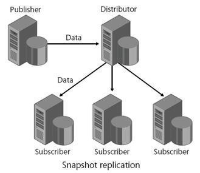

exclude:true
class: module-header ethereum/exercises.etherscan
---
class:tallpic, center
# Exploring the blockchain with Etherscan


https://etherscan.io/

---
# View Transactions


???
ref: https://rinkeby.etherscan.io/tx/0xc52b66cd7fdd5f2289be4f04a324908056703e7046bdece9677d3a7e6ccf26d7

---
exclude:true
class: module-header ethereum/exercises.github-signup
---
# Signing up for Github

---
# Selecting a username

* Consider length, last name, ease of use, professionalism 

http://github.com/<username>/<projectname>

---
# Verifying your email

If you do not verify your email address, you will not be able to:

* Create or fork repositories
* Create issues or pull requests
* Comment on issues, pull requests, or commits
* Authorize OAuth App applications
* Generate personal access tokens
* Receive email notifications

https://help.github.com/articles/verifying-your-email-address/

---
# Publishing your user page

http(s)://<username>.github.io

???
https://help.github.com/articles/user-organization-and-project-pages/

---
# Authentication setup
Connection methods:
* SSH
* HTTPS

???
ref: https://help.github.com/articles/which-remote-url-should-i-use/

---
# Connecting to GitHub with SSH

Using the SSH protocol, you can connect and authenticate to remote servers and services.
With SSH keys, you can connect to GitHub without supplying your username or password at each visit.

???
ref: https://help.github.com/articles/connecting-to-github-with-ssh/

---
# Setting up SSH access

* [Checking for existing SSH keys on your system](https://help.github.com/articles/checking-for-existing-ssh-keys)
 * Before you generate an SSH key, you can check to see if you have any existing SSH keys.
```shell
$ ls -al ~/.ssh
```
* [Generating a new SSH key and adding it to the ssh-agent](https://help.github.com/articles/generating-a-new-ssh-key-and-adding-it-to-the-ssh-agent)
 * After you've checked for existing SSH keys, you can generate a new SSH key to use for authentication, then add it to the ssh-agent.
* [Adding a new SSH key to your GitHub account](https://help.github.com/articles/adding-a-new-ssh-key-to-your-github-account)
 * To configure your GitHub account to use your new (or existing) SSH key, you'll also need to add it to your GitHub account.
* [Testing your SSH connection](https://help.github.com/articles/testing-your-ssh-connection)
 * After you've set up your SSH key and added it to your GitHub account, you can test your connection.
* [Working with SSH key passphrases](https://help.github.com/articles/working-with-ssh-key-passphrases)
 * You can secure your SSH keys and configure an authentication agent so that you won't have to reenter your passphrase every time you use your SSH keys.
???
ref: https://help.github.com/articles/connecting-to-github-with-ssh/

---
# Cloning with HTTPS

The https:// clone URLs are available on all repositories, public and private. These URLs work everywhere--even if you are behind a firewall or proxy. In certain cases, if you'd rather use SSH, you might be able to use SSH over the HTTPS port.

When you git clone, git fetch, git pull, or git push to a remote repository using HTTPS URLs on the command line, you'll be asked for your GitHub username and password.

If you have enabled two-factor authentication, or if you are accessing an organization that uses SAML single sign-on, you must provide a personal access token instead of entering your password for HTTPS Git.
???
ref: https://help.github.com/articles/which-remote-url-should-i-use/

---
# Cloning with SSH

SSH URLs provide access to a Git repository via SSH, a secure protocol. To use these URLs, you must generate an SSH keypair on your computer and add the public key to your GitHub account. For information on setting up an SSH keypair, see "Generating an SSH key."

When you git clone, git fetch, git pull, or git push to a remote repository using SSH URLs, you'll be prompted for a password and must provide your SSH key passphrase.

If you are accessing an organization that uses SAML single sign-on, you won't be able to clone with SSH. Instead, clone with the HTTPS URL.
???
ref: https://help.github.com/articles/which-remote-url-should-i-use/

---
exclude:true
class: module-header ethereum/platform.bitcoin
---
class:tallpic
# Bitcoin

![bitcoin][bitcoin-logo]
[bitcoin-logo]: ../media/bitcoin_logo.png "Bitcoin"

---
name: bitcoin-whitepaper
exclude: true

# Bitcoin Whitepaper

???

"It might make sense just to get some in case it catches on. If enough people think the same way, that becomes a self fulfilling prophecy."
Satoshi Nakamoto, 1/17/2009 - http://nakamotoinstitute.org/crash-course/

---
# Specification

There's more to Bitcoin these days than the whitepaper.

The reference implementation is considered the de-facto specification, while the network protocol is often accurately captured in 
https://en.bitcoin.it/wiki/Protocol_documentation

???
ref: https://en.bitcoin.it/wiki/Protocol_documentation

---
# Bitcoin Network Clients: "Nodes"

Software running as a bitcoin network client is called a "node", and only if it participates in searching for new valid blocks is it a miner.

A bitcoin client is the end-user software that facilitates private key generation and security, payment sending on behalf of a private key, and optionally provides:

* Useful information about the state of the network and transactions.
* Information related to the private keys under its management.
* Syndication of network events to other peer clients.

???
ref: https://en.bitcoin.it/wiki/Clients

---
# Bitcoin Core

The reference implementation of Bitcoin network clients is called Bitcoin Core.
Originally published by Satoshi, it was rebranded "Bitcoin Core" to disambiguate it from the network. Also known as the Satoshi client.
It currently has a team of maintainers, with Wladimir J. van der Laan leading the release process.

???
ref: https://en.wikipedia.org/wiki/Bitcoin_Core

---
# Bitcoin Core Implementations

Original Satoshi clients
 * Private clients pre-release
 * 0.1.0 (2009-01-09) (which supported only Windows 2000 / Windows NT and Windows XP)
 * 0.1.5 (2009-02-04)
Community client implementations
 * 0.2.0 (2009-12-17) (starts to support Linux, adoption rises)
 * 0.3.0 (2010-07-06) (Windows32, Linux, MacOS X support)
 * 0.16.0 (2018-02-26) (Latest as of 2019-01)

Many other community built clients also exist.

???
ref: https://en.bitcoin.it/wiki/Original_Bitcoin_client
ref: https://en.bitcoin.it/wiki/Bitcoind#History_of_official_bitcoind_.28and_predecessor.29_releases

---
# Full nodes

A full node is a program that fully validates transactions and blocks. Almost all full nodes also help the network by accepting transactions and blocks from other full nodes, validating those transactions and blocks, and then relaying them to further full nodes.

Most full nodes also serve lightweight clients by allowing them to transmit their transactions to the network and by notifying them when a transaction affects their wallet. If not enough nodes perform this function, clients won’t be able to connect through the peer-to-peer network—they’ll have to use centralized services instead.

???
ref: https://bitcoin.org/en/full-node

---
# Running a bitcoin full node - requirements

Recommended starting specs for a node:
* Desktop or laptop hardware running recent versions of Windows, Mac OS X, or Linux.
* 200 gigabytes of free disk space, accessible at a minimum read/write speed of 100 MB/s.
* 2 gigabytes of memory (RAM)
* A broadband Internet connection with upload speeds of at least 400 kilobits (50 kilobytes) per second
* An unmetered connection, a connection with high upload limits, or a connection you regularly monitor to ensure it doesn’t exceed its upload limits. It’s common for full nodes on high-speed connections to use 200 gigabytes upload or more a month. Download usage is around 20 gigabytes a month, plus around an additional 195 gigabytes the first time you start your node.
* 6 hours a day that your full node can be left running. (You can do other things with your computer while running a full node.) More hours would be better, and best of all would be if you can run your node continuously.

???
ref: https://bitcoin.org/en/download
ref: https://bitcoin.org/en/full-node#minimum-requirements

---
# Running a bitcoin full node - risks

* Legal: Bitcoin use is prohibited or restricted in some areas.
* Bandwidth limits: Some Internet plans will charge an additional amount for any excess upload bandwidth used that isn’t included in the plan. Worse, some providers may terminate your connection without warning because of overuse. We advise that you check whether your Internet connection is subjected to such limitations and monitor your bandwidth use so that you can stop Bitcoin Core before you reach your upload limit.
* Anti-virus: Several people have placed parts of known computer viruses in the Bitcoin block chain. This block chain data can’t infect your computer, but some anti-virus programs quarantine the data anyway, making it more difficult to run Bitcoin Core. This problem mostly affects computers running Windows.
* Attack target: Bitcoin Core powers the Bitcoin peer-to-peer network, so people who want to disrupt the network may attack Bitcoin Core users in ways that will affect other things you do with your computer, such as an attack that limits your available download bandwidth.

---
# Initial block download

Initial block download refers to the process where nodes synchronize themselves to the network by downloading blocks that are new to them. This will happen when a node is far behind the tip of the best block chain. In the process of IBD, a node does not accept incoming transactions nor request mempool transactions.

If you are trying to set up a new node following the instructions below, you will go through the IBD process at the first run, and it may take a considerable amount of time since a new node has to download the entire block chain (which is roughly 195 gigabytes now). During the download, there could be a high usage for the network and CPU (since the node has to verify the blocks downloaded), and the client will take up an increasing amount of storage space (reduce storage provides more details on reducing storage).

Before the node finishes IBD, you will not be able to see a new transaction related to your account until the client has caught up to the block containing that transaction. So your wallet may not count new payments/spendings into the balance.

???
ref: https://bitcoin.org/en/full-node#initial-block-downloadibd

---
# Wallet Security

Understand how secure the private key managed by your software is, because it's yours.
Nodes are considered "hot" wallets, as they are on a computer, ready for use and connected to the network.

???
ref: https://bitcoin.org/en/secure-your-wallet

question: Is a bitcoin client wallet on your computer more or less secure than a wallet at an exchange?

---
# BIP

[Bitcoin Improvement Proposals](https://github.com/bitcoin/bips)


"We intend BIPs to be the primary mechanisms for proposing new features, for collecting community input on an issue, and for documenting the design decisions that have gone into Bitcoin. The BIP author is responsible for building consensus within the community and documenting dissenting opinions."

???
ref: https://en.bitcoin.it/wiki/Bitcoin_Improvement_Proposals
ref: https://en.bitcoin.it/w/images/en/e/ea/BIP_Workflow.png
ref: https://en.bitcoin.it/wiki/BIP_0001
ref: https://github.com/bitcoin/bips/blob/master/bip-0002.mediawiki BIP2 - Proposal workflow


But maybe this isn't the most important part of what makes a system like Bitcoin like a DAO

---
# BIP Types

There are three kinds of BIP:
* Standards
* Informational
* Process

???

* A Standards Track BIP describes any change that affects most or all Bitcoin implementations, such as a change to the network protocol, a change in block or transaction validity rules, or any change or addition that affects the interoperability of applications using Bitcoin. Standards Track BIPs consist of two parts, a design document and a reference implementation.
* An Informational BIP describes a Bitcoin design issue, or provides general guidelines or information to the Bitcoin community, but does not propose a new feature. Informational BIPs do not necessarily represent a Bitcoin community consensus or recommendation, so users and implementors are free to ignore Informational BIPs or follow their advice.
* A Process BIP describes a process surrounding Bitcoin, or proposes a change to (or an event in) a process. Process BIPs are like Standards Track BIPs but apply to areas other than the Bitcoin protocol itself. They may propose an implementation, but not to Bitcoin's codebase; they often require community consensus; unlike Informational BIPs, they are more than recommendations, and users are typically not free to ignore them. Examples include procedures, guidelines, changes to the decision-making process, and changes to the tools or environment used in Bitcoin development. Any meta-BIP is also considered a Process BIP.

---
exclude:true
# Bitcoin as a DAC

Does the Bitcoin project count as a Decentralized, Autonomous, Corporation?

???
question: In what ways is the Bitcoin project like a Decentralized Autonomous Corporation?

---
# Joining the network

The Bitcoin client has a number of sources that it uses to locate the network on initial startup. In order of importance:

1. The primary mechanism, if the client has ever run on this machine before and its database is intact, is to look at its database. It tracks every node it has seen on the network, how long ago it last saw it, and its IP address.
2. The client can use DNS to locate a list of nodes connected to the network. One such seed is bitseed.xf2.org. The client will resolve this and get a list of Bitcoin nodes.
3. The client has a list of semi-permanent nodes compiled into it.
4. The client can connect to a well-known IRC network, irc.lfnet.org, and find other nodes that way. (This method has been removed as of version 0.8.2)
5. It takes IP addresses from the commandline (-addnode).

???
question: How does a bitcoin node know how to connect to the network? (Peer discovery)

ref: https://bitcoin.stackexchange.com/questions/2027/how-does-the-bitcoin-client-make-the-initial-connection-to-the-bitcoin-network

---
# Hashing algorithm: hashcash

Bitcoin mining uses the hashcash Proof-of-Work algorithm.

Hashcash was proposed in 1997 by Adam Back and described more formally in Back's paper "Hashcash - A Denial of Service Counter-Measure"

Parameters:
* service string
* nonce
* counter

???
ref: https://en.bitcoin.it/wiki/Block_hashing_algorithm
ref: https://en.wikipedia.org/wiki/Hashcash
ref: http://www.hashcash.org/papers/hashcash.pdf

---
# Bitcoin block header

| Field | Purpose | Updated when... | Size (Bytes) |
|---|---|---|---|
| Version | Block version number | You upgrade the software and it specifies a new version | 4 |
| hashPrevBlock | 256-bit hash of the previous block header | A new block comes in | 32 |
| hashMerkleRoot | 256-bit hash based on all of the transactions in the block | A transaction is accepted | 32 |
| Time | Current timestamp as seconds since 1970-01-01T00:00 UTC | Every few seconds | 4 |
| Bits | Current target in compact format | The difficulty is adjusted | 4 |
| Nonce | 32-bit number (starts at 0) | A hash is tried (increments) | 4 |

???
ref: https://en.bitcoin.it/wiki/Block_hashing_algorithm

---
# Bitcoin block body

The body of the block contains the transactions. These are hashed only indirectly through the Merkle root. Because transactions aren't hashed directly, hashing a block with 1 transaction takes exactly the same amount of effort as hashing a block with 10,000 transactions.

???
ref: https://en.bitcoin.it/wiki/Block_hashing_algorithm

---
# Further reading

* https://bitcoin.org/
 * https://bitcoin.org/en/faq

---

exclude:true
class: module-header ethereum/topic.blockchain-intro
---
class: middle, center, invert
# Blockchain

???
Not since the Web itself has a technology promised broader and more fundamental revolution than blockchain technology. A blockchain is a peer-to-peer distributed ledger forged by consensus, combined with a system for “smart contracts” and other assistive technologies. Together these can be used to build a new generation of transactional applications that establishes trust, accountability and transparency at their core, while streamlining business processes and legal constraints.

Think of it as an operating system for marketplaces, data-sharing networks, micro-currencies, and decentralized digital communities. It has the potential to vastly reduce the cost and complexity of getting things done in the real world.

Only an Open Source, collaborative software development approach can ensure the transparency, longevity, interoperability and support required to bring blockchain technologies forward to mainstream commercial adoption.

---
exclude: true
<video width="100%" height="" controls fullscreen>
  <source src="../media/iftf_blockchain_intro.mp4" type="video/mp4">
This browser does not support the video tag.
</video> 

---
# DAC proposal
<p align=center>
  
</p>

???
Daniel Larimer first proposed the concept of a "Decentralized Organized Company" in an article published on September 7, 2013.[10] https://letstalkbitcoin.com/is-bitcoin-overpaying-for-false-security#.Ui-p9WTFT7s

The DAC quote:

Think of a crypto-currency as shares in a Decentralized Autonomous Corporation (DAC) where the source code defines the bylaws. The goal of the DAC is to earn a profit for the shareholders by performing valuable services for the free market. With this goal in mind set out to maximize shareholder value at every stage as you design the bylaws that govern operation of the DAC.

The DAC only has one way that it can acquire the services it requires to operate and that is to pay for them with shares in the decentralized company. One service that is required is transaction validation, another is security against double-spend attacks by private (for-profit) criminals. Another service that is required is a viral marketing campaign. Other services include but are not limited to privacy for the customers and defense against traffic filtering.

The goal of a for-profit DAC is to maximize value and minimize costs. In this case, we only want the DAC to pay for useful security, but no more than necessary to maximize shareholder value.

---
exclude:true
# Autonomous Thinking Systems
<p align=center>
  
</p>

---
exclude: true
# (Non-currency) Data centric blockchains
???
    Private blockchains
    Hyperledger
    IBM
---
# Ethereum

<p align=center>
    
</p>

???
    Value + Data + Code
---
# Decentralized Applications (dApps)
<p align=center>
    
</p>
---
# Solidity
<p align=center>
  
</p>
???
Solidity for smart contract development

Turing complete
https://en.wikipedia.org/wiki/Turing_completeness

    Development
        Dapps
        Mechanism design
    Smart contracts
        Standards - ERC20, ERC721
    The DAO
        The purpose
        The hack
    Challenges
        Mining cost / env impact
        Proof of Stake (PoS) a solution?

---
# Hyperledger

<p align=center>
    
</p>
???
Launched in 2016

Hyperledger is an open source collaborative effort created to advance cross-industry blockchain technologies. It is a global collaboration led by IBM, hosted by The Linux Foundation, including leaders in finance, banking, Internet of Things, supply chains, manufacturing and Technology.

https://www.hyperledger.org/

---
# Cryptoeconomics
<p align=center>
    
</p>
???
It's hard!

Cryptoeconomics is a practical science that focuses on the design and characterization of these protocols.

Incentivization is at the core of economics: action + value

https://blockgeeks.com/guides/what-is-cryptoeconomics/
---
exclude:true
# Economics
???
Auctions - Vickery
---
# Trust

<p align=center>
 <a href="http://ncase.me/trust/">
  
 </a>
</p>

???
http://ncase.me/trust/
---
# Game Theory
<p align=center>
    
</p>
???
    Game theory is "the study of mathematical models of conflict and cooperation between intelligent rational decision-makers". Game theory is mainly used in economics, political science, and psychology, as well as in logic and computer science.

    Decision making & voting
---
# Behavioral Economics

<p align=center>
    
</p>
---
class:center,middle
# Industries
---
exclude: true
# Commerce
        Online commerce! Virtual catalogs!
        Remember Paypal?
---
# Finance
<p align=center>
    
</p>
???
Streamlined settlement, improved liquidity, increased transparency and new products/markets

---
# Healthcare

<p align=center>
    
</p>
???
    Unite disparate processes, increase data flow and liquidity, reduce costs and improve patient experience and outcomes

    Health records
---
# Supply Chain

<p align=center>
    
</p>
???
    Track parts and service provenance, ensure authenticity of goods, block counterfeits, reduce conflicts

    Provenance

    Romain outbreaks!
---
# Entertainment
<p align=center>
    
</p>
???
        Crowdfunding
        Puzzles
        Video games
---
# Politics & Governance
<p align=center>
    
</p>

???
    Problems: Diebold
    Experiements with Agora, Democracy Earth, etc
---
# Funding
<p align=center>
    
</p>
???
        Startup funding models
        ICOs
---
# Jobs

* Protocol engineer
* Platform developer
* dApp developer
--

* Auditors
* Information Security
* Penetration Testers
--

* Economist - Sociologist & Math
* Game Theorist - Poli Sci & Math
* Behavioral Economist - Psychology & Math
---
# Jobs cont.

* Front end developer
* Network engineer
* System administrator
--

* Designers
* Content writers & editors
* Media specialists
--

* Researchers
* Entrepreneurs
* Teachers & Trainers
---
# Healthcare: Proof of authenticity

<p align=center>
    
</p>
???
https://www.ethnews.com/pfizer-and-genentech-turn-to-ethereum-blockchain

Major pharmaceutical conglomerates Pfizer and Genentech, together constituting a market cap greater than $300 billion, recently announced the MediLedger blockchain platform, powered by JP Morgan's enterprise-focused, Ethereum-based Quorum, designed to keep counterfeit goods out of medical supply chains.
---
# Healthcare: Drug Tracking

<p align=center>
     </p>
</p>
???
https://www.ethnews.com/intel-will-oversee-simulated-blockchain-pilot-to-address-opioid-crisis

This spring, tech manufacturer Intel will lead several partner firms, including Johnson & Johnson, in testing a simulated version of a blockchain platform designed to track drugs across the supply chain.
---
# Healthcare: Record reconciliation

<p align=center>
     </p>
</p>
???
https://www.ethnews.com/humana-other-healthcare-firms-to-launch-blockchain-pilot-for-data-sharing

On April 2, Humana, MultiPlan, Quest Diagnostics, UnitedHealth Group's Optum, and UnitedHealthcare announced their intention to launch the trial, which aims to explore an alternative to the current data storage system.

Today, a variety of healthcare entities each maintain their own copies of healthcare provider data, and reconciling the different versions of these records can be a complicated, time-consuming, and expensive process. According to the joint press release, attempts to harmonize records currently cost the healthcare industry some $2.1 billion per year.

The participating companies hope the pilot will lead to solutions that will improve patients' "access to care" in addition to saving healthcare providers money and equipping them with the most current and accurate data available.
---
exclude:true

* Javascript
* Python
* Java, Go...
* Networking protocols
* Hyperledger
* Ethereum

---
class: center, middle
# Open questions

???
What is suitable for blockchain scale?

Solving old problems vs engaging new opportunities

Value volatility

Efficiency vs security trade-off re-evaluation

What new opportunities will these functions create that we haven't thought of yet?

---
exclude:true
class: module-header ethereum/topic.consensus
---
class: center, middle, invert
# Consensus

???

# The Problem

The consensus problem requires agreement among a number of processes (or agents) for a single data value. Some of the processes (agents) may fail or be unreliable in other ways, so consensus protocols must be fault tolerant or resilient. The processes must somehow put forth their candidate values, communicate with one another, and agree on a single consensus value.

ref: https://en.wikipedia.org/wiki/Consensus_(computer_science)

---
# Data security: ACID

* Atomicity - Transactions are often composed of multiple statements. Atomicity guarantees that each transaction is treated as a single "unit", which either succeeds completely, or fails completely.
* Consistency - ensures that a transaction can only bring the database from one valid state to another, maintaining database invariants: any data written to the database must be valid according to all defined rules, including constraints, cascades, triggers, and any combination thereof.
* Transactions - are often executed concurrently (e.g., reading and writing to multiple tables at the same time). Isolation ensures that concurrent execution of transactions leaves the database in the same state that would have been obtained if the transactions were executed sequentially.
* Durability guarantees that once a transaction has been committed, it will remain committed even in the case of a system failure (e.g., power outage or crash) 

???

ref: https://en.wikipedia.org/wiki/ACID_(computer_science)

---
class:tallpic
# Centralized data stores



---
# Database replication

Log based replication replays transactions recorded on the master node at each slave node.
Other forms may directly update the state of the db to match the master.

Eventual consistency means all databases will eventually reach agreement on the state of the data.

Slaves implicitly trust the master. Affect the master, affect all slaves.

---
# PAXOS

Paxos is a family of protocols for solving consensus in a network of unreliable processors (that is, processors that may fail). Consensus is the process of agreeing on one result among a group of participants. This problem becomes difficult when the participants or their communication medium may experience failures.

The Paxos protocol was first published in 1989 and named after a fictional legislative consensus system used on the Paxos island in Greece. It was later published as a journal article in 1998.

???
ref: https://en.wikipedia.org/wiki/Paxos_(computer_science)

---
# RAFT

Raft is a consensus algorithm designed as an alternative to Paxos. It was meant to be more understandable than Paxos by means of separation of logic, but it is also formally proven safe and offers some additional features. Raft offers a generic way to distribute a state machine across a cluster of computing systems, ensuring that each node in the cluster agrees upon the same series of state transitions.

Raft achieves consensus via an elected leader. A server in a raft cluster is either a leader or a follower, and can be a candidate in the precise case of an election (leader unavailable). The leader is responsible for log replication to the followers. It regularly informs the followers of its existence by sending a heartbeat message. Each follower has a timeout (typically between 150 and 300 ms) in which it expects the heartbeat from the leader. The timeout is reset on receiving the heartbeat. If no heartbeat is received the follower changes its status to candidate and starts a leader election.

???
ref: https://en.wikipedia.org/wiki/Raft_(computer_science)

---
# Eventual Consistency

Eventual consistency is a consistency model used in distributed computing to achieve high availability that informally guarantees that, if no new updates are made to a given data item, eventually all accesses to that item will return the last updated value. Eventual consistency, also called optimistic replication, is widely deployed in distributed systems, and has origins in early mobile computing projects. A system that has achieved eventual consistency is often said to have converged, or achieved replica convergence.

???
ref: https://en.wikipedia.org/wiki/Eventual_consistency

---
# BASE

* Basically Available
* Soft state
* Eventual consistency

---
# CAP Theorem

States that it is impossible for a distributed data store to simultaneously provide more than two out of the following three guarantees:

* Consistency: Every read receives the most recent write or an error
* Availability: Every request receives a (non-error) response – without the guarantee that it contains the most recent write
* Partition tolerance: The system continues to operate despite an arbitrary number of messages being dropped (or delayed) by the network between nodes

Database systems designed with traditional ACID guarantees in mind such as RDBMS choose consistency over availability, whereas systems designed around the BASE philosophy, common in the NoSQL movement for example, choose availability over consistency.

???
Formulated by Eric Brewer

"ACID and BASE represent two design philosophies at opposite ends of the consistency-availability spectrum. The ACID properties focus on consistency and are the traditional approach of databases. My colleagues and I created BASE in the late 1990s to capture the emerging design approaches for high availability and to make explicit both the choice and the spectrum."

ref: https://en.wikipedia.org/wiki/CAP_theorem
ref: https://en.wikipedia.org/wiki/Eric_Brewer_(scientist)
ref: https://www.infoq.com/articles/cap-twelve-years-later-how-the-rules-have-changed

---
# Decentralized networks

* Who to trust?
* Who to believe when a conflict arises?

---
exclude: true
# git repositories as decentralized databases

???
git repositories as decentralized databases

---
class: middle, center
# Byzantine failure

???
A process that experiences a Byzantine failure may send contradictory or conflicting data to other processes, or it may sleep and then resume activity after a lengthy delay. Of the two types of failures, Byzantine failures are far more disruptive. 
ref: https://en.wikipedia.org/wiki/Consensus_(computer_science)

ref: https://en.wikipedia.org/wiki/Byzantine_fault

---
# Byzantine Generals problem

<video width="100%" height="" controls>
  <source src="../media/byzantine-generals-problem.mp4" type="video/mp4">
This browser does not support the video tag.
</video>

???
ref: https://www.youtube.com/watch?v=_MwqAaVweJ8
ref: https://blockgeeks.com/guides/blockchain-consensus/
ref: https://en.wikipedia.org/wiki/Two_Generals%27_Problem

---
class: middle, center, invert
# How would you approach solving it?

---
# Distributed Consensus mechanisms

* Proof of Work (PoW)
* Proof of Stake (PoS)
* Delegated Proof of Stake (DPoS)

* Proof of Elapsed Time (PoET)
* Proof of Authority (PoA)
* Proof of Capacity
* Proof of Activity
* Proof of Burn
* Proof of Importance

???
ref: https://medium.com/the-daily-bit/9-types-of-consensus-mechanisms-that-you-didnt-know-about-49ec365179da

---
# Proof of Work

###Challenge-response
<p align=center>
    
</p>

###Solution-verification
<p align=center>
    
</p>

???
Proof-of-work is essentially one-CPU-one-vote.

The concept was invented by Cynthia Dwork and Moni Naor as presented in a 1993 journal article.

The term "Proof of Work" or POW was first coined and formalized in a 1999 paper by Markus Jakobsson and Ari Juels titled,
"Proofs of work and bread pudding protocols"  - http://www.hashcash.org/papers/bread-pudding.pdf

 A proof-of-work (PoW) system (or protocol, or function) is an economic measure to deter denial of service attacks and other service abuses such as spam on a network by requiring some work from the service requester, usually meaning processing time by a computer. The concept was invented by Cynthia Dwork and Moni Naor as presented in a 1993 journal article. The term "Proof of Work" or POW was first coined and formalized in a 1999 paper by Markus Jakobsson and Ari Juels. An early example of the proof-of-work system used to give value to a currency is the shell money of the Solomon Islands.

ref: https://en.wikipedia.org/wiki/Proof-of-work_system
ref: https://medium.com/@julianrmartinez43/understanding-proof-of-work-part-1-586d7ee6b014

---
# Longest chain

A principle for determining how to proceed with incomplete knowledge about the state of the network.

Relativity and technological constraints prevent us from doing instant communication across the globe, so two nodes can not be expected to pick the same chain as the active one. This is no problem: the mining mechanism makes sure that the chance two nodes disagree about blocks in the past decreases exponentially as they are older.

The active chain is one path from genesis block at the top to some leaf node at the bottom of the block tree. Every such path is a valid choice, but nodes are expected to pick the one with the most "work" in it they know about (where work is loosely defined as the sum of the difficulties).

The rules in practice are this: when a new block arrives, and it extends the previous active chain, we just append it to the active chain. If not, it depends on whether the branch it extends now has more work than the currently active branch. If not, we store the block and stop. If it does have more work, we do a so called "reorganisation": deactivating blocks from the old branch, and activating blocks from the new branch.

Ethereum determines the longest chain based on the total difficulty, which is embedded in the block header. Ties are broken randomly.

Total difficulty is the simple sum of block difficulty values without explicitly counting uncles. Difficulty is computed based on parent difficulty and timestamp, block timestamp, and block number, again without reference to uncles.

All of these except tiebreaking are consensus-critical, and so can be expected to be the same across all clients.

???
ref: https://bitcoin.stackexchange.com/questions/5540/what-does-the-term-longest-chain-mean
ref: https://ethereum.stackexchange.com/questions/13378/what-is-the-exact-longest-chain-rule-implemented-in-the-ethereum-homestead-p
---
# How PoW + Longest chain solves the Byzantine Generals problem 


1. The Generals agree the first plan received by all Generals will be accepted as the plan
2. A General solves the PoW problem, creating a block that is broadcast to the network so that all Generals receive it
3. Following receipt of this block, each General verifies and works on solving the next PoW problem, incorporating the prior solution into it, so that their plan adds on to the previous resolution
4. Each time a General solves a PoW problem, a block is generated and the chain begins to grow. In time, any General working on a different solution will switch over to the longest chain. This is the one most Generals are contributing to and therefore has the greatest chance of success
5. As the Generals know roughly how long a PoW solution takes to solve, after a set amount of time they will know if enough of the other Generals are also working on the same chain

???
PoW solves the Byzantine Generals Problem as it achieves a majority agreement without any central authority, in spite of the presence of unknown/potentially untrustworthy parties and despite the network not being instantaneous. It empowers the distributed and un-coordinated Generals to come to an agreement.

Through this process, the Generals can arrive at a consensus of when to attack, can estimate their chances of successfully doing so, and can prevent multiple different signals to attack being sent simultaneously.

PoW also prevents malicious actors, such as a traitorous General, from sabotaging the network by tampering with historic messages. Bitcoin, for example, stores the hash signature of the previous block in every new block. Any change to an earlier block would therefore require all successive blocks to also be changed. This would take an excessively large amount of computing power, and therefore the ledger is secure from alterations.

ref: https://www.radixdlt.com/post/what-is-proof-of-work

---
# Proof-of-Stake (PoS)

In PoS-based networks the creator of the next block is chosen via various combinations of random selection and wealth or age (i.e., the stake).

Proof of stake must have a way of defining the next valid block in any blockchain. Selection by account balance would result in (undesirable) centralization, as the single richest member would have a permanent advantage. Instead, several different methods of selection have been devised.

Unlike in proof-of-work systems, there is little cost to working on several chains.

???
ref: https://cryptoeconomics.study/overview.html#further-suggestions
ref: https://en.wikipedia.org/wiki/Proof-of-stake

---
# Delegated Proof-of-Stake (DPoS)

Various projects are using delegated proof-of-stake, or DPoS. The system uses a limited number of nodes to propose and validate blocks to the blockchain. This is meant to keep transaction processing fast, rather than using several hundred or several thousand nodes. EOS uses a limited number of block validators, 21, whose reputation may or may not drop, allowing back-up validators to replace former nodes.

---
# Proof-of-Authority (PoA)

Parity supports a PoA consensus engine to be used with Ethereum Virtual Machine (EVM) based chains. PoA is a replacement for PoW, which can be used for both public and private chain setups. There is no mining involved to secure the network with PoA, and relies on trusted ‘Validators’ to ensure that valid transactions are added to blocks, processed and executed by the EVM faithfully.

Because mining does not occur on our proposed public test net, malicious actors are prevented from acquiring testnet Ether, solving the spam attack that Ropsten is currently facing.

There is no difference in the way that contracts are executed compared to PoW chains, so developers can test their contracts and user interfaces before deploying to the mainnet in a more reliable and convenient environment.

More information about PoA can be found at: https://github.com/ethcore/parity/wiki/Proof-of-Authority-Chains

???
q: How are transactions validated in a PoA network?
q: How does PoA differ from PoW?

ref: https://github.com/ethcore/parity/wiki/Proof-of-Authority-Chains
ref: https://en.wikipedia.org/wiki/Proof-of-authority
ref: https://kovan-testnet.github.io/website/proposal/

---
exclude: true
# Proof of Autonomy (POA...)

ref: https://forum.poa.network/t/proof-of-autonomy/1743

---
exclude: true
# PoET - Proof of Elapsed Time

PoET uses new secure CPU instruction, which is more and more available in new processors like Intel builds. With these instructions, PoET ensures a safe and random selection of a so-called  “leader”. This can be compared with Bitcoin mining, in which the miners compete for a one-time access to write the blockchain. Other than Bitcoin’s proof algorithm, PoET doesn’t need specialized mining hardware.

To become a leader, every “validator” – which equals to a node or a miner – needs to use the secure CPU instruction to request a wait time. The validator with the shortest wait time will be elected as a leader. Like every good mining, algorithm PoET works like a lottery with the price to get write access to the blockchain.

??? 

Barf. Reliance on a proprietary protocol to pick a fair leader, and a clear mechanism for cheating by enabling a mechanism for a back door to operate by shortcutting and being picked leader. No thanks.

---
exclude: true
# GHOST

Greedy Heaviest Observed Subtree

ref: https://www.cryptocompare.com/coins/guides/what-is-the-ghost-protocol-for-ethereum/
ref: https://blog.ethereum.org/2015/08/01/introducing-casper-friendly-ghost/
ref: https://coincentral.com/what-is-casper-the-friendly-haunting-of-ethereum/

---
exclude: true
# Casper

"The Casper protocol is a PoS algorithm for Ethereum. A validator deposits a stake into a smart contract.  He then runs a node to participate in the consensus algorithm to propose new blocks to the chain.  This keeps the network running.  Casper the Friendly Finality Gadget (CFFG) finalizes the blocks to the chain. Validators receive rewards for behaving correctly, but the system slashes deposits of a validator acts badly."

"Casper provides accountability by detecting violations, knowing which validators violated the rules, and punishing those violators. It also provides a safe process for new validators to enter the system and existing validators to leave the system. Security defenses are integral to Casper."

"Casper exists as an independent module and lives on top of a proposal mechanism. For Ethereum, the current underlying proposal mechanism is PoW.  The first iteration of Casper will sit on top of Ethereum’s existing PoW consensus mechanism. This will make it a hybrid PoW/PoS system. The underlying PoW mechanism lends itself to upgrad to something else in the future. Some form of round-robin approach may replace the PoW component."

“Accountable safety” and “plausible liveness” define two fundamental properties of Casper.

???
ref: https://github.com/ethereum/research/blob/master/papers/casper-basics/casper_basics.pdf
ref: https://coincentral.com/what-is-casper-the-friendly-haunting-of-ethereum/

---
exclude: true
# Accountable Safety
Accountable safety prevents two conflicting checkpoints from being finalized unless at least 1/3 of validators violate the rules.

---
exclude: true
# Plausible liveness
Plausible liveness guarantees that it will always be possible to finalize a new checkpoint without any validator violating any rules if at least 2/3 of validators follow the protocol.

---
exclude:true
class: module-header ethereum/topic.cryptoeconomics
---
# Cryptoeconomics
<p align=center>
    
</p>
???
It's hard!

Cryptoeconomics is a practical science that focuses on the design and characterization of these protocols.

Incentivization is at the core of economics: action + value

ref: https://blockgeeks.com/guides/what-is-cryptoeconomics/
ref: https://cryptoeconomics.study/
ref: https://github.com/jpantunes/awesome-cryptoeconomics

---
# William Vickery

Vickrey was the first to use the tools of game theory to explain the dynamics of auctions. In his seminal paper, Vickrey derived several auction equilibria, and provided an early revenue-equivalence result. The revenue equivalence theorem remains the centrepiece of modern auction theory. The Vickrey auction is named after him.

???
https://en.wikipedia.org/wiki/William_Vickrey

Deceased, was on his way to a Georgism or "Single Tax" convention he had helped found 20 years ago.

https://en.wikipedia.org/wiki/Georgism

Vickrey was the first to use the tools of game theory to explain the dynamics of auctions.[3] In his seminal paper, Vickrey derived several auction equilibria, and provided an early revenue-equivalence result. The revenue equivalence theorem remains the centrepiece of modern auction theory. The Vickrey auction is named after him.[3]

Vickrey worked on congestion pricing, the notion that roads and other services should be priced so that users see the costs that arise from the service being fully used when there is still demand. Congestion pricing gives a signal to users to adjust their behavior or to investors to expand the service in order to remove the constraint. The theory was later partially put into action in London.

---
# Trust

<p align=center>
 <a href="http://ncase.me/trust/">
  
 </a>
</p>

???
http://ncase.me/trust/
---
# Game Theory
<p align=center>
    
</p>
???
    Game theory is "the study of mathematical models of conflict and cooperation between intelligent rational decision-makers". Game theory is mainly used in economics, political science, and psychology, as well as in logic and computer science.

    Decision making & voting
---
# Behavioral Economics

<p align=center>
    
</p>

---
# Incentive Centered Design

Incentive-centered design (ICD) is the science of designing a system or institution according to the alignment of individual and user incentives with the goals of the system. Using incentive-centered design, system designers can observe systematic and predictable tendencies in users in response to motivators to provide or manage incentives to induce a greater amount and more valuable participation. ICD is often considered when designing a system to induce desirable behaviors from users, such as participation and cooperation. It draws from principles in various areas such as economics, psychology, sociology, design, and engineering. ICD has been gaining attention in research communities due to the role it can play in helping systems benefit their users and ultimately achieve better results.

???
https://en.wikipedia.org/wiki/Incentive-centered_design

In 1996, the Nobel Prize in Economics was awarded to William Vickrey and James Mirrlees for their work in "The economic theory of incentives under asymmetric information", which was a core issue addressed by the theory of mechanism design. The theory of mechanism design was an antecedent to incentive-centered design, and in October 15, 2007, Roger Myerson, Leonid Hurwicz and Eric Maskin received the Nobel Prize in Economics from the Royal Swedish Academy of Sciences for their contributions to that theory.[3] Leonid Hurwicz was the founder of the theory of mechanism design, which is a branch in economics that deals with game theory. In mechanism design, designers try to satisfy design goals in specific sets of games by setting outcome functions and message space of the game. The idea of designing "mechanisms", or sets of institutional participation rules, in order to achieve the designer's goals for a system, is a core concept for ICD.

In 2001, the STIET program (Socio-Technical Infrastructure for Electronic Transactions) received a grant to fund for doctoral fellowships and a multidisciplinary program for the University of Michigan. The program aimed to train, research, and outreach to modern information systems through an incentive-centered design approach. The participants in the program composed of doctoral students and also faculty members of the universities. In 2004, Paul Resnick, one of the four faculty members in the STIET research group of Michigan coined the phrase "Incentive-centered Design" to describe the type of work they did. In 2007, Wayne State University joined the University of Michigan to focus the program on Incentive-centered Design, and the STIET program received a five-year renewal grant that allowed for research in incentive-centered design.[4] 

---
# Models of human behavior

---
# Homo Reciprocans

???
https://en.wikipedia.org/wiki/Homo_reciprocans

Homo reciprocans, or reciprocating human, is the concept in some economic theories of humans as cooperative actors who are motivated by improving their environment. This concept stands in contrast to the idea of homo economicus, which states the opposite theory that human beings are exclusively motivated by self-interest.

---
# Homo Economicus

???
https://en.wikipedia.org/wiki/Homo_economicus

In economics, homo economicus, or economic man, is the concept in many economic theories portraying humans as consistently rational and narrowly self-interested agents who usually pursue their subjectively-defined ends optimally.

Generally, homo economicus attempts to maximize utility as a consumer and profit as a producer.

---
# Homo Sociologicus

???
https://en.wikipedia.org/wiki/Homo_economicus#Homo_sociologicus

Hirsch et al. say that homo sociologicus is largely a tabula rasa upon which societies and cultures write values and goals; unlike economicus, sociologicus acts not to pursue selfish interests but to fulfill social roles (though the fulfillment of social roles may have a selfish rationale-— e.g. politicians or socialites). This "individual" may appear to be all society and no individual.

---
# Homo Biologicus

???
https://en.wikipedia.org/wiki/Charles_Elworthy_(scientist)  (Redirected from Homo biologicus)

Homo biologicus is linked to, but extends, the economic Homo economicus model, which describes man as a rational and self-interested being. The core hypothesis is derived from evolutionary psychology, and proposes that human psychological processes were shaped by natural and sexual selection to solve evolutionarily relevant problems.

---
# Behavioral Economics
Thinking, Fast & Slow

???
See Daniel Kahnman

---
# Cognitive Science
![cogsci] (../media/Cognitive_Science_Hexagon.svg)

???
https://en.wikipedia.org/wiki/Cognitive_science

Cognitive science is the interdisciplinary, scientific study of the mind and its processes.[2] It examines the nature, the tasks, and the functions of cognition (in a broad sense). Cognitive scientists study intelligence and behavior, with a focus on how nervous systems represent, process, and transform information. 

---
exclude:true
class: module-header ethereum/topic.how-to-get-crypto
---
class: splash invert
name: HOW-TO-GET-CRYPTO-START
# Cryptocurrency:
## How to get yours

???
ref: https://github.com/ethereum/wiki/wiki/Getting-Ether

---
# Options
* Buying
 * Directly from a person
 * Purchasing from an exchange (exchange for fiat)
* Trading
 * Exchanging one currency for another
* Earning
 * Participate in the network: "mining"
 * Get paid in crypto: "working"
* Accepting
 * Selling goods & services

---
# Buying in person

* Finding people who will sell
* Considerations
 * Risk - reputation matters
 * Trust - like any craigslist exchange (see video)
 * Transaction will link your wallet addresses

---
# Purchasing from an exchange

* Finding an exchange for purchase
 * Coinbase
* Considerations
 * Setting up your account
  * KYC
 * Timeliness
 * Wallet ownership

---
# Trading

* Finding an exchange for trade

---
# Earning by mining

* Getting set up to mine
 * Hardware
 * Electricity
 * Bandwidth

* Considerations
 * ROI
 * Efficiency
 * Proof type

---
# Earning by working

* Finding work
 * Consider open bounties!
  * https://gitcoin.co/
 * Support automated services
  * https://filecoin.io/

* Considerations
 * Volatility
  * Arrangement of value and timing of payment
 * Trust
  * Can you see it?

---
# Selling for crypto - Accepting

* Offering to accept payment in crypto
 * Which ones?
 * At what rate?

* Considerations
 * Market volatility

---

