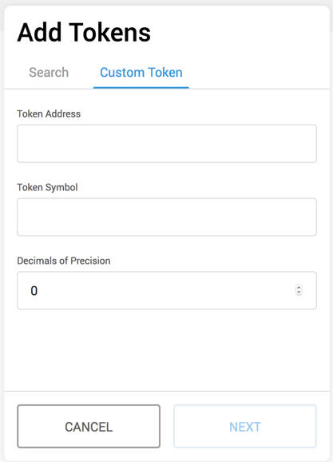
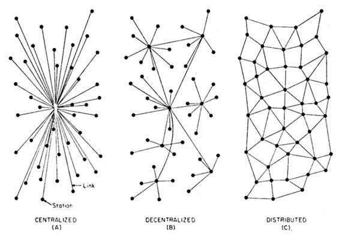

exclude:true
class: module-header ethereum/clients.geth
---
class:splash
name: CLIENTS.GETH-1-START
# Geth: Go Ethereum client


???
ref: https://geth.ethereum.org
ref: https://github.com/ethereum/go-ethereum/

TODO: see sample slides on geth for additional info

---
# GEth: Go Ethereum node client

Geth is the official go implementation of the Ethereum network client.

An entry point into the Ethereum network (main-, test- or private net), capable of running as a full node (default), archive node (retaining all historical state) or a light node (retrieving data live). It can be used by other processes as a gateway into the Ethereum network via JSON RPC endpoints exposed on top of HTTP, WebSocket and/or IPC transports.

Geth has been audited for security and will be the future basis for the enduser-facing Mist Browser, so if you have experience with web development and are interested in building frontends for dapps, you should experiment with Geth.

???

ref: https://www.ethereum.org/cli

---
# Installing on OS X

1. Install Homebrew and make sure it's up to date
2. `brew update`
3. `brew upgrade`
4. `brew tap ethereum/ethereum`
5. `brew install ethereum`

For more, see the full documentation on [Mac OSX Geth](https://github.com/ethereum/go-ethereum/wiki/Installation-Instructions-for-Mac)
---
# Installing on Windows

1. Download the latest stable binary, extract it, download the zip file, extract geth.exe from zip, open a command terminal and type:

2. `chdir <path to extracted binary>`
3. `open geth.exe`

For more, see the [full documentation on Windows Geth](https://github.com/ethereum/go-ethereum/wiki/Installation-instructions-for-Windows)

---
# Installing on Linux (Ubuntu)

On Ubuntu, execute these commands:

1. `sudo apt-get install software-properties-common`
2. `sudo add-apt-repository -y ppa:ethereum/ethereum`
3. `sudo apt-get update`
4. `sudo apt-get install ethereum`

For other environments and more instruction, see the [full documentation on Geth](https://github.com/ethereum/go-ethereum/wiki/Building-Ethereum)
---
# Other options

See https://www.ethereum.org/cli

---
# Running Geth

Mainnet, quick sync, with javascript console:
```shell
$ geth console
```
Same, but on a local test network instead of mainnet:
```shell
$ geth --testnet console # ropsten test network
$ geth --rinkeby console # rinkeby test network
```

To end your session, type '''exit'''

???
add: https://www.ethereum.org/cli

---
class:scrollable
# Other utilities included

* abigen - Source code generator to convert Ethereum contract definitions into easy to use, compile-time type-safe Go packages. It operates on plain Ethereum contract ABIs with expanded functionality if the contract bytecode is also available. However it also accepts Solidity source files, making development much more streamlined. Please see our Native DApps wiki page for details.

* bootnode - Stripped down version of our Ethereum client implementation that only takes part in the network node discovery protocol, but does not run any of the higher level application protocols. It can be used as a lightweight bootstrap node to aid in finding peers in private networks.

* evm - Developer utility version of the EVM (Ethereum Virtual Machine) that is capable of running bytecode snippets within a configurable environment and execution mode. Its purpose is to allow isolated, fine-grained debugging of EVM opcodes (e.g. evm --code 60ff60ff --debug).

* gethrpctest - Developer utility tool to support our ethereum/rpc-test test suite which validates baseline conformity to the Ethereum JSON RPC specs. Please see the test suite's readme for details.

* rlpdump - Developer utility tool to convert binary RLP (Recursive Length Prefix) dumps (data encoding used by the Ethereum protocol both network as well as consensus wise) to user friendlier hierarchical representation (e.g. rlpdump --hex CE0183FFFFFFC4C304050583616263).

* swarm - Swarm daemon and tools. This is the entrypoint for the Swarm network. swarm --help for command line options and subcommands. See Swarm README for more information.

* puppeth - a CLI wizard that aids in creating a new Ethereum network.

---
# Sync modes

Allow for running different "types" of client, performing different operations.

`$ geth --syncmode [ full | light | fast ]`

* Full
* Light
* Fast

---
# Full mode

Full synchronization with the network's blockchain, including download of all transactions.

---
# Light mode

The purpose of the light client protocol is to allow users in low-capacity environments (embedded smart property environments, smartphones, browser extensions, some desktops, etc) to maintain a high-security assurance about the current state of some particular part of the Ethereum state or verify the execution of a transaction. Although full security is only possible for a full node, the light client protocol allows light nodes processing about 1KB of data per 2 minutes to receive data from the network about the parts of the state that are of concern to them, and be sure that the data is correct provided that the majority of miners are correctly following the protocol, and perhaps even only provided that at least one honest verifying full node exists.

???
ref: https://github.com/ethereum/wiki/wiki/Light-client-protocol

---
# Fast mode

The goal of the the fast sync algorithm is to exchange processing power for bandwidth usage. Instead of processing the entire block-chain one link at a time, and replay all transactions that ever happened in history, fast syncing downloads the transaction receipts along the blocks, and pulls an entire recent state database. This allows a fast synced node to still retain its status an an archive node containing all historical data for user queries (and thus not influence the network's health in general), but at the same time to reassemble a recent network state at a fraction of the time it would take full block processing.

An outline of the fast sync algorithm would be:

* Similarly to classical sync, download the block headers and bodies that make up the blockchain
* Similarly to classical sync, verify the header chain's consistency (POW, total difficulty, etc)
* Instead of processing the blocks, download the transaction receipts as defined by the header
* Store the downloaded blockchain, along with the receipt chain, enabling all historical queries
* When the chain reaches a recent enough state (head - 1024 blocks), pause for state sync:
 * Retrieve the entire Merkel Patricia state trie defined by the root hash of the pivot point
 * For every account found in the trie, retrieve it's contract code and internal storage state trie
* Upon successful trie download, mark the pivot point (head - 1024 blocks) as the current head
* Import all remaining blocks (1024) by fully processing them as in the classical sync

???
ref: https://github.com/ethereum/go-ethereum/pull/1889
ref: https://ethereum.stackexchange.com/questions/1161/what-is-geths-fast-sync-and-why-is-it-faster

---
# Gas price oracle

Built in to geth.

Details: https://github.com/ethereum/go-ethereum/wiki/Gas-Price-Oracle

???
---
exclude:true
class: module-header ethereum/ethereum.intro
---
# Ethereum: a quick introduction
<p align=center>
    
</p>
???
More resources
https://ethereum.gitbooks.io/frontier-guide/

---
exclude: true
# Ethereum whitepaper
<p align=center>
    
</p>
???
https://github.com/ethereum/wiki/wiki/White-Paper

---
# Ethereum is a P2P network
<p align=center>
    
</p>
???
Decentralized - no single "master" node
There are "boot nodes" that are reliably available and help new nodes join the network

---
# Ethereum is P2P network software

| | |
|----|----|
| Main network | Other networks |
|  |  

</p>
???

---
exclude:true
# Participating network nodes

Full nodes - download a full copy of the blockchain's transactions
Light clients - sync up with the latest block and old root, trusting the calculations up to that point

???
Work:
* Mining: processing transactions
* Proving: checking block hashing to confirm integrity
* Facilitating interaction via transaction submission

---
# Networks

* Public main network
* Public test networks
 * Ropsten
 * Kovan - PoA network, moving to Görli
 * Rinkeby - PoA network, moving to Görli
* Private Test networks
 * testrpc / ganache
 * javascript vm
* Private networks

???
Test networks often have a single node, running locally, possibly only for the duration of the testing

ref: https://ethereum.stackexchange.com/questions/10311/what-is-olympic-frontier-morden-homestead-and-ropsten-ethereum-blockchain

---
exclude: true
# Peer discovery
???

The peer discovery algorithm is based on the kademlia protocol.

A simplified model of how the p2p algorithm works is the following:

1. you have nodes that are assumed to be always available/online (in Ethereum they are called bootstrap nodes)
2. bootstrap nodes maintain a list of all nodes that connected to them in a period of time (predefined temporal value, for example last 24 hours)
3. when peers (Ethereum client applications such as eth, geth, pyethapp, etc.) connect to the Ethreum network, they first connect to the bootstrap nodes which share the lists of peers that have connected to them in the last predefined time period
4. the connecting peers then synchronize with the peers and may prune the connections to the bootstrap nodes since they are no longer essential in peer discovery (the peers can perform discovery on their own)
ref: https://ethereum.stackexchange.com/questions/7743/what-are-the-peer-discovery-mechanisms-involved-in-ethereum?noredirect=1&lq=1

---
# Hashes

* Functions that transform data
* Accept arbitrary input as a serialized string
* Produce uniform length output
* Output, the has, is arbitrary - not related to the input
* Same input = Same output
* Keccak-256 (SHA3) is the heavy lifter among hashing functions in Ethereum

???

MD5: An algorithm is a widely used hash function producing a 128-bit hash value. Although MD5 was initially designed to be used as a cryptographic hash function, it has been found to suffer from extensive vulnerabilities. It can still be used as a checksum to verify data integrity, but only against unintentional corruption.

SHA3: A hash function formerly called Keccak, chosen in 2012 after a public competition among non-NSA designers. It supports the same hash lengths as SHA-2, and its internal structure differs significantly from the rest of the SHA family.

---
# Hash uses

* Different input SHOULD produce different output
** If not, this is a collision
* One-way function
* Small changes to the input will produce a significantly different output
* Useful to quickly compare two pieces of data
* The harder to compute a collision, the better

???
Being able to take data of arbitrary size - say the entirety of a novel, or a hard drive, or a database - and tell if it is identical to another piece of data

"One basic requirement of any cryptographic hash function is that it should be computationally infeasible to find two non-identical messages which hash to the same value. MD5 fails this requirement catastrophically; such collisions can be found in seconds on an ordinary home computer."
ref: https://en.wikipedia.org/wiki/MD5

---
exclude: true
# Hash functions

MD5: An algorithm is a widely used hash function producing a 128-bit hash value. Although MD5 was initially designed to be used as a cryptographic hash function, it has been found to suffer from extensive vulnerabilities. It can still be used as a checksum to verify data integrity, but only against unintentional corruption.

SHA0: A retronym applied to the original version of the 160-bit hash function published in 1993 under the name "SHA". It was withdrawn shortly after publication due to an undisclosed "significant flaw" and replaced by the slightly revised version SHA-1.

SHA1: A 160-bit hash function which resembles the earlier MD5 algorithm. This was designed by the National Security Agency (NSA) to be part of the Digital Signature Algorithm. Cryptographic weaknesses were discovered in SHA-1, and the standard was no longer approved for most cryptographic uses after 2010.

SHA2: A family of two similar hash functions, with different block sizes, known as SHA-256 and SHA-512. They differ in the word size; SHA-256 uses 32-bit words where SHA-512 uses 64-bit words. There are also truncated versions of each standard, known as SHA-224, SHA-384, SHA-512/224 and SHA-512/256. These were also designed by the NSA.

SHA3: A hash function formerly called Keccak, chosen in 2012 after a public competition among non-NSA designers. It supports the same hash lengths as SHA-2, and its internal structure differs significantly from the rest of the SHA family.

???
ref: https://en.wikipedia.org/wiki/MD5
ref: https://en.wikipedia.org/wiki/Secure_Hash_Algorithms
ADD: https://en.wikipedia.org/wiki/Merkle%E2%80%93Damg%C3%A5rd_construction

---
exclude: true
# Merkle Tree
<p align=center>
    
</p>
???
A hashes of hashes!

Merkle proofs make it easy to compare hierarchies and identify differences caused by undesired changes, such as tampering or corruption

Git uses merkle trees for just this purpose

File hashes are useful as an ID for that file

ref: https://www.youtube.com/watch?v=-SMliFtoPn8

---
# Blockchains are:
## Public ledgers

<p align=center>

</p>
???
secured via distributed verification
permissioned via account addresses

---
# Blockchains are:
## Append-only databasees

<p align=center>
    
</p>

An ever-growing merkle tree

* Data is composed into sets called blocks
* Hashing old root + new block = new root
* Repeat ad infinitum

???
Root (hash of existing data) + new data, hashed, = new root
Locks in the order of additional data: no tampering with the order possible without changing all the following hashes

---
exclude:true
# Blockchains are:
## Directed acyclic graph (DAG)

<p align=center>
    
</p>

???
In mathematics and computer science, a directed acyclic graph, is **a finite directed graph with no directed cycles**. That is, it consists of finitely many vertices and edges, with each edge directed from one vertex to another, such that there is no way to start at any vertex v and follow a consistently-directed sequence of edges that eventually loops back to v again. Equivalently, a DAG is a directed graph that has a topological ordering, a sequence of the vertices such that every edge is directed from earlier to later in the sequence.

---
<style>
    .red { color: red }
</style>
# Reaching Consensus

How do we know which root to use when multiple nodes are contending with different options?

Who to choose?

--
<b>Let participants compete!</b>

Type of competition is the .red[Consensus Protocol]

???
Because we want a fair competition, we use a method that should provide fair and equal distribution across all participants

---
class: middle, center
# Proof of work
???
Based on performing calculations known to be hard
Difficulty can be adjusted to tune the time it takes to add a new block ("blocktime")

???

---
# Incentivizing participants
<p align=center>
    
</p>
???
* Miner who contributes the next block gets the "block reward"
* Reward is cryptocurrency--bitcoin, ether--used to pay transaction fees and as currency
* Miner gets transaction fees - cost of doing the work to process the transactions
** This is why there is a "gas cost"
** prevent spam, DOS attacks
* Encourages miners to process blocks with transactions
* Encourages users to pay fees depending on urgency
** This is why you can adjust the "gas limit"

---
exclude: true
# Ethereum VM

Virtual machine state is the result of previous transactions: the previous "block"

---
exclude: true
# Ethereum Block composition
* Timestamp
* List of transactions
* Root hash
* Hash
* Uncles - would-be parent blocks that lost
* Miner address
* Difficulty
* Nonce
* Gas used
* Reward

---
# Transaction composition
* from address
* to address
* gas price per operation
* gas limit per transaction
* value sent (in ether)
* data
* signature

---
# Ether denomonations

| Unit  | Wei Value  | Wei |
|---|---|---|
| wei   | 1 wei    | 1 |
| gwei  | 1e9 wei  | 1,000,000,000 |
| ether | 1e18 wei | 1,000,000,000,000,000,000 |

???
ref: https://github.com/ethereum/EIPs/issues/33

The whitepaper only has wei, szabo, finney, ether: https://github.com/ethereum/wiki/wiki/White-Paper

web3.js has shannon etc. https://github.com/ethereum/web3.js/blob/master/lib/utils/utils.js

These other unit names are not popular and cause confusion, recent discussion in top comment: https://www.reddit.com/r/ethereum/comments/3to11c/eip_102_serenity_rename_gas_to_mana_vbuterin/

ref: https://ethereum.stackexchange.com/questions/253/the-ether-denominations-are-called-finney-szabo-and-wei-what-who-are-these-na

---
# Accounts

Accounts are identified by a 160 bit hash number

.center[Example:]
.center[<b>0x0FAfCFf23DACd4E828C5af786b19eF1Df8A532B5</b>]
.center[(Not an address I own, don't send ETH here!)]

--
There are 2 types of accounts, both identified by a 160 bit hash number

--
* EOA: externally owned account (<b>just value</b>) 
 * tracks (stores) ONLY value 
 * accessed via private key
 * not allocated a location, but each transaction in order updates the value
 * address derived from last 20 

* Smart contract (<b>value + .red[code]</b>)
 * accessed via function call

???
An address acts as a key into the blockchain's state trie
Wallets have no code
Allocation of smart contract addresses is somehow sequential, preventing duplicates
State storage space is allocated right after the smart contract code itself

In Ethereum, the state is made up of objects called "accounts", with each account having a 20-byte address and state transitions being direct transfers of value and information between accounts. An Ethereum account contains four fields:

* The nonce, a counter used to make sure each transaction can only be processed once
* The account's current ether balance
* The account's contract code, if present
* The account's storage (empty by default)

"Ether" is the main internal crypto-fuel of Ethereum, and is used to pay transaction fees. In general, there are two types of accounts: externally owned accounts, controlled by private keys, and contract accounts, controlled by their contract code. An externally owned account has no code, and one can send messages from an externally owned account by creating and signing a transaction; in a contract account, every time the contract account receives a message its code activates, allowing it to read and write to internal storage and send other messages or create contracts in turn.

Note that "contracts" in Ethereum should not be seen as something that should be "fulfilled" or "complied with"; rather, they are more like "autonomous agents" that live inside of the Ethereum execution environment, always executing a specific piece of code when "poked" by a message or transaction, and having direct control over their own ether balance and their own key/value store to keep track of persistent variables.

---
exclude: true
# Assigning a new address

1. Generate a new private key
2. Derive the public key from the private key
3. Derive the address from the public key

???

Deriving the address
1. Start with the public key (128 characters / 64 bytes)
2. Take the Keccak-256 hash of the public key. You should now have a string that is 64 characters / 32 bytes. (note: SHA3-256 eventually became the standard, but Ethereum uses Keccak)
3. Take the last 40 characters / 20 bytes of this public key (Keccak-256). Or, in other words, drop the first 24 characters / 12 bytes. These 40 characters / 20 bytes are the address. When prefixed with 0x it becomes 42 characters long.

ref: https://ethereum.stackexchange.com/questions/51647/the-difference-between-contract-address-and-wallet-address

---
exclude: true
# Assigning addresses
???
https://ethereum.stackexchange.com/questions/3542/how-are-ethereum-addresses-generated

---
# Ethereum timeline (1/2)

* 2013 November: Ethereum whitepaper published
* 2014 January: public announcement and initial team formation: Vitalik Buterin, Mihai Alisie, Anthony Di Iorio, and Charles Hoskinson. Initial development under a Swiss company called Ethereum Switzerland GmbH
* 2014 June: Ethereum Foundation founded
* 2014 July and August: Ethereum crowdsale, Ethereum becomes available in exchange for Bitcoin. 11.9 million Ethereum tokens were sold (about 13% of the circulating supply), raising about 18.4 million USD
* 2014 August: Gavin Wood proposes Solidity language for smart contracts
* 2015 May: Olympic testnet launched
* 2015 July: "Frontier" phase of network launched. Basic functionality, no guarantees on safety or security
* 2015 August: Augur launches first ICO
* 2016 March: "Homestead" launches as the first "safe" version of the Ethereum platform

???
* 2013 November:
After proposing a scripting language for Bitcoin and having the idea rejected by the community, Vitalik Buterin publishes the Ethereum whitepaper, proposing inclusion of a virtual machine in the network clients, the Ethereum Virtual Machine. This would allow for the execution and verification of smart contracts.

---
# Ethereum timeline (2/2)

* 2016 May: DAO crowdfund
* 2016 June: DAO reentrance hack exploit
* 2016 July: Vote called and decision made to hard fork, in order to reverse the DAO hack transactions. ETC forks.
* 2016 October: "Tangerine whistle" first update/fork released
* 2016 November: "Spurious Dragon" second hard fork
* 2017 October: "Byzantium" release (pt 1/2 of Metropolis, 3rd of 4 phases on the roadmap) adds zkSNARK support and other features
* 2019 January: ETC susceptible to double spend attacks
* 2019 February: Constantinople update due
* TBD: Serenity update, moving consensus on mainnet from PoW to PoS

???

* 2016 July
as a result of the exploitation of a flaw in The DAO project's smart contract software, and subsequent theft of $50 million worth of Ether, Ethereum was split into two separate blockchains – the new separate version became Ethereum (ETH) with the theft reversed, and the original continued as Ethereum Classic (ETC).
Ethereum network implemented a “hard fork” to refund the money users put into The DAO. This was accomplished using a block that moved all Ether from The DAO and child DAO accounts into a “refund contract” account that only allowed affected users to withdraw their original investment.

* 2016 October: Tangerine whistle - in response to attackers using the low cost of operations to launch Denial of Service attacks against the Ethereum network. By executing a large number of computationally expensive but gas-cheap operations on the Ethereum blockchain, the attacker was able to delay transactions on Ethereum, slowing down the Ethereum Virtual Machine.

* 2016 November: Spurious dragon - hard fork of the Ethereum blockchain designed to thwart the Denial of Service attackers creating "empty accounts" in order to attack the network.

ref: https://en.wikipedia.org/wiki/The_DAO_(organization)
ref: https://www.coinmama.com/guide/history-of-ethereum
ref: https://en.wikipedia.org/wiki/Ethereum_Classic
ref: https://en.wikipedia.org/wiki/Gavin_Wood

---
# Version / "fork" history

|    |                  |                    |              |
|----|------------------|--------------------|--------------|
| 0. | Genesis          | @ block 0          |  ~ Jul 30 2015 (first block mined)
|0.1 | Ice Age          | @ block #200,000   | on Sep 07 2015
| 1. | Homestead        | @ block #1,150,000 | on Mar 14 2016
| 2. | DAO              | @ block #1,920,000 | on Jul 20 2016 (ETC spins off)
| 3. | Tangerine Whistle| @ block #2,463,000 | on Oct 18 2016
| 4. | Spurious Dragon  | @ block #2,675,000 | on Nov 18 2016
| 5. | Byzantium        | @ block #4,370,000 | on Oct 12 2017

???
ref: https://ethereum.stackexchange.com/questions/13014/please-provide-a-summary-of-the-ethereum-hard-forks

see also media/ethereum-forks-map.png

---
exclude:true
class: module-header ethereum/ethereum.nodes
---
# Ethereum Nodes

Network clients participating in network activity.

---
# Stateless nodes

* Don't download the blockchain

???
ref: https://ethereum-magicians.org/t/towards-a-stateless-node-api/1458
ref: https://ethresear.ch/t/the-stateless-client-concept/172
ref: https://medium.com/coinmonks/stateful-vs-stateless-blockchain-contracts-bcd1b0c25ff

---
exclude:true
class: module-header ethereum/exercises.geth-setup
---
class: center, middle, invert
# Geth: Go ethereum network client

---
# Installing geth

---
* Setting up a new account

---
* Running a full node

`$ geth` (default mode)
`$ geth --syncmode "full"`

---
* Running a light node
`$ geth --syncmode "light"`

???
ref: https://github.com/ethereum/wiki/wiki/Light-client-protocol
---
* Running a fast node
`$ geth --syncmode "fast"`

---
* public Main net
* public test net
* local test net

---
* Importing an existing account

---
exclude:true
class: module-header ethereum/exercises.metamask-add-token
---
# Adding tokens to Metamask

---
# The token

* What network?
* Contract address

---
# Confirm information

Look up the contract address on etherscan.io. Ensure that you're using the right interface for your network, i.e. rinkeby.etherscan.io if you're testing on rinkeby.

---
# Open Metamask

---
# Connect to the appropriate network

* Token ledgers are smart contracts.
* Smart contract addresses are network specific.

---
# "Add Token" 

*You must be on the correct network BEFORE clicking "Add Token"*

---
# "Add Token" 

---
# Select "Custom Token"

---
# Provide token contract address

---
# Note: ticker & decimals retrieved from contract

---
# Note new balance

---
# Now let's send some tokens!

NOTE: Your account will need some rinkeby eth to place this transaction.
---
# Open to the account with tokens
* Check your network!
---
# Click on the token's ticker
---
# Click "Send" and enter details
* Click in the "To" field and select another account from the dropdown of your accounts 

* Set the Amount to something greater than 0
* Click Next
---
# Moving all tokens?
* Click the "Max" anchor below "Amount:" to query your remaining tokens and use that amount automatically.
---
# Review transaction details & Confirm

* Click "Confirm" and wait for the transaction to process...
---
# Change account to check recipient token balance

---
exclude:true
class: module-header ethereum/exercises.metamask-setup
---
class: middle, center, invert
# Getting started with Metamask

???

---
name:installation
# Installing

---
name:new-account
# Setting up your account

---
name:safety-first
# Securing your accounts

exclude:true
class: module-header ethereum/exercises.paper-wallet-creation
---
# Creating a paper wallet

ref: https://github.com/blockchainbuddha/Walrus-Paper-Wallet-Generator
ref: https://medium.com/@pi0neerpat/walrus-paper-wallet-5c39b89c9e22
ref: https://blog.goodaudience.com/burner-wallets-the-average-users-solution-to-purchasing-coffee-or-beer-with-crypto-c5863123ceac
---

exclude:true
class: module-header ethereum/exercises.tracing-transactions
---
# Exercise: Tracing value with blockchain explorers

???
Have students use etherscan or such to watch value transacted through a series of contracts.

skill: finding contract addresses
skill: looking up transaction details on the blockchain
see: topic.blockchain-explorers.md

---
exclude:true
class: module-header ethereum/platform.ethereum
---
# Ethereum: a quick introduction
<p align=center>
    
</p>
???
ref: https://www.ethereum.org/

---
# Ethereum is a P2P network

???
Decentralized - no single "master" node
There are "boot nodes" that are reliably available and help new nodes join the network

---
exclude:true
# Participating network nodes

Full nodes - download a full copy of the blockchain's transactions
Light nodes - sync up with the latest block and old root, trusting the calculations up to that point
Stateless nodes - doesn't download, only validates (not present in Ethereum 1.0)

???
Work:
* Mining: processing transactions
* Proving: checking block hashing to confirm integrity
---
# Networks

* Public main network
* Private networks
* Public test networks
** Rinkeby
** Ropsten
** Kovan
* Private Test networks
** testrpc / ganache
** javascript vm
???
Test networks often have a single node, running locally, possibly only for the duration of the testing
---
# Peer discovery
???

The peer discovery algorithm is based on the kademlia protocol.

A simplified model of how the p2p algorithm works is the following:

1. you have nodes that are assumed to be always available/online (in Ethereum they are called bootstrap nodes)
2. bootstrap nodes maintain a list of all nodes that connected to them in a period of time (predefined temporal value, for example last 24 hours)
3. when peers (Ethereum client applications such as eth, geth, pyethapp, etc.) connect to the Ethreum network, they first connect to the bootstrap nodes which share the lists of peers that have connected to them in the last predefined time period
4. the connecting peers then synchronize with the peers and may prune the connections to the bootstrap nodes since they are no longer essential in peer discovery (the peers can perform discovery on their own)
ref: https://ethereum.stackexchange.com/questions/7743/what-are-the-peer-discovery-mechanisms-involved-in-ethereum?noredirect=1&lq=1

---
# Hashes

* Functions that transform data
* Accept arbitrary input as a serialized string
* Produce uniform length output
* Output, the has, is arbitrary - not related to the input
* Same input = Same output

???
---
# Hash uses

* Different input SHOULD produce different output
** If not, this is a collision
* One-way function
* Small changes to the input will produce a significantly different output
* Useful to quickly compare two pieces of data
* The harder to compute a collision, the better

???
Being able to take data of arbitrary size - say the entirety of a novel, or a hard drive, or a database - and tell if it is identical to another piece of data

"One basic requirement of any cryptographic hash function is that it should be computationally infeasible to find two non-identical messages which hash to the same value. MD5 fails this requirement catastrophically; such collisions can be found in seconds on an ordinary home computer."
ref: https://en.wikipedia.org/wiki/MD5

---
class: hideslide
# Hash functions

MD5: An algorithm is a widely used hash function producing a 128-bit hash value. Although MD5 was initially designed to be used as a cryptographic hash function, it has been found to suffer from extensive vulnerabilities. It can still be used as a checksum to verify data integrity, but only against unintentional corruption.

SHA0: A retronym applied to the original version of the 160-bit hash function published in 1993 under the name "SHA". It was withdrawn shortly after publication due to an undisclosed "significant flaw" and replaced by the slightly revised version SHA-1.

SHA1: A 160-bit hash function which resembles the earlier MD5 algorithm. This was designed by the National Security Agency (NSA) to be part of the Digital Signature Algorithm. Cryptographic weaknesses were discovered in SHA-1, and the standard was no longer approved for most cryptographic uses after 2010.

SHA2: A family of two similar hash functions, with different block sizes, known as SHA-256 and SHA-512. They differ in the word size; SHA-256 uses 32-bit words where SHA-512 uses 64-bit words. There are also truncated versions of each standard, known as SHA-224, SHA-384, SHA-512/224 and SHA-512/256. These were also designed by the NSA.

SHA3: A hash function formerly called Keccak, chosen in 2012 after a public competition among non-NSA designers. It supports the same hash lengths as SHA-2, and its internal structure differs significantly from the rest of the SHA family.

???
ref: https://en.wikipedia.org/wiki/MD5
ref: https://en.wikipedia.org/wiki/Secure_Hash_Algorithms
ADD: https://en.wikipedia.org/wiki/Merkle%E2%80%93Damg%C3%A5rd_construction
---
# Merkle Tree
<p align=center>
    
</p>
The Yellow Paper states that it assumes implementations will maintain the world state and transactions in a modified Merkle Patricia tree (trie)

???
A tree of hashes of hashes (and hashes of data for the leaves)!

In a Merkle tree, the leaf nodes contain the hash of a block of data and the non-leaf nodes contain the hash of its children nodes.

Git uses merkle trees for just this purpose

File hashes are useful as an ID for that file

ref: https://www.youtube.com/watch?v=-SMliFtoPn8
ref: https://pegasys.tech/ethereum-explained-merkle-trees-world-state-transactions-and-more/
ref: https://github.com/ethereum/wiki/wiki/Patricia-Tree

---
# Merkle Proofs

Merkle proofs make it easy to compare hierarchies and identify differences caused by undesired changes, such as tampering or corruption

???
ref: https://medium.com/crypto-0-nite/merkle-proofs-explained-6dd429623dc5

---
# World State

The world state is a mapping between addresses (accounts) and account states. The world state is not stored on the blockchain but the Yellow Paper states its expected implementations store this data in a trie (also referred as the state database or state trie). The world state can be seen as the global state that is constantly updated by transaction executions. The Ethereum network is like a decentralized computer and the world state is considered this computer’s hard drive.

All the information about Ethereum accounts live in the world state and is stored in the world state trie. If you want to know the balance of an account, or the current state of a smart contract, you query the world state trie to retrieve the account state of that account. I’ll describe how this data is stored shortly.

???
ref: https://pegasys.tech/ethereum-explained-merkle-trees-world-state-transactions-and-more/
ref: https://medium.com/cybermiles/diving-into-ethereums-world-state-c893102030ed

---
# Account State

The account state contains information about an Ethereum account. For example, it stores how much Ether an account has and the number of transactions sent by the account. Each account has an account state.

* nonce
 * Number of transactions sent from this address (if this is an External Owned Account – EOA) or the number of contract-creations made by this account (don’t worry about what contract-creations means for now). 

* balance
 * Total Ether (in Wei) owned by this account. 

* storageRoot
 * Hash of the root node of the account storage trie

* codeHash
 * For contract accounts, hash of the EVM code of this account. For EOAs, this will be empty. 

---
# Blockchains

An ever-growing merkle tree

* Data is composed into sets called blocks
* Hashing old root + new block = new root
* Repeat ad infinitum

???

Root (hash of existing data) + new data, hashed, = new root
Locks in the order of additional data: no tampering with the order possible without changing all the following hashes

---
# Reaching Consensus

How do we know which root to use when multiple nodes are contending with different candidates for the next block to add?

Who to choose?
--
Let participants compete!

Type of competition is the Consensus Protocol

???
Because we want a fair competition, we use a method that should provide fair and equal distribution across all participants

---
# Proof of work

* The original method for Bitcoin & Ethereum
* Based on performing calculations known to be hard
* Difficulty can be adjusted to tune the time it takes to add a new block ("blocktime")
* Ethereum plans transition to "Proof of work"

???

???
---
# Incentivizing participants

???
* Miner who contributes the next block gets the "block reward"
* Reward is cryptocurrency--bitcoin, ether--used to pay transaction fees and as currency
* Miner gets transaction fees - cost of doing the work to process the transactions
** This is why there is a "gas cost"
** prevent spam, DOS attacks
* Encourages miners to process blocks with transactions
* Encourages users to pay fees depending on urgency
** This is why you can adjust the "gas limit"

---
class: hideslide
# Ethereum VM

Virtual machine state is the result of previous transactions: the previous "block"
---
class: hideslide
# Ethereum Block composition
* Timestamp
* List of transactions
* Root hash
* Hash
* Uncles - would-be parent blocks that lost
* Miner address
* Difficulty
* Nonce
* Gas used
* Reward
---
# Transactions

1. Transactions that transfer value between two EOAs (e.g., change the sender and receiver account balances)
2. Transactions that send a message call to a contract (e.g., set a value in the smart contract by sending a message call that executes a setter method)
3. Transactions that deploy a contract (therefore, create an account, the contract account)

???
Technically 1&2 are the same, but useful to distinguish them

ref: https://pegasys.tech/ethereum-explained-merkle-trees-world-state-transactions-and-more/
ref: https://medium.com/@codetractio/inside-an-ethereum-transaction-fa94ffca912f
ref: https://medium.com/blockchannel/life-cycle-of-an-ethereum-transaction-e5c66bae0f6e

---
class:hideslide
# Transaction composition
* from address
* to address
* gas price per operation
* gas limit per transaction
* value sent (in ether)
* data
* signature


*nonce
    Number of transactions sent by the account that created the transaction.

*gasPrice
    Value (in Wei) that will be paid per unit of gas for the computation costs of executing this transaction.

*gasLimit
    Maximum amount of gas to be used while executing this transaction.

*to
    -If this transaction is transferring Ether, address of the EOA account that will receive a value transfer.
    -If this transaction is sending a message to a contract (e.g., calling a method in the smart contract), this is address of the contract.
    -If this transactions is creating a contract, this value is always empty.

*value
    -If this transaction is transferring Ether, amount in Wei that will be transferred to the recipient account.
    -If this transaction is sending a message to a contract, amount of Wei payable by the smart contract receiving the message.
    -If this transaction is creating a contract, this is the amount of Wei that will be added to the balance of the created contract.

*v, r, s
    Values used in the cryptographic signature of the transaction used to determine the sender of the transaction.

*data (only for value transfer and sending a message call to a smart contract)
    Input data of the message call (e.g., imagine you are trying to execute a setter method in your smart contract, the data field would contain the identifier of the setter method and the value that should be passed as parameter).

*init (only for contract creation)
    The EVM-code utilized for initialization of the contract.

???

Not surprisingly, all transactions in a block are stored in a trie. And the root hash of this trie is stored in the…block header! 
ref: 
---
class: hideslide
# Ether denomonations
---
# Addresses

There are 2 types of address, both identified by a 160 bit hash number

* EOA: externally owned account (just value) 
** tracks (stores) ONLY value 
** accessed via private key
** not allocated a location, but each transaction in order updates the value
** address derived from last 20 

* smart contract (value + code)
** accessed via function call
???
An address acts as a key into the blockchain's state trie
Wallets have no code
Allocation of smart contract addresses is somehow sequential, preventing duplicates
State storage space is allocated right after the smart contract code itself

---
class: hideslide
# Assigning a new address

1. Generate a new private key
2. Derive the public key from the private key
3. Derive the address from the public key

???

Deriving the address
1. Start with the public key (128 characters / 64 bytes)
2. Take the Keccak-256 hash of the public key. You should now have a string that is 64 characters / 32 bytes. (note: SHA3-256 eventually became the standard, but Ethereum uses Keccak)
3. Take the last 40 characters / 20 bytes of this public key (Keccak-256). Or, in other words, drop the first 24 characters / 12 bytes. These 40 characters / 20 bytes are the address. When prefixed with 0x it becomes 42 characters long.

ref: https://ethereum.stackexchange.com/questions/51647/the-difference-between-contract-address-and-wallet-address
---
class: hideslide
# Assigning addresses
???
https://ethereum.stackexchange.com/questions/3542/how-are-ethereum-addresses-generated
---
exclude:true
class: module-header ethereum/project.hello-ethereum
---
---
class: middle, center, invert
# Project: Simple Record

<a href="https://github.com/beyondlogical/simple-record/tree/master/v1">https://github.com/beyondlogical/simple-record/tree/master/v1</a>
???
TODO: copy this file and break out with each of: https://github.com/beyondlogical/eth-demos

---
# Overview

Simple Record is a very basic "Hello world" smart contract. It includes a solidity file (.sol) and a hypertext file (.html) that contains some css and javascript to provide a front-end. The Javascript uses the web3.js library to interact with a node (called a provider) on the Ethereum network.

---
# Code Repository

## <a href="https://github.com/beyondlogical/simple-record/tree/master/v1">https://github.com/beyondlogical/simple-record/tree/master/v1</a>

---
# The solidity code
[https://github.com/beyondlogical/simple-record/blob/master/v1/SimpleRecord.v1.sol](https://github.com/beyondlogical/simple-record/blob/master/v1/SimpleRecord.v1.sol)
<p align=center>
    
</p>
???

---
# The HTML & JS
[https://github.com/beyondlogical/simple-record/blob/master/v1/SimpleRecord.v1.html](https://github.com/beyondlogical/simple-record/blob/master/v1/SimpleRecord.v1.html)
<p align=center>
    
</p>

???
The HTML file has instructions for deploying the contract in remix and spinning up the front end

---

exclude:true
class: module-header ethereum/tokens.intro
---
class: center, middle, invert
# Tokens

---
# What is a token?

* Managed by a smart contract
* Implements a ledger, tracking
 * owner address
 * assigned value
* Observes transaction function standard, such as ERC20

???
ref: https://openzeppelin.org/api/docs/learn-about-tokens.html

---
# Finding public tokens

https://etherscan.io/tokens

---
exclude: true
# SEC token security guidelines

But... what IS a token? For the SEC, the jury is still out.

???
ref: https://www.sec.gov/litigation/investreport/34-81207.pdf

---

exclude:true
class: module-header ethereum/tools.metamask-intro
---
name: TOOLS.METAMASK-INTRO-START
exclude:true

---
class: middle, center
# Metamask
<p align=center>
    
</p>
[https://metamask.io/](https://metamask.io/)

???
Everyone's favorite browser extension wallet

ref: https://cryptospaceguides.com/step-by-step-guide-to-metamask/
ref: https://metamask.zendesk.com/hc/en-us/articles/360015489211-MetaMask-Basics
ref: https://metamask.zendesk.com/hc/en-us/articles/360015489531-Getting-Started-With-MetaMask-Part-1-
ref: https://metamask.zendesk.com/hc/en-us/articles/360015489391-Getting-Started-With-MetaMask-Part-2-
ref: https://metamask.zendesk.com/hc/en-us/articles/360015290092-How-To-Get-Logs-And-Help-MetaMask-Support-and-Diagnose-Your-Issue

todo: add a live metamask logo here, as from https://github.com/MetaMask/metamask-logo

---
exclude:true
class: module-header ethereum/tools.remix-intro
---
name: REMIX-INTRO
# .red[Remix]: in-browser Solidity IDE

Available in your browser, now! 

.bold.center[ https://remix.ethereum.org/ ]

<p align=center>
    
</p>
???

Other images available:
    

* tabs
* new sol file
* compiling
* accounts
* deploying

ref: https://github.com/ethereum/remix-workshops/
---
exclude:true
class: module-header ethereum/topic.blockchain-explorers
---
name: BLOCKCHAIN-EXPLORERS-START
# Blockchain Explorers

???
idea: show deploying a contract and looking it up on etherscan
ref: https://news.bitcoin.com/five-of-the-best-blockchain-explorers/

---
# Why would I use a blockchain explorer?

* Transactions: search and view all transactions — pending, internal, and token
* Addresses: check your balance and tokens, and take a peek at other addresses
* Blocks: see block miners, transactions, rewards, and other relevant data
* Tokens: Explore tokens: name, market cap, price, daily volume, change, etc

---
# Online blockchain explorers

## Ethereum
* [Etherscan](https://etherscan.io/) - most popular centralized way to view Eth transactions and contract code
* [BlockScout](https://github.com/poanetwork/blockscout) - Open Source Ethereum Block explorer, funded by [Ethprize](http://ethprize.io) and developed by [POA](https://poa.net)
* [QuickBlocks](https://github.com/Great-Hill-Corporation/quickBlocks)- QuickBlocks is a collection of software libraries, applications, tools, and examples that allow you to retrieve Ethereum blockchain data (a) more quickly, (b) with higher information content, (c) in an fully decentralized way, (d) in a fully automated way, and (e) in a highly maintenance free way.)
* [Etherchain](https://www.etherchain.org/)
* [Etherchain lite](https://github.com/gobitfly/etherchain-light)- Lightweight blockchain explorer for your private Ethereum chain
* [Alethio EthStats 2.0](https://media.consensys.net/alethio-lighting-up-the-blockchain-with-real-time-stats-a80bb30576db) coming soon
* [Supermax](https://www.supermax.cool/)- A live data feed of the activities and event logs of your smart contracts on Ethereum

## Other networks
* [Blockchain.info](https://blockchain.info/) - BTC & ETH
* [Gastracker.io](http://gastracker.io/) - ETC
* [Enjinx](https://enjinx.io/) - BTC & ETH - search focused

---
# Blockexplorer.com
## https://blockexplorer.com/

The Bitcoin Wiki credits Blockexplorer.com as being the first dedicated tool of its kind, which was developed by Bitcointalk forum owner Theymos, who’s since sold it. It came online in November 2010

???
ref: https://news.bitcoin.com/five-of-the-best-blockchain-explorers/

---
# Blockchain.com
## https://www.blockchain.com/explorer

Supports Bitcoin & Ethereum

---
# Blockchair
## https://blockchair.com/
## https://blockchair.com/ethereum

Supports Bitcoin, Bitcoin Cash, Ethereum, Litecoin
???
todo: pull some nice graphics from here

---
# Etherscan
## https://etherscan.io/

Supports Ethereum

---
# Enjinx
## https://enjinx.io/

???
ref: https://blog.enjincoin.io/announcing-enjinx-ad-free-user-friendly-ethereum-blockchain-explorer-3d679ba034c8

---
exclude:true
class: module-header ethereum/topic.dapp
---
name: DAPP-INTRO
# Introduction to DApps
### Decentralized Application Development

---
# What is a DApp?

"A decentralized application (Dapp, dApp or DApp) is an application that is run by many users on a decentralized network with trustless protocols. They are designed to avoid any single point of failure. They typically have tokens to reward users for providing computing power."

- https://en.wikipedia.org/wiki/Decentralized_application

???
ref: https://en.wikipedia.org/wiki/Decentralized_application
ref: https://www.coindesk.com/information/what-is-a-decentralized-application-dapp/


---
# Where can I find DApps?

https://www.stateofthedapps.com/

???
ref: https://www.stateofthedapps.com/

---
# 3 DApp relations to cryptocurrency

The ethereum white paper splits dapps into three types:
* apps that manage money
 * wallets
 * escrow contracts
 * swap contracts
 * sale contracts
 * auction contracts
 * gambling / insurance contracts
* apps where money is involved (but also requires another piece)
 * deeds / cryptocollectibles
 * token curated registries
* apps in the "other" category
 * voting & governance

???
ref: https://www.coindesk.com/information/what-is-a-decentralized-application-dapp/

---
# Adoption


???
https://dapplife.com/how-far-are-dapps-from-real-world-adoption/
---
exclude:true
class: module-header ethereum/topic.decentralization
---
# Decentralization

???
ref: 
Đ
---
# Flat graphs of centralization / distribution


---
# Buterin's 3 axes of decentralization


* Architectural (de)centralization — how many physical computers is a system made up of? How many of those computers can it tolerate breaking down at any single time?

* Political (de)centralization — how many individuals or organizations ultimately control the computers that the system is made up of?

* Logical (de)centralization — does the interface and data structures that the system presents and maintains look more like a single monolithic object, or an amorphous swarm?”

???

ref: https://medium.com/@VitalikButerin/the-meaning-of-decentralization-a0c92b76a274

---
# Blockchain as decentralized network

Blockchains are '''politically decentralized''' (no one controls them) and '''architecturally decentralized''' (no infrastructural central point of failure) but they are '''logically centralized''' (there is one commonly agreed state and the system behaves like a single computer)

---
name: decentralized-governance
# Decentralized governance

<quote>
“Decentralized governance, refers to the restructuring or reorganization of authority so that there is a system of co-responsibility.” 
</quote>
[https://en.wikipedia.org/wiki/Decentralization](https://en.wikipedia.org/wiki/Decentralization)

???

---
name: network distribution
class:bigpic
# Distribution



???

---
# Disintermediation
Reduction in the use of intermediaries between producers and consumers, for example by investing directly in the securities market rather than through a bank.

???

---
# Decentralized Applications (DA)

"A decentralized application is similar to a smart contract, but different in two key ways. First of all, a decentralized application has an unbounded number of participants on all sides of the market. Second, a decentralized application need not be necessarily financial."

???
Again, from Vitalik's quadrants: https://blog.ethereum.org/2014/05/06/daos-dacs-das-and-more-an-incomplete-terminology-guide/

---
# Decentralized Organizations (DO)

"In general, a human organization can be defined as combination of two things: a set of property, and a protocol for a set of individuals, which may or may not be divided into certain classes with different conditions for entering or leaving the set, to interact with each other including rules for under what circumstances the individuals may use certain parts of the property."

???
Again, from Vitalik's quadrants: https://blog.ethereum.org/2014/05/06/daos-dacs-das-and-more-an-incomplete-terminology-guide/

"a decentralized organization involves a set of humans interacting with each other according to a protocol specified in code, and enforced on the blockchain."

---
name: decentralized-autonomous-organizations
class: tallpic
# Decentralized Autonomous Organizations


???
"the holy grail"

"it is an entity that lives on the internet and exists autonomously, but also heavily relies on hiring individuals to perform certain tasks that the automaton itself cannot do."

---
# DO vs Organizations


---
# DO vs DAO

"... in a DO the humans are the ones making the decisions, and a DAO is something that, in some fashion, makes decisions for itself. This is a surprisingly tricky distinction to define because, as dictatorships are always keen to point out, there is really no difference between a certain set of actors making decisions directly and that set of actors controlling all of the information through which decisions are made. In Bitcoin, a 51% attack between a small number of mining pools can make the blockchain reverse transactions, and in a hypothetical decentralized autonomous corporation the providers of the data inputs can all collude to make the DAC think that sending all of its money to1FxkfJQLJTXpW6QmxGT6oF43ZH959ns8Cq constitutes paying for a million nodes’ worth of computing power for ten years. However, there is obviously a meaningful distinction between the two, and so we do need to define it."

???

"DOs and DAOs are both vulnerable to collusion attacks, where (in the best case) a majority or (in worse cases) a significant percentage of a certain type of members collude to specifically direct the D*O’s activity. However, the difference is this: in a DAO collusion attacks are treated as a bug, whereas in a DO they are a feature. In a democracy, for example, the whole point is that a plurality of members choose what they like best and that solution gets executed; in Bitcoin’s on the other hand, the “default” behavior that happens when everyone acts according to individual interest without any desire for a specific outcome is the intent, and a 51% attack to favor a specific blockchain is an aberration. "

---
# Decentralized Programmable Organisation (DPO)

If it's programmable externally, and not a self-programming automaton (AI), is it really a DAO? Perhaps Decentralized Programmable Organisation is more accurate?

???
https://medium.com/economic-spacing/why-dpo-not-dao-f7d93a2a3eb3

This point is argued by Tere Vadén of the "Economic Space Agency"

---
# The Cathedral and the Bazaar

"given enough eyeballs, all bugs are shallow"

???
ref: https://en.wikipedia.org/wiki/The_Cathedral_and_the_Bazaar
---
# Open source

The Open Source software movement has decentralized the locus of control in software.

---
# Themes in decentralization

???
ref: https://ruben.verborgh.org/blog/2017/12/20/paradigm-shifts-for-the-decentralized-web/
---
# Incentivizing participation

???
ref: https://ruben.verborgh.org/articles/incentivized-collaboration/
---
exclude:true
class: module-header ethereum/topic.distributedsystems
---
# Distributed Systems

---
# CAP Theorem
The CAP (or Brewer's) theorem it is impossible for a distributed data store to simultaneously provide more than two out of the following three guarantees:

* Consistency: Every read receives the most recent write or an error
* Availability: Every request receives a (non-error) response – without the guarantee that it contains the most recent write
* Partition Tolerance: The system continues to operate despite an arbitrary number of messages being dropped (or delayed) by the network

"In particular, the CAP theorem implies that in the presence of a network partition, one has to choose between consistency and availability. Note that consistency as defined in the CAP theorem is quite different from the consistency guaranteed in ACID database transactions."

???

No distributed system is safe from network failures, thus network partitioning generally has to be tolerated. In the presence of a partition, one is then left with two options: consistency or availability. When choosing consistency over availability, the system will return an error or a time-out if particular information cannot be guaranteed to be up to date due to network partitioning. When choosing availability over consistency, the system will always process the query and try to return the most recent available version of the information, even if it cannot guarantee it is up to date due to network partitioning.

In the absence of network failure – that is, when the distributed system is running normally – both availability and consistency can be satisfied.

CAP is frequently misunderstood as if one has to choose to abandon one of the three guarantees at all times. In fact, the choice is really between consistency and availability only when a network partition or failure happens; at all other times, no trade-off has to be made.[4][5]

Database systems designed with traditional ACID guarantees in mind such as RDBMS choose consistency over availability, whereas systems designed around the BASE philosophy, common in the NoSQL movement for example, choose availability over consistency.[6]

The PACELC theorem builds on CAP by stating that even in the absence of partitioning, another trade-off between latency and consistency occurs. 

ref: https://en.wikipedia.org/wiki/CAP_theorem

---
exclude:true
class: module-header ethereum/topic.identity
---
# Identity

---
# Proving identity: authentication

---
# Secrets

---
# Passwords

---
# 2FA

---
# Private keys

---
# The password problem

"Currently, verifying your identity online is still dependent on physical or digital proof managed by a central party, whether it’s your passport number, your proof of address, driver’s license, user credentials or other means. This dependence places a huge burden on individuals, who have to successfully remember hundreds of passwords for various identities and are increasingly being subjected to more complexity in proving their identity and managing their data."

"The answer to these challenges is a service that would allow individuals to enter, control and share their identity data their way–on the devices they use every day."

“Today’s digital identity landscape is patchy, inconsistent and what works in one country often won’t work in another. We have an opportunity to establish a system that puts people first, giving them control of their identity data and where it is used,” 
- Ajay Bhalla, president, cyber and intelligence solutions, Mastercard.

???
ref: https://newsroom.mastercard.com/press-releases/mastercard-microsoft-join-forces-to-advance-digital-identity-innovations/
---
# Advantages of digital identity

Access to a universally-recognized digital identity could unlock new and enhanced experiences for people as they interact with businesses, service providers and their community online, including:

* Financial Services: Improve and speed the applicant identification process for establishing a new bank account, loan or payment service account
* Commerce: Enable a more personalized and efficient shopping experience online and in stores, regardless of the payment type, device or service provider
* Government Services: Simplify interactions with government agencies and services – such as filing taxes, applying for passports or securing support payments (e.g., Social Security)
* Digital Services: Streamline and provide easier use of email, social media, movie/music streaming services, and rideshare platforms

---
# A solution for common challenges:

* Identity Inclusion: More than 1 billion people, a majority of them women, children and refugees, are not officially recognized; a digital identity can improve their access to health, financial and social services.
* Identity Verification: A single, reusable digital identity can help people interact with a merchant, bank, government agency and countless other digital service providers with greater integrity, lower cost and with less friction.
* Fraud Prevention: A single digital identity can help reduce payments fraud and identity theft of various forms.

---
# Identity scores

Used to determine the degree of certainty that a person is accurately representing who they are in a particular transaction.

???

https://en.wikipedia.org/wiki/Identity_score

---
# Companies pursuing Digital Identity solutions

* Mastercard
* uPort

---
# Own your identity

### Plant your flag
Identity thieves will find it harder to create a fake account with your details if you already have an account with those details.

???
ref: https://krebsonsecurity.com/2018/06/plant-your-flag-mark-your-territory/

---
# Ship of Theseus

???
https://en.wikipedia.org/wiki/Ship_of_Theseus

The ship of Theseus, also known as Theseus's paradox, is a thought experiment that raises the question of whether an object that has had all of its components replaced remains fundamentally the same object. The paradox is most notably recorded by Plutarch in Life of Theseus from the late first century. Plutarch asked whether a ship that had been restored by replacing every single wooden part remained the same ship.

---
exclude:true
class: module-header ethereum/topic.industry-news
---
# Industry news sources

* https://cryptomurmur.com/
* http://www.weekinethereum.com/

---
exclude:true
class: module-header ethereum/topic.organizations
---
# Organizations

---
# Bitcoin focused orgs

* reddit

---
# Ethereum focused orgs

* Ethereum Community Fund - https://ecf.network/
* Ethereum Enterprise Alliance

---
# Hyperledger focused orgs

* Hyperledger Foundation

---
exclude:true
class: module-header ethereum/topic.p2p
---
# Peer-to-peer networks

---
# Network history

???
* Network layer model
---
# Evolution of network models
???
* Time sharing
* Token ring
* Star
* LAN / WAN
* Universities
* Government research
* Encryption needs
* Protocols
* Adoption & scale
* Infrastructure
* Trackers
* Seeding
* Throttling
* Anonymity
* Trust
* Attacks
* Consensus

* P2P Projects
 * Napster
 * Limewire
 * Kazaa
 * Gnutella
 * Tor
 * The Pirate bay

Distributed computing
* The information super highway
* SETI @ Home
* Folding @ Home

---
# Napster

---
# FastTrack


The FastTrack protocol and Kazaa were created and developed by Estonian programmers of BlueMoon Interactive headed by Jaan Tallinn, the same team that later created Skype.

???
ref: https://en.wikipedia.org/wiki/FastTrack

---
# Gnutella

???
ref: https://en.wikipedia.org/wiki/Gnutella

---
# GNUnet


GNUnet is a software framework for decentralized, peer-to-peer networking and an official GNU package. The framework offers link encryption, peer discovery, resource allocation, communication over many transports (such as TCP, UDP, HTTP, HTTPS, WLAN and Bluetooth) and various basic peer-to-peer algorithms for routing, multicast and network size estimation.[6]

GNUnet's basic network topology is that of a mesh network. GNUnet includes a distributed hash table (DHT) which is a randomized variant of Kademlia that can still efficiently route in small-world networks. GNUnet offers a "F2F topology" option for restricting connections to only the users' trusted friends. The users' friends' own friends (and so on) can then indirectly exchange files with the users' computer, never using its IP address directly.

GNUnet consists of several subsystems, of which essential ones are Transport and Core subsystems.[8] Transport subsystem provides insecure link-layer communications, while Core provides peer discovery and encryption.[9] On top of the core subsystem various applications are built.

GNUnet includes various P2P applications in the main distribution of the framework, including filesharing, chat and VPN; additionally, a few external projects (such as secushare) are also extending the GNUnet infrastructure.

???
ref: https://en.wikipedia.org/wiki/GNUnet

---
# Commercial use

* Software distribution
 * Blizzard: Battle.net clients share on a p2p network

---
# Gossip Protocol

A gossip protocol[1] is a procedure or process of computer peer-to-peer communication that is based on the way that epidemics spread. Some distributed systems use peer-to-peer gossip to ensure that data is routed to all members of an ad-hoc network. Some ad-hoc networks have no central registry and the only way to spread common data is to rely to each member to pass it along to their neighbors.

Related ideas:
* The core of the protocol involves periodic, pairwise, inter-process interactions.
* The information exchanged during these interactions is of bounded size.
* When agents interact, the state of at least one agent changes to reflect the state of the other.
* Reliable communication is not assumed.
* The frequency of the interactions is low compared to typical message latencies so that the protocol costs are negligible.
* There is some form of randomness in the peer selection. Peers might be selected from the full set of nodes or from a smaller set of neighbors.
* Due to the replication there is an implicit redundancy of the delivered information.


???
ref: https://en.wikipedia.org/wiki/Gossip_protocol

---
# Replication

???
ref: https://www.microsoft.com/en-us/research/publication/the-dangers-of-replication-and-a-solution/

---
# Replication scheme examples

Joint checking account
value ($1000) captured in:
* your checkbook
* your spouse's checkbook
* your bank's ledger

Eager replication assures that all three books have the same account balance.  It prevents you and your spouse from writing checks totaling more than $1,000.  If you try to overdraw your account, the transaction will fail.  

Lazy replication allows both you and your spouse to write checks totaling $1,000 for a total of $2,000 in withdrawals.  When these checks arrived at the bank, or when you communicated with your spouse, someone or something reconciles the transactions that used the virtual $1,000.  

It would be nice to automate this reconciliation.  The bank does that by rejecting updates that cause an overdraft.  This is a master replication scheme:  the bank has the master copy and only the bank’s updates really count.  Unfortunately, this works only for the bank.  You, your spouse, and your creditors are likely to spend considerable time reconciling the “extra” thousand dollars worth of transactions.  In the meantime, your books will be inconsistent with the bank’s books.  That makes it difficult for you to perform further banking operations.

???
The database for a checking account is a single number, and a log of updates to that number.  It is the simplest database.  In reality, databases are more complex and the serialization issues are more subtle.

ref: https://www.microsoft.com/en-us/research/publication/the-dangers-of-replication-and-a-solution/

---
exclude:true
class: module-header ethereum/topic.privacy
---
# Privacy

"Privacy is the ability of an individual or group to seclude themselves, or information about themselves, and thereby express themselves selectively." - wikipedia


???
ref: https://en.wikipedia.org/wiki/Privacy
ref: https://plato.stanford.edu/entries/it-privacy/

---
# Privacy concerns

* the right to be let alone
* the option to limit the access others have to one's personal information
* secrecy, or the option to conceal any information from others
* control over others' use of information about oneself
* states of privacy
* personhood and autonomy
* self-identity and personal growth
* protection of intimate relationships

???
ref: https://en.wikipedia.org/wiki/Privacy

---
# "Nothing to hide" argument

"If you've got nothing to hide, you've got nothing to fear"

???
The nothing to hide argument states that government surveillance programs do not threaten privacy unless they uncover illegal activities, and that if they do uncover illegal activities, the person committing these activities does not have the right to keep them private. Hence, a person who favors this argument may state "I've got nothing to hide" and therefore does not express opposition to government surveillance.

ref: https://en.wikipedia.org/wiki/Nothing_to_hide_argument

---
# Tradeoff: with great power...
## Solemnly swear you are up to no no-good

Example "disclaimer" for users of projects in this space:

* Any kind of illegal or criminal act, activity or business;
* Any kind of act, activity or business that requires any kind of governmental authorization or license to legally occur or exist, without previously obtaining such authorization or license;
* Any kind of act, activity or business that is expected to infringe upon intellectual property rights belonging to other people;
* Any kind of act, activity or business involving dangerous or controlled goods or substances, including stolen goods, firearms, radioactive materials or drugs. Something will be considered illegal, criminal, or requiring any kind of governmental authorization or license, when either the laws or regulations of the country in which you reside, or the laws or regulations of the country from which you use RskJ, consider it illegal, criminal, or requiring any kind of governmental authorization or license.

(from RSK: https://github.com/rsksmart/rskj & http://www.rsk.co/)

???
ref: http://www.rsk.co/
ref: https://github.com/rsksmart/rskj

---
# Anonymity

"An anonymous system empowers individuals to reveal their identity when desired and only when desired; this is the essence of privacy."

ref: https://www.activism.net/cypherpunk/manifesto.html
---


exclude:true
class: module-header ethereum/topic.smart-contracts
---
class: center, middle, invert
name: def-smart-contracts
# Smart Contracts

???
"A smart contract is the simplest form of decentralized automation, and is most easily and accurately defined as follows: a smart contract is a mechanism involving digital assets and two or more parties, where some or all of the parties put assets in and assets are automatically redistributed among those parties according to a formula based on certain data that is not known at the time the contract is initiated."

ref: https://en.wikipedia.org/wiki/Smart_contract
ref: https://en.wikipedia.org/wiki/Secure_multi-party_computation
ref: https://en.wikipedia.org/wiki/Yao%27s_Millionaires%27_Problem
ref: https://en.wikipedia.org/wiki/Ricardian_contract

---
class:bigpic
# What is a Smart Contract?


???
Well, a smart contract is basically a small computer program.  It is compiled into Bytecode and interpretted by the Ethereum VM for use by the network of Ethereum users it is developed to target.

A smart contract is able to accept calls from Ethereum's users, who provide external data in the form of arguments in order to perform the logic specified within the smart contract and modify the underlying state of the smart contract moving forward.

Smart contracts typically contain access restrictions in order to ensure only the right parties, under the right conditions, are able to modify this state. Otherwise, anyone could say whatever they want and the smart contract wouldn't be useful.

There are a few smart contract languages in existance that target the EVM, but Solidity is by far and away the most widely used

ref: https://en.wikipedia.org/wiki/Smart_contract

---
class:tallpic
# Smart Contracts on Ethereum


???
"cryptographic ‘boxes’ that contain value and only unlock it if certain conditions are met" - Vitalik Buterin, Ethereum white-paper

Smart contracts are...
* compiled bytecode for the EVM
* able to accept calls
* contains access rules and logic

Smart contract langauges:
* Solidity (most common)
* Vyper
* others...

ref: https://github.com/ethereum/wiki/wiki/White-Paper

---
# Creating a Smart Contract in Ethereum

* Send a transaction with no recipient (empty "to" field)
* Transaction data becomes the executable code
* Contract installed at an address, becomes accessible for transacting

???
When a smart contract gets compiled (translated into machine language so that Ethereum can understand it), it's hashed – compressed into an unreadable format.
This is why we need the ABI: Application Binary Interface

---
# Calling a Smart Contract

* Send to the contract's address
* Data is used

# Side-effects to Contract Calls
Contracts can call other contracts!
* Beware of re-entrancy issues, where called contract calls the calling contract...

---
# Smart Contract ABIs
Application Binary Interface: used after smart contract is deployed & hashed to access the binary executable

???
How to get the ABI?
1. The author of the smart contract generally publishes the ABI alongside his contract. For example, the ABI of our raffle contract is here.
2. If the author published the source code of the smart contract, the ABI can be generated with tools like Truffle, Solc, or even Remix as we'll see later.
ref: https://bitfalls.com/2018/04/08/how-to-call-ethereum-smart-contract-functions/

---
# ABIs do not need to be complete

You can provide a subset of functions present in the contract in an ABI for that contract.

???
It's important to note that an ABI does not need to match the contract's source code 100%. If a contract has 10 functions of which only one is myFunction, then an ABI with just that one function defined is enough to call that one function, ignoring the rest.

---
# Upgrading

What is upgrading a smart contract?
> Not changing the bytecode deployed to an address
> Changing (re-pointing) an address reference to a different address with the "upgraded" code

---
exclude: true
# Data Migration on Upgrade

Q: If you have a deployed smart contract that has collected state data, how do you migrate that data to maintain it on the new contract?
A: ?

???
ref: https://medium.com/coinmonks/ethereum-smart-contract-migration-13f6f12539bd

---
# Lack of arbitration

Human contracts are fairly flexible, and often fall back on arbitration and compromise.
Smart contracts are not flexible in their execution, and are fit for transactions that can be trusted to not require such accomodation.

---
exclude:true
class: module-header ethereum/topic.taxation
---
# Cryptocurrency Taxation

???
ref: https://cryptotaxgirl.com/
ref: https://twitter.com/CryptoTaxGirl/status/1016864441785245697
ref: https://cointracking.info/

---
exclude:true
class: module-header ethereum/topic.whitepapers
---
# Whitepapers
## (and all the other colors too)

---
# Origin of the term

---
# Notable Whitepapers

---
# Bitcoin

---
# Ethereum

---
# What they tend to include

---
# Evaluating projects from their publication

---
