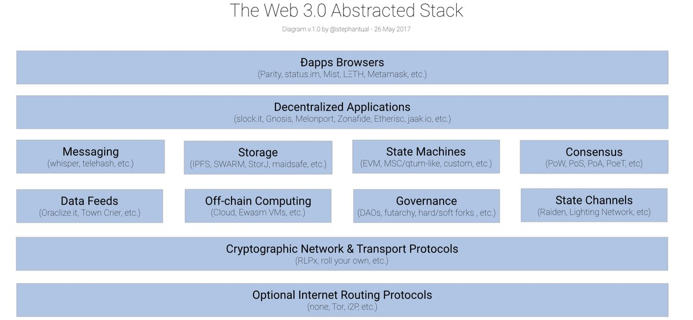
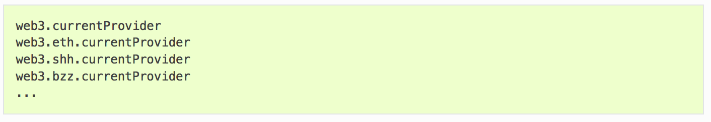
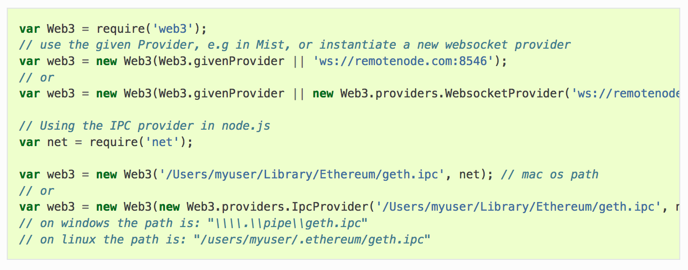
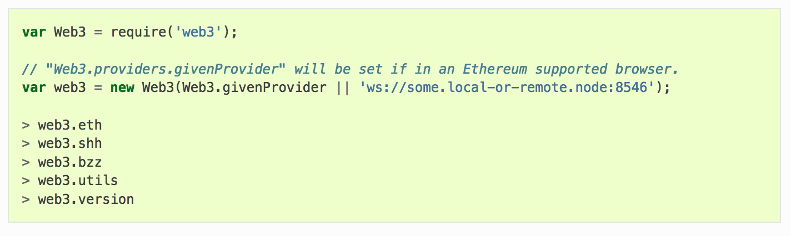
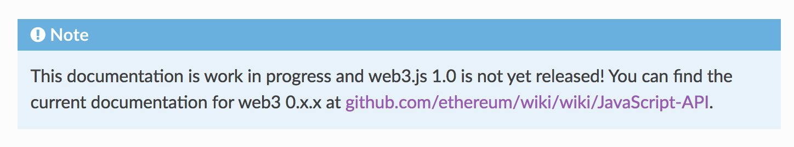
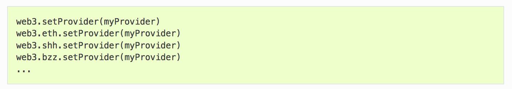

exclude:true
class: module-header ethereum/libraries.web3
---
class: middle, center
# web3.js
## API for decentralized appliactions


???
ref: https://github.com/ethereum/web3.js/
ref: https://github.com/ethereum/wiki/wiki/JavaScript-API
ref: https://web3js.readthedocs.io/en/1.0/
ref: https://web3js.readthedocs.io/en/1.0/getting-started.html
ref: https://blockchainhub.net/web3-decentralized-web/
ref: https://www.npmjs.com/package/web3
ref: http://www.dappuniversity.com/articles/web3-js-intro
ref: https://github.com/w3f/Web3-wiki/wiki/Tech-Stack

---
# Web3: what does it do?

<p align=center>
    
</p>

???
"To make your app work on Ethereum, you can use the web3 object provided by the web3.js library. Under the hood it communicates to a local node through RPC calls. web3.js works with any Ethereum node which exposes an RPC layer. web3 contains:
* the eth object - web3.eth (for specifically Ethereum blockchain interactions)
* the shh object - web3.shh (for Whisper interaction)

Over time other objects for each of the other web3 protocols will be introduced

---
# JSON RPC API
### The web3 family of libraries

* Provides a common interface for interacting with Ethereum
* Shares features with Solidity

https://github.com/ethereum/wiki/wiki/JSON-RPC

---
# The web3 stack

<p align=center>
    
</p>
---
# web3.js
The web3.js library is a collection of modules which contain specific functionality for the ethereum ecosystem.

* The web3-eth is for the ethereum blockchain and smart contracts
* The web3-shh is for the whisper protocol to communicate p2p and broadcast
* The web3-bzz is for the swarm protocol, the decentralized file storage
* The web3-utils contains useful helper functions for Dapp developers.

???

---
# Web3 object
```solidity
var Web3 = require('web3');

> Web3.utils
> Web3.version
> Web3.givenProvider
> Web3.providers
> Web3.modules
```

???
ref: https://web3js.readthedocs.io/en/1.0/web3.html

---
# Provider types

* HttpProvider: The HTTP provider is deprecated, as it won’t work for subscriptions.
* WebsocketProvider: The Websocket provider is the standard for usage in legacy browsers.
* IpcProvider: The IPC provider is used node.js dapps when running a local node. Gives the most secure connection.

---
# web3.currentprovider

<p align=center>
    
</p>

---
# Setting the provider

<p align=center>
    
</p>

---
# Re-setting the provider
<p align=center>
    
</p>

---
# web3 methods
<p align=center>
    
</p>
---
# WARNING!
<p align=center>
    
</p>
???
It has changed a few times this year. In particular, instantiation

---
# web3.eth

The web3-eth package allows you to interact with an Ethereum blockchain and Ethereum smart contracts.
???
---
# Numbers

Javascript's number handling is problematic.

web3JS uses the BigNumber library to work around this.

* https://github.com/MikeMcl/bignumber.js/
* Still limited to 20 or fewer floating points

Using WEI instead of ETH allows integer operations instead of floating point.

---
exclude: true
# TODO

* Deploying contracts
* Transactions
* Calling smart contract functions

---
# Web3 Resources

# Web3.js Resources

* https://github.com/ethereum/web3.js/
* https://web3js.readthedocs.io/en/1.0/
exclude:true
class: module-header ethereum/libraries.web3js-eth-personal
---
# Web3.js
## web3-eth-personal

The web3-eth-personal package allows you to interact with the Ethereum node’s accounts.

Versions:

0.X
https://github.com/ethereum/wiki/wiki/JavaScript-API

1.0
https://web3js.readthedocs.io/en/1.0/web3-eth-personal.html
---
exclude:true
class: module-header ethereum/libraries.web3js
---
class: middle, center
# web3.js
## API for decentralized appliactions
???
ref: https://github.com/ethereum/web3.js/
ref: https://github.com/ethereum/wiki/wiki/JavaScript-API
ref: https://web3js.readthedocs.io/en/1.0/
ref: https://web3js.readthedocs.io/en/1.0/getting-started.html
ref: https://blockchainhub.net/web3-decentralized-web/
ref: https://www.npmjs.com/package/web3
ref: http://www.dappuniversity.com/articles/web3-js-intro

---
# Web3: what does it do?
<p align=center>
    
</p>
---
# JSON RPC API
### The web3 family of libraries

* Provides a common interface for interacting with Ethereum
* Shares features with Solidity
---
# The web3 stack

<p align=center>
    
</p>
---
# web3.js
The web3.js library is a collection of modules which contain specific functionality for the ethereum ecosystem.

* The web3-eth is for the ethereum blockchain and smart contracts
* The web3-shh is for the whisper protocol to communicate p2p and broadcast
* The web3-bzz is for the swarm protocol, the decentralized file storage
* The web3-utils contains useful helper functions for Dapp developers.

???

---
# Web3 object
```solidity
var Web3 = require('web3');

> Web3.utils
> Web3.version
> Web3.givenProvider
> Web3.providers
> Web3.modules
```

???
ref: https://web3js.readthedocs.io/en/1.0/web3.html

---
# Provider types

* HttpProvider: The HTTP provider is deprecated, as it won’t work for subscriptions.
* WebsocketProvider: The Websocket provider is the standard for usage in legacy browsers.
* IpcProvider: The IPC provider is used node.js dapps when running a local node. Gives the most secure connection.

---
# web3.currentprovider

<p align=center>
    
</p>

---
# Setting the provider

<p align=center>
    
</p>

---
# Re-setting the provider
<p align=center>
    
</p>

---
# web3 methods
<p align=center>
    
</p>
---
class:center, blink
# .red[WARNING!]
<p align=center>
    
</p>
???
It has changed a few times this year. In particular, instantiation

--
Check your version documentation!

The pre-1 and 1.0 branches, bother being developed, have diverged!

---
# web3.eth

The web3-eth package allows you to interact with an Ethereum blockchain and Ethereum smart contracts.
???

---
exclude: true
# Utilities: Hashing functions
* web3.utils.sha3('Hello ethereum')
* web3.utils.keccack256('Hello ethereum')

---
exclude: true
# TODO

* Deploying contracts
* Transactions
* Calling smart contract functions
* Inspecting blocks
* Provided utilities


---
# Web3.js Resources

* https://github.com/ethereum/web3.js/
* https://web3js.readthedocs.io/en/1.0/

---
# Adding to your project

* npm: npm install web3
* bower: bower install web3
* meteor: meteor add ethereum:web3
* vanilla: link the dist./web3.min.js

???
ref: https://github.com/ethereum/wiki/wiki/JavaScript-API#web3ethaccounts

---

exclude:true
class: module-header ethereum/project.ethereum-crowdsale
---
# Project: Crowdsale
https://ethereum.org/crowdsale

---
exclude:true
class: module-header ethereum/topic.webdev
---
# Web Development

???
Good overview of different skill trees:
ref: https://github.com/kamranahmedse/developer-roadmap

---
# Serving Code

---
# Server model evolution

---
# Content Caching

---
# Protocols

---
# HTTP

* Stateless

---
# HTTP Methods

* GET
* POST
* PUT
* DELETE

---
# HTTP + TLS = HTTPS

Wrapper around HTTP payload

---
# Server Side Code

---
# Client Side Code

---
# CSS

---
# Data sources

---
# Data storage

---
# Interactivity

---
# Webapps

???
The movement to have a full application running in the browser, which might be launched by a webpage on a remote server, or saved locally as an app or file. The server is no longer responsible for performing logic, only serving resources. Use of remote APIs for most data sources & persistence.

---
# Web Assembly

https://webassembly.org/


"WebAssembly (abbreviated Wasm) is a binary instruction format for a stack-based virtual machine. Wasm is designed as a portable target for compilation of high-level languages like C/C++/Rust, enabling deployment on the web for client and server applications."

---
# Asynchronous calls

---
# P2P Networking

---
# Dapps

???
Accessing data and transacting over P2P networks, Decentralized Applications (or Dapps) can leave even servers behind 

---
# Patterns

* Model-View-Controller (MVC)

---
# MVC

???
ref: https://medium.freecodecamp.org/model-view-controller-mvc-explained-through-ordering-drinks-at-the-bar-efcba6255053

---
# Websockets

???
outcome: Explain how websockets work

---
# Concurrency

???
outcome: Explain parallelism vs. concurrency

---
# System Tenancy

???
outcome: Explain multi-tenancy vs. single tenancy
*** https://www.gartner.com/it-glossary/multitenancy

---
# Webapp Diagnostics

???
outcome: What are some common causes of slow queries?

---
# Provisioning systems

???
outcome: What alternatives are there to docker?

---
# HTTP

???
outcome: How does HTTP work?
outcome: How is HTTP/1.1 different from HTTP/2?
outcome: What do the different HTTP verbs mean?

---
# Security

???
outcome: What are some of the OWASP top ten?

---
# Encryption

???
outcome: Explain symmetric vs asymmetric encryption and when you'd use either
outcome: How does a TCP handshake & SSL certificate work?
outcome: What is DKIM?

---
# Databases

???
outcome: When would you use a NoSQL database?
outcome: Compare MySQL and PostgreSQL
outcome: Explain OLAP vs OLTP

---
# Resource sharing

???
outcome: How do you solve a race condition?
outcome: What is a deadlock?

outcome: Explain SOLID principles
*** https://hackernoon.com/solid-principles-made-easy-67b1246bcdf

---
# Application architecture / hosting

???
outcome: When would you use a serverless application?

---
# Development methodologies

???
outcome: What are features of a 12-factor app?
*** https://12factor.net/

---
# Caching

???
outcome: Describe caching solutions for Rails apps

---
# Containers

???
outcome: What is the benefit of containerization?
outcome: Explain kubernetes

---
# DNS

???
outcome: What is traceroute, dnsmasq, and iptables?
outcome: Explain A, CNAME, and ALIAS records 

---
# IP

---
# IPv4

---
# IPv6

???
outcome: Explain IPv4 vs IPv6

---
# Character encodings

???
outcome: Explain unicode vs UTF-8

---
