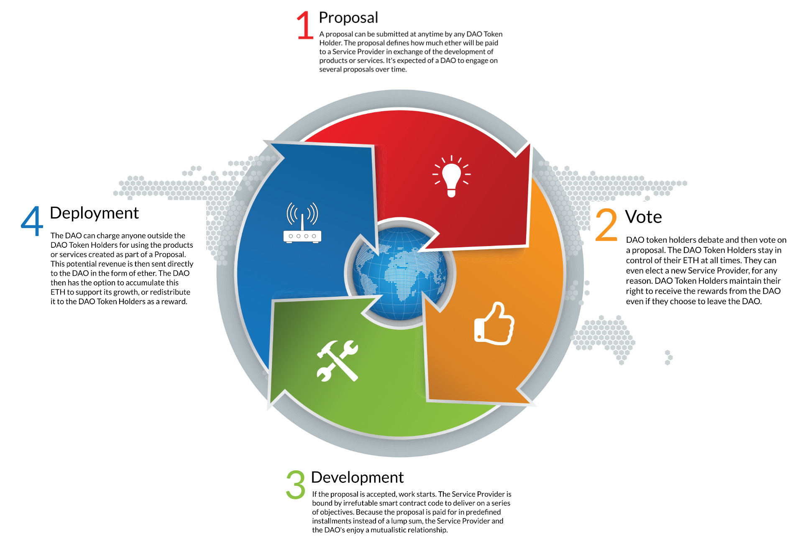
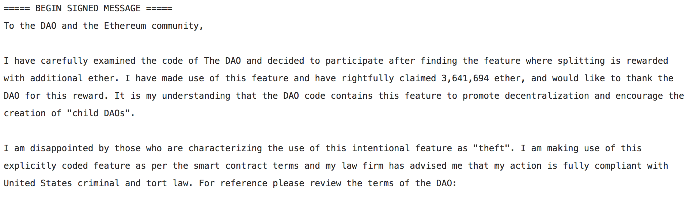

exclude:true
class: module-header ethereum/exercises.ganache-setup
---
# Getting started with Ganache

???
ref: https://medium.com/@adamh90/creating-a-local-test-environment-for-ethereum-smart-contracts-1f638efca020
ref: https://truffleframework.com/docs/truffle/reference/configuration
---
# Quick intro: using ganache as a local network with remix

Run ganache-cli
Open Browser, metamask
Import accounts using seed phrase from ganache window
Select network “Localhost 8545”
Set remix env to “injected web3”
Deploy contract

Command overview
ganache

ganache-cli
Usage: ganache-cli 

```
rj@Orko ~ : ganache-cli
Ganache CLI v6.1.6 (ganache-core: 2.1.5)

Available Accounts
==================
(0) 0x0fafcff23dacd4e828c5af786b19ef1df8a532b5 (~100 ETH)
(1) 0x549052023f164e525c35fe3b66bbfc7cf7bc658e (~100 ETH)
(2) 0xbc5b2a67efa90a22406b2dd1f79e3b3e2e21ca2b (~100 ETH)
(3) 0x0734e5fb9f9a3f0f2f37be69d886e67ab9f4f38b (~100 ETH)
(4) 0xaad05544cce681d7a469e2814b5c59c27784df74 (~100 ETH)
(5) 0x67c19084fc917a85749a994fb5894aa1cb6efd66 (~100 ETH)
(6) 0x9fb4a0a3f6e5b9647597dbe987512771c8c00bb0 (~100 ETH)
(7) 0x87961cb22481d2ab338ca697bbcd8eee39b64275 (~100 ETH)
(8) 0xdd0c3e528d78af276d217e887dbb0f8aa84c9444 (~100 ETH)
(9) 0xa7ff1b32a1d844b7a7879f41c63d5ae812b036e1 (~100 ETH)

Private Keys
==================
(0) 0xe99ee6d9ee23f902a6fedaf3467832f1b8d15047dfca1ad2f3b28e49427859e8
(1) 0x636fbe9b4245c3ce580c232ee086e7d2ac415cc77ec68373f2af786ddca72b62
(2) 0x44dff99da453044924a90f2d93d9bf3b1a21f67534096633c815cf32069c6b80
(3) 0xedbd81381e0efbc08e5b63ed3ffdb3ae0a84ea0e89df3c6ce688346751c40af5
(4) 0x9f1e76ef5b6d338721b1f20457b07f9733803050f447a163060b04d79f7834dd
(5) 0x1ef49c0c384fab7bda28da204a4b9233231c7ca955820021afda5048f80674b2
(6) 0x083eeeb72ce83af46db1d9cc16a8fea3142071a5c0d6ea872602acfa6eae6efe
(7) 0xc670459c57cb16b284ac8e61ba6375c87956f161ce9943d77b1c474d7ae42d70
(8) 0xcd5e797dac9570b49afe522c9fa9b69e09763ed717d29246659feb49ff49613c
(9) 0x8eae7ab1e92129d80e30204230b5e3f15908777bd21539cff2f087eba3c6f57a

HD Wallet
==================
Mnemonic:      tank grass remove brave silent antenna tower latin gain rigid bright drastic
Base HD Path:  m/44'/60'/0'/0/{account_index}

Gas Price
==================
20000000000

Gas Limit
==================
6721975

Listening on 127.0.0.1:8545
```
---
exclude:true
class: module-header ethereum/project.ethereum-dao
---
class:tallpic
# Project: "The DAO"
## Decentralized Autonomous Organization


[https://ethereum.org/dao](https://ethereum.org/dao)

???

The DAO was intended to operate as "a hub that disperses funds (currently in Ether, the Ethereum value token) to projects".

The DAO’s Mission: To blaze a new path in business organization for the betterment of its members, existing simultaneously nowhere and everywhere and operating solely with the steadfast iron will of unstoppable code. 

https://en.wikipedia.org/wiki/The_DAO_(organization)

Features:
"complete transparency, total shareholder control, unprecedented flexibility, and autonomous governance"

https://techcrunch.com/2016/05/16/the-tao-of-the-dao-or-how-the-autonomous-corporation-is-already-here/

---
name: dao-manifesto

# Manifesto
## The DAO's Operating Guidelines

What is the DAO?

Definition:
* The DAO consists of the sum of those holding the DAO’s representative tokens.

---
name: dao-manifesto-values
# The DAO Manifesto: Values

We, as a DAO, ascribe to the following values:

* Transparency
* Democracy
* Decentralization
* Voluntary participation
* Non-exclusion
* Privacy and the right to anonymity
* Non-aggression

---
name: dao-manifesto-goals
# The DAO Manifesto: Goals

To blaze a new path in business organization for the betterment of its members, existing simultaneously nowhere and everywhere and operating solely with the steadfast iron will of immutable code. The goal of The DAO is to diligently use the ETH it controls to support projects that will:
* Provide a return on investment or benefit to the DAO and its members.
* Benefit the decentralized ecosystem as a whole.

---
name: dao-manifesto-conduct
# The DAO Manifesto: Conduct

We as a DAO, both as a whole and as individual members, will adhere to the following code of conduct:

* We will not seek profits through means contradictory to our stated values or the categorical imperative.
* We shall respect free speech and encourage all opinions to be both voiced and heard freely, without persecution.
* We will strive toward decentralization and autonomy whenever and wherever it is reasonably possible and beneficial.

???

daohub.org/manifesto.html had:

This website is owned by the DAO community, it is managed by the DAOhub team and hosting is generously offered by dao.link Sarl, Switzerland.

 dao.link has a "coming soon! see: blog.slock.it"

---
name: the-dao-cycle
class: bigpic

# The DAO - process cycle



---
# The DAO - hack

<a href="https://pastebin.com/CcGUBgDG"></a>

???
===== BEGIN SIGNED MESSAGE =====

To the DAO and the Ethereum community,
 
I have carefully examined the code of The DAO and decided to participate after finding the feature where splitting is rewarded with additional ether. I have made use of this feature and have rightfully claimed 3,641,694 ether, and would like to thank the DAO for this reward. It is my understanding that the DAO code contains this feature to promote decentralization and encourage the creation of "child DAOs".
 
I am disappointed by those who are characterizing the use of this intentional feature as "theft". I am making use of this explicitly coded feature as per the smart contract terms and my law firm has advised me that my action is fully compliant with United States criminal and tort law. For reference please review the terms of the DAO:
 
"The terms of The DAO Creation are set forth in the smart contract code existing on the Ethereum blockchain at 0xbb9bc244d798123fde783fcc1c72d3bb8c189413. Nothing in this explanation of terms or in any other document or communication may modify or add any additional obligations or guarantees beyond those set forth in The DAO’s code. Any and all explanatory terms or descriptions are merely offered for educational purposes and do not supercede or modify the express terms of The DAO’s code set forth on the blockchain; to the extent you believe there to be any conflict or discrepancy between the descriptions offered here and the functionality of The DAO’s code at 0xbb9bc244d798123fde783fcc1c72d3bb8c189413, The DAO’s code controls and sets forth all terms of The DAO Creation."
 
A soft or hard fork would amount to seizure of my legitimate and rightful ether, claimed legally through the terms of a smart contract. Such fork would permanently and irrevocably ruin all confidence in not only Ethereum but also the in the field of smart contracts and blockchain technology. Many large Ethereum holders will dump their ether, and developers, researchers, and companies will leave Ethereum. Make no mistake: any fork, soft or hard, will further damage Ethereum and destroy its reputation and appeal.
 
I reserve all rights to take any and all legal action against any accomplices of illegitimate theft, freezing, or seizure of my legitimate ether, and am actively working with my law firm. Those accomplices will be receiving Cease and Desist notices in the mail shortly.
 
I hope this event becomes an valuable learning experience for the Ethereum community and wish you all the best of luck.
 
Yours truly,
"The Attacker"

===== END SIGNED MESSAGE =====
 
Message Hash (Keccak): 0xaf9e302a664122389d17ee0fa4394d0c24c33236143c1f26faed97ebbd017d0e

Signature: 0x5f91152a2382b4acfdbfe8ad3c6c8cde45f73f6147d39b072c81637fe81006061603908f692dc15a1b6ead217785cf5e07fb496708d129645f3370a28922136a32

---
class: middle, center
# Code as law

???
While the attacker asserts that this is all legal and within the scope of the rules (the code), the community votes with their feet to hard fork. The choice is left up to the community using the system, not the people running the system, so who is there to be culpable. Final arbitration by community action is never off the table, although it may be significantly harder to gather that consensus as we move forward.

Code may be law, but only within the scope of the system. Not having the threat of violence hanging over them to oblige the system, people are free to vote with their feet. This is the free market in action. 

---
class:bigpic
# The DAO Hack - community response


???

While the attacker asserts that this is all legal and within the scope of the rules (the code), the community votes with their feet to hard fork. The choice is left up to the community using the system, not the people running the system, so who is there to be culpable. Final arbitration by community action is never off the table, although it may be significantly harder to gather that consensus as we move forward.

Code may be law, but only within the scope of the system. Not having the threat of violence hanging over them to oblige the system, people are free to vote with their feet. This is the free market in action. 

---
class: middle, center
# Forking is a feature!

???
Forking is the opportunity of the community to follow a particular version of an outcome by voting with their feet (and software config) and following a particular upgrade path over another.

The alternative to giving the community the choice would be to force it on them, either through design (inability to do otherwise, but this is OPEN SOURCE software, so that's not possible) or violence... as we've seen many countries resort to when it comes to the public attempting to engage in mining or using cryptocurrency.

---
exclude:true
class: module-header ethereum/solidity.events
---

---
exclude:true
class: module-header ethereum/solidity.nuances
---
# Nuances:

???

---
# Useful data types for common usage
* bytes4 -  
* bytes32 - 

---
# Useful literals
* 0x0 - The default address
 * address(0)

---
exclude:true
class: module-header ethereum/solidity.resources
---
# Solidity Resources

* http://solidity.readthedocs.io/
* https://remix.ethereum.org/
* https://ethereum.stackexchange.com/
* https://github.com/ethereum/
* https://www.stateofthedapps.com/
* https://docs.ethhub.io/

---
# Solidity Gamified Education

* https://capturetheether.com/

---
exclude:true
class: module-header ethereum/solidity.tools
---
# Tools for the Solidity language

???
ref: https://github.com/tomlion/vim-solidity
ref: https://media.consensys.net/an-definitive-list-of-ethereum-developer-tools-2159ce865974

---
# Pre-processors

* [psol](https://github.com/Lamarkaz/psol)
* [parasol](https://github.com/Lamarkaz/parasol)

---
exclude:true
class: module-header ethereum/tokens.nonfungible
---
class: invert, middle, center
# Non-Fungible Tokens

---
# ERC721 Standard

ERC721 is a standard for representing ownership that is non-fungible aka, each token has unique properties.

???
todo: See Token Talk to extract slides
ref: https://openzeppelin.org/api/docs/learn-about-tokens.html
ref: https://github.com/ethereum/EIPs/blob/master/EIPS/eip-721.md
ref: https://nakamotoinstitute.org/shelling-out/

---
# "NFT" Word Choice

"NFT" was satisfactory to nearly everyone surveyed and is widely applicable to a broad universe of distinguishable digital assets. We recognize that "deed" is very descriptive for certain applications of this standard (notably, physical property).

Alternatives considered: distinguishable asset, title, token, asset, equity, ticket

???
ref: https://github.com/ethereum/EIPs/blob/master/EIPS/eip-721.md

---
# OpenZepplin Contracts supporting ERC721 

* ERC721 — the full implementation of ERC721, and the contract you'll most likely be inheriting from. Interfaces are part of the IERC721.sol file:
 * IERC721
 * IERC721Metadata
 * IERC721Enumerable
* IERC721Receiver — in some cases, it's beneficial to be 100% certain that a contract knows how to handle ERC721 tokens (imagine sending an in-game item to an exchange address that can't send it back!). When using safeTransferFrom(), the contract checks to see that the receiver is an IERC721Receiver, which implies that it knows how to handle ERC721 tokens. If you're writing a contract that accepts 721 tokens, you'll want to implement this interface.
* ERC721Mintable — like the ERC20 version, ERC721Mintable allows addresses with the Minter role to mint tokens.
* ERC721Pausable — like the ERC20 version, ERC721Pausable allows addresses with the Pauser role to freeze transfers of tokens.

???

https://openzeppelin.org/api/docs/learn-about-tokens.html

---
# Transfer 

ERC-721 standardizes a safe transfer function safeTransferFrom (overloaded with and without a bytes parameter) and an unsafe function transferFrom. Transfers may be initiated by:

* The owner of an NFT
* The approved address of an NFT
* An authorized operator of the current owner of an NFT


Additionally, an authorized operator may set the approved address for an NFT. This provides a powerful set of tools for wallet, broker and auction applications to quickly use a large number of NFTs.

---
# ERC-165 Standard Interface Detection

Used to expose the interfaces that a ERC-721 smart contract supports and avoid ill-equipped recipient contracts.

???
ref: http://erc721.org/
---
exclude: true
# Extensions

---
# Utility libraries

* [OpenZepplin utils/Address](https://github.com/OpenZeppelin/openzeppelin-solidity/blob/master/contracts/utils/Address.sol) - exposes
 * isContract(address) internal view returns (bool) 
* [OpenZepplin utils/SafeMath](https://github.com/OpenZeppelin/openzeppelin-solidity/blob/master/contracts/math/SafeMath.sol) - exposes
 * mul(int, int) , mul(uint, uint)
 * div(int, int) , div(uint, uint)
 * add(int, int) , add(uint, uint)
 * sub(int, int) , sub(uint, uint)
 * mod(unit, unit) 

???
https://github.com/OpenZeppelin/openzeppelin-solidity/blob/master/contracts/utils/Address.sol
---
# Library: Address

```solidity
library Address {
    /**
     * Returns whether the target address is a contract
     * @dev This function will return false if invoked during the constructor of a contract,
     * as the code is not actually created until after the constructor finishes.
     * @param account address of the account to check
     * @return whether the target address is a contract
     */
    function isContract(address account) internal view returns (bool) {
        uint256 size;
        // XXX Currently there is no better way to check if there is a contract in an address
        // than to check the size of the code at that address.
        // See https://ethereum.stackexchange.com/a/14016/36603
        // for more details about how this works.
        // TODO Check this again before the Serenity release, because all addresses will be
        // contracts then.
        // solium-disable-next-line security/no-inline-assembly
        assembly { size := extcodesize(account) }
        return size > 0;
    }
}
```
---
exclude:true
class: module-header ethereum/tools.ganache-cli
---
name: TOOLS.GANACHE-CLI-START
# Installing ganache-cli
### (formerly named testrpc)

Via npm:
```solidity
npm install -g ganache-cli
```

This will install the ganache (formerly testrpc) command line tool, allowing us to easily simulate an Ethereum network.
It will provide some test accounts and a local endpoint, by default localhost:8545

???
Notes...

---
# Check your installation

???
Steps to confirm

---
exclude:true
class: module-header ethereum/topic.abis
---
# Contract Metadata & ABIs

???
ref: https://solidity.readthedocs.io/en/develop/abi-spec.html
ref: https://www.sitepoint.com/compiling-smart-contracts-abi/

---
# JSON metadata format

The Solidity compiler automatically generates a JSON file, the contract metadata, that contains information about the current contract. You can use this file to query the compiler version, the sources used, the ABI and NatSpec documentation to more safely interact with the contract and verify its source code.

* JSON format (JavaScript Object Notation)
 * native to JS
 * useful for key/value data, like config
 * has no fixed order, can change with compiler versions.

???
ref: https://solidity.readthedocs.io/en/develop/metadata.html
---
# Metadata file example

```json
{
  // Required: The version of the metadata format
  version: "1",
  // Required: Source code language, basically selects a "sub-version"
  // of the specification
  language: "Solidity",
  // Required: Details about the compiler, contents are specific
  // to the language.
  compiler: {
    // Required for Solidity: Version of the compiler
    version: "0.4.6+commit.2dabbdf0.Emscripten.clang",
    // Optional: Hash of the compiler binary which produced this output
    keccak256: "0x123..."
  },
  // Required: Compilation source files/source units, keys are file names
  sources:
  {
    "myFile.sol": {
      // Required: keccak256 hash of the source file
      "keccak256": "0x123...",
      // Required (unless "content" is used, see below): Sorted URL(s)
      // to the source file, protocol is more or less arbitrary, but a
      // Swarm URL is recommended
      "urls": [ "bzzr://56ab..." ]
    },
    "mortal": {
      // Required: keccak256 hash of the source file
      "keccak256": "0x234...",
      // Required (unless "url" is used): literal contents of the source file
      "content": "contract mortal is owned { function kill() { if (msg.sender == owner) selfdestruct(owner); } }"
    }
  },
  // Required: Compiler settings
  settings:
  {
    // Required for Solidity: Sorted list of remappings
    remappings: [ ":g/dir" ],
    // Optional: Optimizer settings (enabled defaults to false)
    optimizer: {
      enabled: true,
      runs: 500
    },
    // Required for Solidity: File and name of the contract or library this
    // metadata is created for.
    compilationTarget: {
      "myFile.sol": "MyContract"
    },
    // Required for Solidity: Addresses for libraries used
    libraries: {
      "MyLib": "0x123123..."
    }
  },
  // Required: Generated information about the contract.
  output:
  {
    // Required: ABI definition of the contract
    abi: [ ... ],
    // Required: NatSpec user documentation of the contract
    userdoc: [ ... ],
    // Required: NatSpec developer documentation of the contract
    devdoc: [ ... ],
  }
}
```
---
# Metadata file publication

The compiler appends a Swarm hash of the metadata file to the end of the bytecode of each contract, so that you can retrieve the file in an authenticated way without having to resort to a centralized data provider.

You have to publish the metadata file to Swarm (or another service) so that others can access it. You create the file by using the solc --metadata command that generates a file called ContractName_meta.json. It contains Swarm references to the source code, so you have to upload all source files and the metadata file.

*NOTE:* Since the bytecode of the resulting contract contains the metadata hash, any change to the metadata results in a change of the bytecode. This includes changes to a filename or path, and since the metadata includes a hash of all the sources used, a single whitespace change results in different metadata, and different bytecode.

---
# Usage: Automatic Interface Generation and NatSpec

The metadata is used in the following way: A component that wants to interact with a contract (e.g. Mist or any wallet) retrieves the code of the contract, from that the Swarm hash of a file which is then retrieved. That file is JSON-decoded into a structure like above.

The component can then use the ABI to automatically generate a rudimentary user interface for the contract.

Furthermore, the wallet can use the NatSpec user documentation to display a confirmation message to the user whenever they interact with the contract, together with requesting authorization for the transaction signature.

---
# Usage: Source Code Verification

In order to verify the compilation, sources can be retrieved from Swarm via the link in the metadata file. The compiler of the correct version (which is checked to be part of the “official” compilers) is invoked on that input with the specified settings. The resulting bytecode is compared to the data of the creation transaction or CREATE opcode data. This automatically verifies the metadata since its hash is part of the bytecode. Excess data corresponds to the constructor input data, which should be decoded according to the interface and presented to the user.

---
# ABI: Application Binary Interface

When sending or receiving data, it needs to be serialized into a string of bytes.
Data is encoded according to its type, as described in this specification. The encoding is not self describing and thus requires a schema in order to decode.
Binary format describes how data is packed, JSON format describes how to unpack the data

???
todo: add a good graphic of the data encoding, and how the ABI provides the parsing
ref: https://solidity.readthedocs.io/en/develop/abi-spec.html
---
# ABI JSON function description

* type: "function", "constructor", or "fallback" (the unnamed “default” function);
* name: the name of the function;
* inputs: an array of objects, each of which contains:
 * name: the name of the parameter;
 * type: the canonical type of the parameter (more below).
 * components: used for tuple types (more below).
* outputs: an array of objects similar to inputs, can be omitted if function doesn’t return anything;
* stateMutability: a string with one of the following values:
 * pure (specified to not read blockchain state),
 * view (specified to not modify the blockchain state),
 * nonpayable (function does not accept Ether) 
 * payable (function accepts Ether);
* payable: true if function accepts Ether, false otherwise; DEPRECATED - see *stateMutability*
* constant: true if function is either pure or view, false otherwise. DEPRECATED - see *stateMutability*

Defaults:
* type can be omitted, defaulting to "function",
* likewise payable and constant can be omitted, both defaulting to false.

Constructor and fallback function never have name or outputs. Fallback function doesn’t have inputs either.
---
# ABI JSON event description

* type: always "event"
* name: the name of the event;
* inputs: an array of objects, each of which contains:
 * name: the name of the parameter;
 * type: the canonical type of the parameter (more below).
 * components: used for tuple types (more below).
 * indexed: true if the field is part of the log’s topics, false if it one of the log’s data segment.
* anonymous: true if the event was declared as anonymous.

---
# Example

```solidity
pragma solidity >0.4.99 <0.6.0;

contract Test {
  constructor() public { b = hex"12345678901234567890123456789012"; }
  event Event(uint indexed a, bytes32 b);
  event Event2(uint indexed a, bytes32 b);
  function foo(uint a) public { emit Event(a, b); }
  bytes32 b;
}
```

```json
[{
"type":"event",
"inputs": [{"name":"a","type":"uint256","indexed":true},{"name":"b","type":"bytes32","indexed":false}],
"name":"Event"
}, {
"type":"event",
"inputs": [{"name":"a","type":"uint256","indexed":true},{"name":"b","type":"bytes32","indexed":false}],
"name":"Event2"
}, {
"type":"function",
"inputs": [{"name":"a","type":"uint256"}],
"name":"foo",
"outputs": []
}]
```

---
# Partial ABI acceptable for transacting

* Not necessary to reveal the entire interface
* Only interface with defined functions
 * Much match signature, i.e. same # arguments

---
# Function call data
The first four bytes of the call data for a function call specifies the function to be called.
It is the first (left, high-order in big-endian) four bytes of the Keccak-256 (SHA-3) hash of the signature of the function.

---
# Function signatures
The signature is defined as the canonical expression of the basic prototype without data location specifier, i.e. the function name with the parenthesised list of parameter types. Parameter types are split by a single comma - no spaces are used.

ex: functionName(uint,string,address) 
---
# Argument Encoding

Starting from the fifth byte, the encoded arguments follow. This encoding is also used in other places, e.g. the return values and also event arguments are encoded in the same way, without the four bytes specifying the function.

???
ref: https://solidity.readthedocs.io/en/develop/abi-spec.html
---
# Supported types

Solidity supports all the ABI's data types

* uint<M>: unsigned integer type of M bits, 0 < M <= 256, M % 8 == 0. e.g. uint32, uint8, uint256.
* int<M>: two’s complement signed integer type of M bits, 0 < M <= 256, M % 8 == 0.
* address: equivalent to uint160, except for the assumed interpretation and language typing. For computing the function selector, address is used.
* uint, int: synonyms for uint256, int256 respectively. For computing the function selector, uint256 and int256 have to be used.
* bool: equivalent to uint8 restricted to the values 0 and 1. For computing the function selector, bool is used.
* fixed<M>x<N>: signed fixed-point decimal number of M bits, 8 <= M <= 256, M % 8 ==0, and 0 < N <= 80, which denotes the value v as v / (10 ** N).
* ufixed<M>x<N>: unsigned variant of fixed<M>x<N>.
* fixed, ufixed: synonyms for fixed128x18, ufixed128x18 respectively. For computing the function selector, fixed128x18 and ufixed128x18 have to be used.
* bytes<M>: binary type of M bytes, 0 < M <= 32.
* function: an address (20 bytes) followed by a function selector (4 bytes). Encoded identical to bytes24.

* <type>[M]: a fixed-length array of M elements, M >= 0, of the given type.

* bytes: dynamic sized byte sequence.
* string: dynamic sized unicode string assumed to be UTF-8 encoded.
* <type>[]: a variable-length array of elements of the given type.

---
# Type Tuples

The ABI also supports use of tuples ()

Types can be combined to a tuple by enclosing them inside parentheses, separated by commas:

    (T1,T2,...,Tn): tuple consisting of the types T1, …, Tn, n >= 0

It is possible to form tuples of tuples, arrays of tuples and so on. It is also possible to form zero-tuples (where n == 0).

---
# Support for Solidity specific types

* address payable: address
* contract: address
* enum: smallest uint type that is large enough to hold all values
For example, an enum of 255 values or less is mapped to uint8 and an enum of 256 values is mapped to uint16.
* struct: tuple

---
# Other modes

* Strict encoding mode
* Non-standard packed mode

Which you don't need to worry about at this point.
---
# ABI Encoding and Decoding Functions

* abi.decode(bytes memory encodedData, (...)) returns (...): ABI-decodes the given data, while the types are given in parentheses as second argument. Example: (uint a, uint[2] memory b, bytes memory c) = abi.decode(data, (uint, uint[2], bytes))
* abi.encode(...) returns (bytes memory): ABI-encodes the given arguments
* abi.encodePacked(...) returns (bytes memory): Performs packed encoding of the given arguments
* abi.encodeWithSelector(bytes4 selector, ...) returns (bytes memory): ABI-encodes the given arguments starting from the second and prepends the given four-byte selector
* abi.encodeWithSignature(string memory signature, ...) returns (bytes memory): Equivalent to abi.encodeWithSelector(bytes4(keccak256(bytes(signature))), ...)`

???

---
# encodePacked
## Computing the hash of structured data

`keccak256(abi.encodePacked(a, b))`

NOTE: it is possible to craft a “hash collision” using different function parameter types.

???
ref: https://solidity.readthedocs.io/en/v0.5.1/units-and-global-variables.html?highlight=encodePacked

---
# Interacting with deployed contracts

```solidity
pragma solidity ^0.4.18;

contract Deployed {
    
    function setA(uint) public returns (uint) {}
    
    function a() public pure returns (uint) {}
    
}

contract Existing  {
    
    Deployed dc;
    
    function Existing(address _t) public {
        dc = Deployed(_t);
    }
 
    function getA() public view returns (uint result) {
        return dc.a();
    }
    
    function setA(uint _val) public returns (uint result) {
        dc.setA(_val);
        return _val;
    }
}
```
???
ref: https://medium.com/@blockchain101/calling-the-function-of-another-contract-in-solidity-f9edfa921f4c

---
# Calling contracts without an ABI

Deep magic warning!

???
ref: https://medium.com/@blockchain101/calling-the-function-of-another-contract-in-solidity-f9edfa921f4c
exclude:true
class: module-header ethereum/topic.signatures
---
# Digital signatures

A digital signature is a mathematical scheme for verifying the authenticity of digital messages or documents. A valid digital signature gives a recipient reason to believe that the message was created by a known sender (authentication), that the sender cannot deny having sent the message (non-repudiation), and that the message was not altered in transit (integrity).

https://en.wikipedia.org/wiki/Digital_signature

???
ref: https://en.wikipedia.org/wiki/Digital_signature

---
# Public-key cryptography

In his 1874 book The '''Principles of Science''', William Stanley Jevons wrote:

```quote
"Can the reader say what two numbers multiplied together will produce the number 8616460799? I think it unlikely that anyone but myself will ever know."
```

???
ref: https://en.wikipedia.org/wiki/Public-key_cryptography
---
# Diffie–Hellman key exchange 

The Diffie–Hellman key exchange method allows two parties that have no prior knowledge of each other to jointly establish a shared secret key over an insecure channel. This key can then be used to encrypt subsequent communications using a symmetric key cipher. 


???
ref: https://en.wikipedia.org/wiki/Diffie%E2%80%93Hellman_key_exchange

---
# Electronic signatures

Digital signatures are often used to implement electronic signatures, a broader term that refers to any electronic data that carries the intent of a signature.

---
# Signatures in Ethereum

4 different signature standards supported by different clients (wallets):

* eth.sign, which signs the data as-is. Supported by Metamask with a deprecation warning.
* eth.personal.sign, originally implemented in Geth, which prepends “\x19Ethereum Signed Message:\n” prefix and a data bytes length in ASCII. Supported by Metamask, Mist and some other wallets such as Trust.
* “Fixed” eth.personal.sign, which prepends “\x19Ethereum Signed Message:\n” prefix and a data bytes length in HEX. Implemented in Trezor and Ledger (and possibly in other software/hardware wallets).
* SignTypedData, originally proposed in EIP712 by Leonid Logvinov of 0x. Supported by Metamask.

???
ref: https://hackernoon.com/you-dont-need-ether-to-transfer-tokens-f3ae373606e1

---
# EIP 191: Signed Data Standard

"This ERC proposes a specification about how to handle signed data in Etherum contracts."

Several multisignature wallet implementations have been created which accepts presigned transactions. A presigned transaction is a chunk of binary signed_data, along with signature (r, s and v). The interpretation of the signed_data has not been specified, leading to several problems:

Standard Ethereum transactions can be submitted as signed_data. An Ethereum transaction can be unpacked, into the following components: RLP\<nonce, gasPrice, startGas, to, value, data> (hereby called RLPdata), r, s and v. If there are no syntactical constraints on signed_data, this means that RLPdata can be used as a syntactically valid presigned transaction.

Multisignature wallets have also had the problem that a presigned transaction has not been tied to a particular validator, i.e a specific wallet. Example:
* Users A, B and C have the 2/3-wallet X
* Users A, B and D have the 2/3-wallet Y
* User A and B submites presigned transaction to X.
* Attacker can now reuse their presigned transactions to X, and submit to Y.

???
ref: https://github.com/ethereum/EIPs/issues/191

---
# eth_sign

Old Method, deprecated due to security issue

???
ref: https://medium.com/metamask/the-new-secure-way-to-sign-data-in-your-browser-6af9dd2a1527

---
# personal_sign

???

---
# SignedTypedData

EIP712
https://github.com/ethereum/EIPs/issues/712

???
ref: https://medium.com/metamask/scaling-web3-with-signtypeddata-91d6efc8b290

---
# ERC-712

---
# Signing Ethereum transactions 

```javascript
const Web3 = require('web3');

// connect to any peer; using infura here
const web3 = new Web3(new Web3.providers.HttpProvider("https://ropsten.infura.io/<TOKEN>"));

// contents of keystore file, can do a fs read
const keystore = "Contents of keystore file";
const decryptedAccount = web3.eth.accounts.decrypt(keystore, 'PASSWORD');
const rawTransaction = {
  "from": "Keystore account id",
  "to": "Account you want to transfer to",
  "value": web3.utils.toHex(web3.utils.toWei("0.001", "ether")),
  "gas": 2000,
  "chainId": 3
};

decryptedAccount.signTransaction(rawTransaction)
  .then(signedTx => web3.eth.sendSignedTransaction(signedTx.rawTransaction))
  .then(receipt => console.log("Transaction receipt: ", receipt))
  .catch(err => console.error(err));

// Or sign using private key from decrypted keystore file

/*
web3.eth.accounts.signTransaction(rawTransaction, decryptedAccount.privateKey)
  .then(console.log);
*/

```
ref: https://medium.com/coinmonks/signing-and-making-transactions-on-ethereum-using-web3-js-1b5663207d63
---
# Signing Ethereum transactions offline

???
ref: https://medium.com/coinmonks/sign-an-ethereum-transaction-off-line-d3e38fbda677
---
# The danger of signing a transaction

You are certifying that the transaction is valid, even if it isn't submitted immediately.

---
# Keystore files

???
ref: https://github.com/ethereum/go-ethereum/wiki/Managing-your-accounts

---
