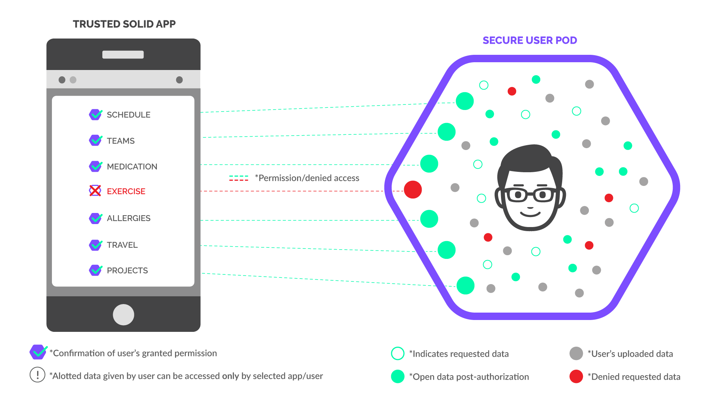
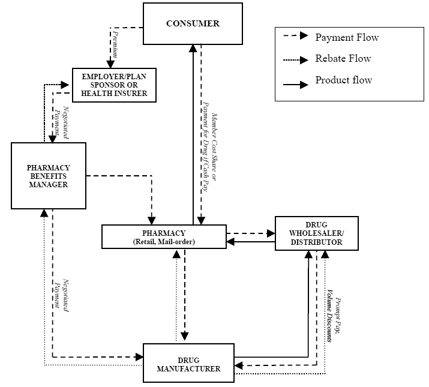

exclude:true
class: module-header ethereum/platform.cardano
---
# Cardano

### https://www.cardano.org/

???
ref: https://blockgeeks.com/guides/what-is-cardano/
ref: https://whycardano.com/

---
# Introducing Cardano
Cardano is a decentralised public blockchain and cryptocurrency project and is fully open source. Cardano is developing a smart contract platform which seeks to deliver more advanced features than any protocol previously developed. It is the first blockchain platform to evolve out of a scientific philosophy and a research-first driven approach. The development team consists of a large global collective of expert engineers and researchers

---
# Motivation

Cardano is a project that began in 2015 as an effort to change the way cryptocurrencies are designed and developed. The overall focus beyond a particular set of innovations is to provide a more balanced and sustainable ecosystem that better accounts for the needs of its users as well as other systems seeking integration.

In the spirit of many open source projects, Cardano did not begin with a comprehensive roadmap or even an authoritative white paper. Rather it embraced a collection of design principles, engineering best practices and avenues for exploration. These include the following:

* Separation of accounting and computation into different layers
* Implementation of core components in highly modular functional code
* Small groups of academics and developers competing with peer reviewed research
* Heavy use of interdisciplinary teams including early use of InfoSec experts
* Fast iteration between white papers, implementation and new research required to correct issues discovered during review
* Building in the ability to upgrade post-deployed systems without destroying the network
* Development of a decentralized funding mechanism for future work
* A long-term view on improving the design of cryptocurrencies so they can work on mobile devices with a reasonable and secure user experience
* Bringing stakeholders closer to the operations and maintenance of their cryptocurrency
* Acknowledging the need to account for multiple assets in the same ledger
* Abstracting transactions to include optional metadata in order to better conform to the needs of legacy systems
* Learning from the nearly 1,000 altcoins by embracing features that make sense
* Adopt a standards-driven process inspired by the Internet Engineering Task Force using a dedicated foundation to lock down the final protocol design
* Explore the social elements of commerce
* Find a healthy middle ground for regulators to interact with commerce without compromising some core principles inherited from Bitcoin

???
ref: https://whycardano.com/

---
exclude:true
class: module-header ethereum/platform.corda
---
name: PLATFORM.CORDA
# Corda

???
ref: https://cointelegraph.com/news/natwest-bank-launches-r3-corda-blockchain-based-syndicated-lending-platform

http://www.corda.net/

---
# R3 - The Company behind Corda

https://www.r3.com/

R3 builds blockchain technology to transform the way the world does business. Our global network of partners works with us to develop innovative apps for finance and commerce on our blockchain platform, Corda.

---
# Installing

http://www.corda.net/download.html

---
# Corda

Corda is an open source blockchain project, designed for business from the start. Only Corda allows you to build interoperable blockchain networks that transact in strict privacy. Corda's smart contract technology allows businesses to transact directly, with value.

https://github.com/corda/corda
???
ref: https://github.com/corda/corda

---
# Corda Features

* Smart contracts that can be written in Java and other JVM languages
* Flow framework to manage communication and negotiation between participants
* Peer-to-peer network of nodes
* "Notary" infrastructure to validate uniqueness and sequencing of transactions without global broadcast
* Enables the development and deployment of distributed apps called CorDapps
* Written in Kotlin, targeting the JVM

---
# Whitepaper

Corda:  A distributed ledger
Mike Hearn
November 29, 2016
Version 0.5

Abstract

A decentralised database with minimal trust between nodes would al-
low for the creation of a global ledger.  Such a ledger would have many
useful applications in finance, trade, supply chain tracking and more.  We
present Corda, a decentralised global database, and describe in detail how
it achieves the goal of providing a platform for decentralised app develop-
ment.  We elaborate on the high level description provided in the paper
<i>Corda: An introduction</i> and provide a detailed technical discussion.

https://docs.corda.net/_static/corda-technical-whitepaper.pdf

???
ref: https://docs.corda.net/_static/corda-technical-whitepaper.pdf

---
# Core Concepts

* The network
* The ledger
* Identity
* States
* Contracts
* Transactions
* Flows
* Consensus
* Notaries
* Time-windows
* Oracles
* Nodes
* Tradeoffs

???
ref: https://docs.corda.net/key-concepts.html

---
# Installing Corda

Follow the instructions, the environment is rather specific:

https://docs.corda.net/getting-set-up.html

---
# Software requirements

Corda uses industry-standard tools:

* Oracle JDK 8 JVM - minimum supported version 8u171
* IntelliJ IDEA - supported versions 2017.x and 2018.x (with Kotlin plugin version 1.2.51)
* Git

We also use Gradle and Kotlin, but you do not need to install them. A standalone Gradle wrapper is provided, and it will download the correct version of Kotlin.

Please note:

* Corda runs in a JVM. JVM implementations other than Oracle JDK 8 are not actively supported. However, if you do choose to use OpenJDK, you will also need to install OpenJFX
* Applications on Corda (CorDapps) can be written in any language targeting the JVM. However, Corda itself and most of the samples are written in Kotlin. Kotlin is an official Android language, and you can read more about why Kotlin is a strong successor to Java here. If you’re unfamiliar with Kotlin, there is an official getting started guide, and a series of Kotlin Koans.
* IntelliJ IDEA is recommended due to the strength of its Kotlin integration.

---
# Demobench

DemoBench is a standalone desktop application that makes it easy to configure and launch local Corda nodes. It is useful for training sessions, demos or just experimentation. 

exe & dmg available

http://www.corda.net/discover/demobench.html

---
# Running DemoBench

### Configuring a Node
Each node must have a unique name to identify it to the network map service. DemoBench will suggest node names, nearest cities and local port numbers to use. The first node will host the network map service, and we are forcing that node also to be a notary. Hence only notary services will be available to be selected in the Services list. For subsequent nodes you may also select any of Corda’s other built-in services. Press the Start node button to launch the Corda node with your configuration.

### Running Nodes
DemoBench launches each new node in a terminal emulator. The View Database, Launch Explorer and Launch Web Server buttons will all be disabled until the node has finished booting. DemoBench will then display simple statistics about the node such as its cash balance. It is currently impossible from DemoBench to restart a node that has terminated, e.g. because the user typed “bye” at the node’s shell prompt. However, that node’s data and logs still remain in its directory.

### Exiting DemoBench
When you terminate DemoBench, it will automatically shut down any nodes and explorers that it has launched and then exit. Profiles You can save the configurations and CorDapps for all of DemoBench’s currently running nodes into a profile, which is a ZIP file with the following layout, e.g.: notary/ node.conf plugins/ banka/ node.conf plugins/ bankb/ node.conf plugins/ example-cordapp.jar ... When DemoBench reloads this profile it will close any nodes that it is currently running and then launch these new nodes instead. All nodes will be created with a brand new database. Note that the node.conf files within each profile are JSON/HOCON format, and so can be extracted and edited as required.

DemoBench writes a log file to the following location:

* MacOSX/Linux - $HOME/demobench/demobench.log
* Windows - %USERPROFILE%\demobench\demobench.log

---
# CorDapps

https://docs.corda.net/cordapp-overview.html

Primary languages:
* Kotlin (Android language)
* Java

---

exclude:true
class: module-header ethereum/platform.solid
---
name: PROJECT.SOLID-START
# Solid

### https://solid.mit.edu/

???
ref: https://en.wikipedia.org/wiki/Solid_(web_decentralization_project)

---
# What is Solid?

Solid is an exciting new project led by Prof. Tim Berners-Lee, inventor of the World Wide Web, taking place at MIT. The project aims to radically change the way Web applications work today, resulting in true data ownership as well as improved privacy.

Solid (derived from "social linked data") is a proposed set of conventions and tools for building decentralized social applications based on Linked Data principles. Solid is modular and extensible and it relies as much as possible on existing W3C standards and protocols.

At a glance, here is what Solid offers...

---
# True data ownership

Users should have the freedom to choose where their data resides and who is allowed to access it. By decoupling content from the application itself, users are now able to do so.

---
# Modular design

Because applications are decoupled from the data they produce, users will be able to avoid vendor lock-in, seamlessly switching between apps and personal data storage servers, without losing any data or social connections.

---
# Reusing existing data

Developers will be able to easily innovate by creating new apps or improving current apps, all while reusing existing data that was created by other apps.

---
# Specification

https://github.com/solid/solid-spec

---
# Getting Started

ref: https://solid.inrupt.com/
ref: https://solid.inrupt.com/docs/

---
# Source

https://github.com/solid/solid

---
# Developer Resources

---
# Your first Solid App

ref: https://solid.inrupt.com/docs/app-on-your-lunch-break

---
# Get a Pod

ref: https://solid.inrupt.com/get-a-solid-pod

---
# Run a Solid server

https://solid.inrupt.com/docs/installing-running-nss

```shell
$ npm install -g solid-server
```
---
# JS utilities
* solid-auth-client allows us to perform authenticated retrieval of data from pods
* RDFlib lets us parse and process that data

---
# solid-auth-client

The solid-auth-client library helps us with authenticating the user and securely fetching files from their pod. You need the following components:

---
# RDFlib.js

RDFlib.js is a JavaScript library that allows us to interact with Linked Data stored in Solid pods. You can obtain it from https://linkeddata.github.io/rdflib.js/dist/rdflib.min.js

---
# History


---
# Inrupt
https://www.inrupt.com/

---
# Resources

???
see: beyondlogical/solid-resources

Inrupt team interview: https://www.pscp.tv/w/1lPKqdWNbLYxb

gitter: https://gitter.im/solid/chat



---
# Linked Data

---
# Breadcrumbs

---
# Permissioning

---
# Registration

---
# Decentralized Authentication

---
# Inrupt Data Browser

---
# Devkit

* Helpers
* Utilities
* Libraries

---
# LDP

---
# node-solid-server

---
# Go server

---
# PHP server

---
# 
exclude:true
class: module-header ethereum/tools.hyperledger-fabric
---
# Introduction to Hyperledger Fabric
# Smart Contract development for Hyperledger

---
exclude:true
class: module-header ethereum/topic.blockchain-jobs
---
# Blockchain Jobs

* Protocol engineer
* Platform developer
* dApp developer
--

* Auditors
* Information Security
* Penetration Testers
--

* Economist - Sociologist & Math
* Game Theorist - Poli Sci & Math
* Behavioral Economist - Psychology & Math
---
# Blockchain Jobs cont.

* Front end developer
* Network engineer
* System administrator
--

* Designers
* Content writers & editors
* Media specialists
--

* Researchers
* Entrepreneurs
* Teachers & Trainers
---
# Healthcare: Proof of authenticity

<p align=center>
    
</p>
???
https://www.ethnews.com/pfizer-and-genentech-turn-to-ethereum-blockchain

Major pharmaceutical conglomerates Pfizer and Genentech, together constituting a market cap greater than $300 billion, recently announced the MediLedger blockchain platform, powered by JP Morgan's enterprise-focused, Ethereum-based Quorum, designed to keep counterfeit goods out of medical supply chains.
---
# Healthcare: Drug Tracking

<p align=center>
     </p>
</p>
???
https://www.ethnews.com/intel-will-oversee-simulated-blockchain-pilot-to-address-opioid-crisis

This spring, tech manufacturer Intel will lead several partner firms, including Johnson & Johnson, in testing a simulated version of a blockchain platform designed to track drugs across the supply chain.
---
# Healthcare: Record reconciliation

<p align=center>
     </p>
</p>
???
https://www.ethnews.com/humana-other-healthcare-firms-to-launch-blockchain-pilot-for-data-sharing

On April 2, Humana, MultiPlan, Quest Diagnostics, UnitedHealth Group's Optum, and UnitedHealthcare announced their intention to launch the trial, which aims to explore an alternative to the current data storage system.

Today, a variety of healthcare entities each maintain their own copies of healthcare provider data, and reconciling the different versions of these records can be a complicated, time-consuming, and expensive process. According to the joint press release, attempts to harmonize records currently cost the healthcare industry some $2.1 billion per year.

The participating companies hope the pilot will lead to solutions that will improve patients' "access to care" in addition to saving healthcare providers money and equipping them with the most current and accurate data available.
---
exclude:true

* Javascript
* Python
* Java, Go...
* Networking protocols
* Hyperledger
* Ethereum

---
exclude:true
class: module-header ethereum/topic.blockchain-open-questions
---
class: center, middle
# Open questions

???
What is suitable for blockchain scale?

Solving old problems vs engaging new opportunities

Value volatility

Efficiency vs security trade-off re-evaluation

What new opportunities will these functions create that we haven't thought of yet?

---
# The Oracle Problem

???

https://medium.com/@DelphiSystems/the-oracle-problem-856ccbdbd14f
https://en.wikipedia.org/wiki/Test_oracle


---
# Anonymity


---
exclude:true
class: module-header ethereum/topic.ethereum-future
---
# Ethereum 2.0 - Serenity
<p align=center>
    
</p>

???
ref: https://media.consensys.net/state-of-ethereum-protocol-1-d3211dd0f6
ref: https://our.status.im/tag/two-point-oh/

---
# Serenity

---
# Economics in Serenity

* Change from Proof of Work (PoW) to Proof of Stake (PoS)

* Validator - a participant in the Casper/sharding consensus system. You can become one by depositing 32 ETH into the Casper mechanism.
* Committee - a (pseudo-) randomly sampled subset of active validators. When a committee is referred to collectively, as in "this committee attests to X", this is assumed to mean "some subset of that committee that contains enough validators that the protocol recognizes it as representing the committee".
* Issuance Rate - The annualized rate at which ETH supply grows.
* Interest - The annualized rate at which validators are rewarded (in ETH).

???
ref: https://github.com/ethhub-io/ethhub/blob/master/ethereum-101/monetary-policy/eth-2.0-economics.md

---
# Switching to POS: the difficulty "bomb"

Because delaying the difficulty bomb also impacts ether inflation (the time it takes to mine blocks is directly correlated to the quantity of ether distributed on the platform), ethereum is under pressure to upgrade its code before the bomb hits.

???

ref: https://www.reddit.com/r/ethereum/comments/a1ixov/ive_seen_so_much_misinformation_regarding_the/
ref: https://docs.google.com/presentation/d/e/2PACX-1vSNUc9zSj5x1zVJJNsJNlXedZkP-DLDLvcoaCB7zHwoWz8ApjFLsXJvEB6B7wRpysYJFsyT-1YJgduE/pub?start=false&loop=false#slide=id.g442e52dd04_0_13

---
# Validators

???
ref: https://our.status.im/two-point-oh-explaining-validators/

---
# Beacon Chain

???
ref: https://our.status.im/two-point-oh-the-beacon-chain/

---
# Liveness guarantee

???
ref: https://ethresear.ch/t/explaining-the-liveness-guarantee/4228

---
# Nimbus

A new type of node for the Ethereum network.

Given that Ethereum 2.0 must remain compatible with 1.0, the functionality for 2.0 will include everything 1.0 can do. This means that Nimbus will be an alternative to Geth and Parity as a full Ethereum node, but will also include features that can make it run as a light node - a node that doesn't need to download the full blockchain - or even a stateless node - a node that doesn't need to download state at all to be able to verify it.

???
ref: https://our.status.im/nimbus-for-newbies/

---
exclude:true
class: module-header ethereum/topic.project-interoperation
---
# Interoperation
## Network Bridges and Bindings

---
# Web3
## HTTP <> Ethereum

---
# Delegation of work
## IPFS <> Ethereum

* First class citizen via web3.js
* Tools like TheGraph using GraphQL to bridge Ethereum <> IPFS data

???
https://thegraph.com/

---
## Bitcoin <> Ethereum pinning

"Pinning" data values across networks, or coordinating relative changes (swaps). 

E.g.: RSK's Bitcoin <> Ethereum bridge

RSK is the first open-source smart contract platform with a 2-way peg to Bitcoin that also rewards the Bitcoin miners via merge-mining, allowing them to actively participate in the Smart Contract revolution. RSK goal is to add value and functionality to the Bitcoin ecosystem by enabling smart-contracts, near instant payments and higher-scalability.

???
ref: https://www.rsk.co/

---
